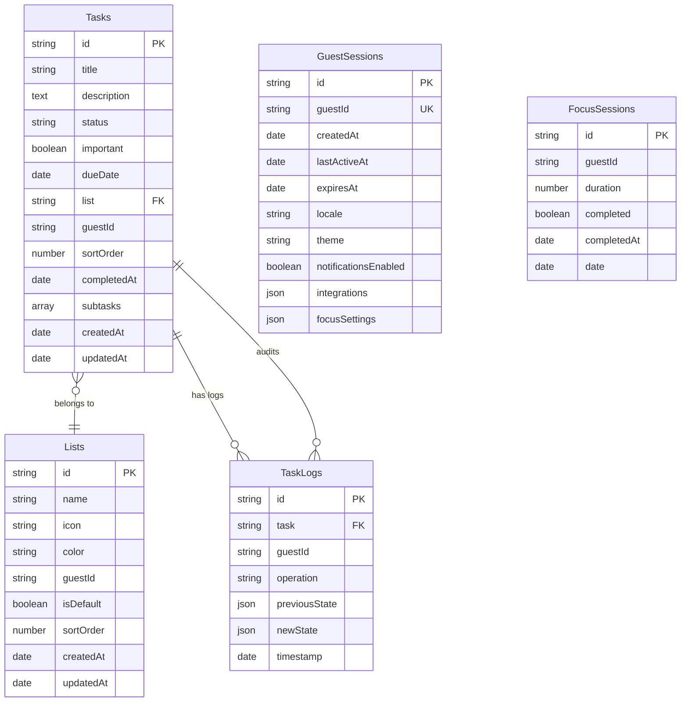
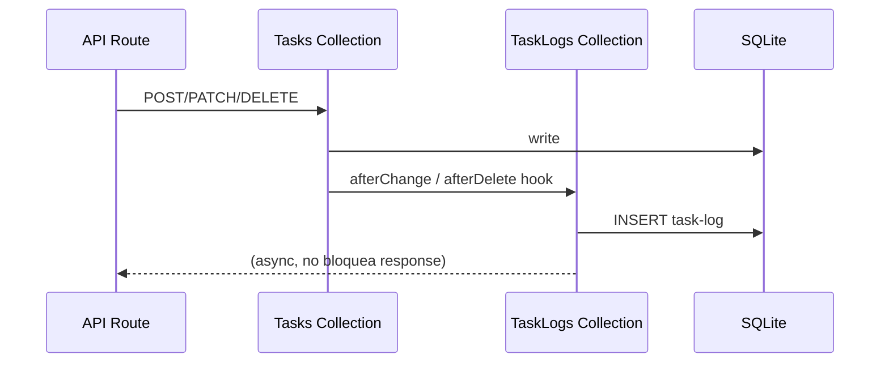

# Design: Crear colecciones PayloadCMS

## Visual Mapping (HTML → Payload)

No hay elementos HTML/Stitch directamente involucrados en esta actividad — las colecciones son la capa de persistencia invisible. Sin embargo, cada colección se mapea a pantallas de Stitch que la consumirán en fases posteriores:

| Pantalla Stitch (futura) | Colección Payload | Campos Clave |
|---|---|---|
| Stack My Day, Important, Planned, All Tasks | `Tasks` | title, status, important, dueDate, list, sortOrder |
| Sidebar ListNav | `Lists` | name, icon, color, sortOrder |
| Task Detail (sub-steps) | `Tasks.subtasks` | array con title + completed |
| Task Detail (notes) | `Tasks.description` | textarea |
| Config Main (theme/locale) | `GuestSessions` | theme, locale, notificationsEnabled |
| Focus Session page | `FocusSessions` | duration, completed, date |
| (Auditoría interna) | `TaskLogs` | operation, previousState, newState |

## Diagrama de Relaciones



## Flujo de Datos (Hooks)



## Tipos (alineados con payload-types.ts esperado)

```typescript
// Estos tipos serán GENERADOS AUTOMÁTICAMENTE por pnpm generate:types
// Se listan aquí para referencia del mapeo esperado

interface Task {
  id: string
  title: string
  description?: string | null
  status: 'pending' | 'completed'
  important?: boolean | null
  dueDate?: string | null
  list: string | List
  guestId: string
  sortOrder?: number | null
  completedAt?: string | null
  subtasks?: {
    id?: string
    title: string
    completed?: boolean | null
  }[] | null
  createdAt: string
  updatedAt: string
}

interface List {
  id: string
  name: string
  icon?: string | null
  color?: string | null
  guestId: string
  isDefault?: boolean | null
  sortOrder?: number | null
  createdAt: string
  updatedAt: string
}

interface TaskLog {
  id: string
  task: string | Task
  guestId: string
  operation: 'CREATE' | 'UPDATE' | 'DELETE'
  previousState?: Record<string, unknown> | null
  newState?: Record<string, unknown> | null
  timestamp: string
}

interface GuestSession {
  id: string
  guestId: string
  createdAt: string
  lastActiveAt: string
  expiresAt: string
  locale?: 'es' | 'en' | null
  theme?: 'light' | 'dark' | 'system' | null
  notificationsEnabled?: boolean | null
  integrations?: Record<string, unknown> | null
  focusSettings?: Record<string, unknown> | null
}

interface FocusSession {
  id: string
  guestId: string
  duration: number
  completed?: boolean | null
  completedAt?: string | null
  date: string
}
```
