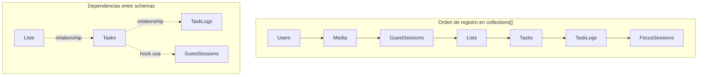
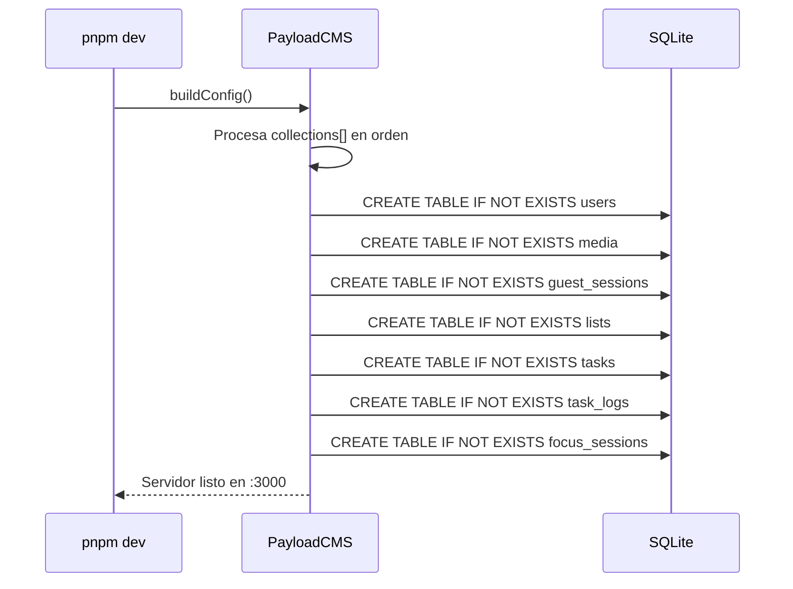

# Design: Registrar colecciones en payload.config.ts

## Visual Mapping

No hay elementos HTML/Stitch involucrados. El cambio es puramente infraestructural:

| Archivo actual | Cambio |
|---|---|
| `src/payload.config.ts` | +5 imports, +1 modificación en array collections |

## Diagrama de Dependencias entre Colecciones



**Reglas del orden:**
1. `GuestSessions` antes que `Tasks` — el hook `afterChange` de Tasks referencia guestId (aunque no sea relationship directa, PayloadCMS procesa hooks que pueden referenciar otras colecciones)
2. `Lists` antes que `Tasks` — Tasks tiene `{ type: 'relationship', relationTo: 'lists' }`
3. `Tasks` antes que `TaskLogs` — TaskLogs tiene `{ type: 'relationship', relationTo: 'tasks' }`
4. `FocusSessions` al final — no tiene relaciones entrantes ni salientes

## Flujo de Inicialización



## Código Esperado (payload.config.ts modificado)

```typescript
import { sqliteAdapter } from '@payloadcms/db-sqlite'
import { lexicalEditor } from '@payloadcms/richtext-lexical'
import path from 'path'
import { buildConfig } from 'payload'
import { fileURLToPath } from 'url'
import sharp from 'sharp'

import { Users } from './collections/Users'
import { Media } from './collections/Media'
import { GuestSessions } from './collections/GuestSessions'
import { Lists } from './collections/Lists'
import { Tasks } from './collections/Tasks'
import { TaskLogs } from './collections/TaskLogs'
import { FocusSessions } from './collections/FocusSessions'

const filename = fileURLToPath(import.meta.url)
const dirname = path.dirname(filename)

export default buildConfig({
  admin: {
    user: Users.slug,
    importMap: {
      baseDir: path.resolve(dirname),
    },
  },
  collections: [Users, Media, GuestSessions, Lists, Tasks, TaskLogs, FocusSessions],
  editor: lexicalEditor(),
  secret: process.env.PAYLOAD_SECRET || '',
  typescript: {
    outputFile: path.resolve(dirname, 'payload-types.ts'),
  },
  db: sqliteAdapter({
    client: {
      url: process.env.DATABASE_URL || '',
    },
  }),
  sharp,
  plugins: [],
})
```
