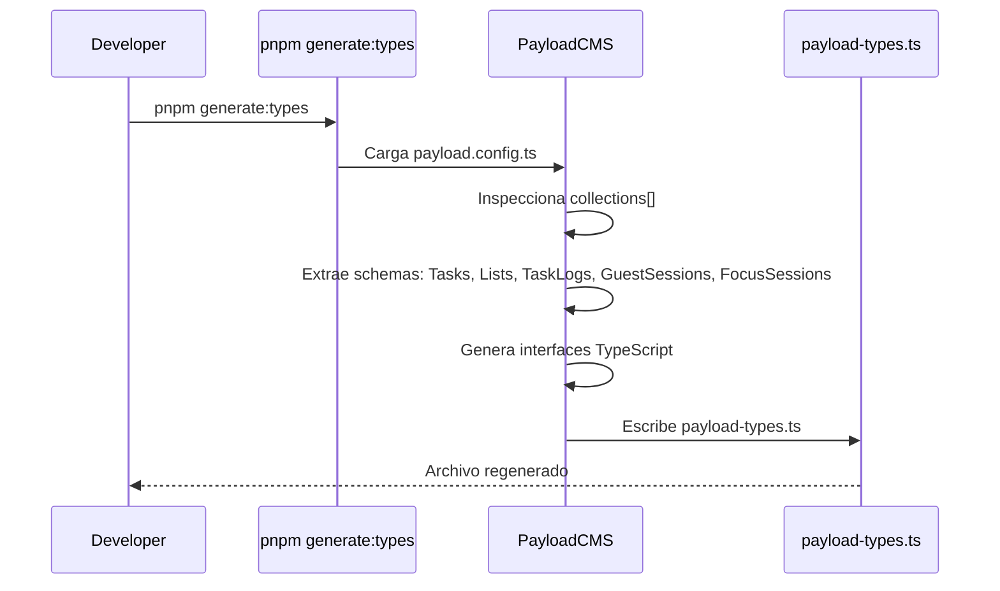
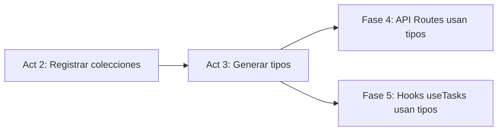

# Design: Generar tipos TypeScript

## Visual Mapping

No hay elementos HTML/Stitch. El cambio es puramente de infraestructura de tipos.

## Flujo de Generación



## Dependencias



- **Act 2 debe completarse antes**: `generate:types` lee `payload.config.ts` — sin colecciones registradas, los tipos no se generan.
- **Act 3 es prerrequisito de Fases 4-6**: API Routes, hooks TanStack Query, y componentes React importan tipos desde `payload-types.ts`.

## Mapeo Schema → Tipo Generado

| Campo en Schema Payload | Tipo TypeScript Generado |
|---|---|
| `{ type: 'text', required: true }` | `string` |
| `{ type: 'textarea', maxLength: 5000 }` | `string \| null` |
| `{ type: 'select', options: [...], required: true }` | `'a' \| 'b'` |
| `{ type: 'checkbox', defaultValue: false }` | `boolean \| null` |
| `{ type: 'date' }` | `string \| null` |
| `{ type: 'relationship', relationTo: 'lists', required: true }` | `string \| List` |
| `{ type: 'json' }` | `Record<string, unknown> \| null` |
| `{ type: 'array', fields: [...] }` | `{ id?: string; ... }[] \| null` |
| `{ type: 'number' }` | `number \| null` |
| `{ type: 'number', required: true, min: 1 }` | `number` |

## Interfaces Esperadas (post-generación)

```typescript
// Fragmento ilustrativo de lo que payload-types.ts contendrá

export interface Task {
  id: string
  title: string
  description?: string | null
  status: 'pending' | 'completed'
  important?: boolean | null
  dueDate?: string | null
  list: string | List
  guestId: string
  sortOrder?: number | null
  completedAt?: string | null
  subtasks?:
    | {
        id?: string
        title: string
        completed?: boolean | null
      }[]
    | null
  createdAt: string
  updatedAt: string
}

export interface List {
  id: string
  name: string
  icon?: string | null
  color?: string | null
  guestId: string
  isDefault?: boolean | null
  sortOrder?: number | null
  createdAt: string
  updatedAt: string
}

// GuestSession, FocusSession, TaskLog siguen el mismo patrón
// Ver spec.md para los campos completos esperados
```
