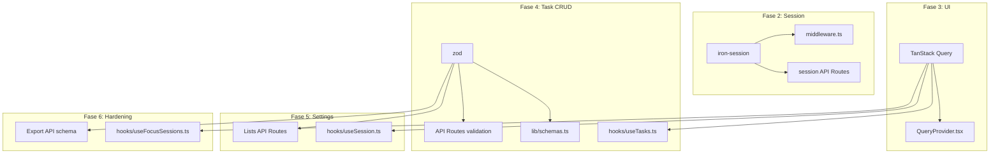

# Design: Instalar dependencias

## Visual Mapping

No hay elementos HTML/Stitch — actividad puramente de infraestructura.

## Diagrama de Uso Futuro



## Versiones y Compatibilidad

| Paquete | Versión esperada | Peer dependencies clave |
|---|---|---|
| `@tanstack/react-query` | ^5.x | React 18+ (compatible con React 19) |
| `iron-session` | ^8.x | Next.js compatible con App Router (no requiere API Routes de Pages Router) |
| `zod` | ^3.23.x | Sin peer dependencies |

## Código de Verificación (import test)

```typescript
// src/_import-test.ts (temporal, eliminar después)
import { useQuery, useMutation, QueryClient } from '@tanstack/react-query'
import { getIronSession, IronSession } from 'iron-session'
import { z } from 'zod'

// TanStack Query
const queryClient = new QueryClient()

// Zod
const TestSchema = z.object({ name: z.string().min(1) })
type TestType = z.infer<typeof TestSchema>

// Iron-Session
declare const session: IronSession<{ guestId: string }>

console.log('All imports resolve correctly')
```

```bash
pnpm tsx src/_import-test.ts  # Debe ejecutarse sin errores
rm src/_import-test.ts         # Limpiar
```
