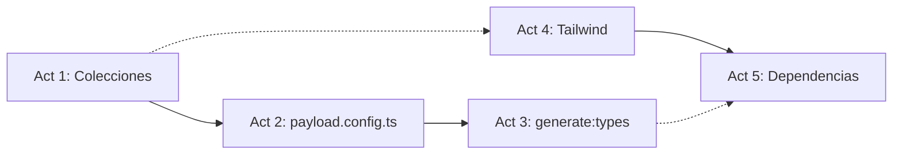

# Phase 1 Enrichment: Foundation — Data Models & Design Tokens

> **Fase:** `1.Foundation-Data-Models/`  
> **Derivado de:** `plan.md` (Fase 1), `design.md` (Sección 1.B, 5.A), `spec.md` (Sección 2)

---

## Resumen de la Fase

Establecer la base de datos (5 colecciones PayloadCMS), el sistema de diseño (Tailwind config con ~60 tokens Ethereal Focus) y las dependencias del proyecto. Esta fase no produce UI visible — es la infraestructura sobre la que se construye todo lo demás.

---

## Análisis de Impacto en PayloadCMS

| Colección | Slug | Impacto | Dependencias |
|---|---|---|---|
| `Tasks` (nueva) | `tasks` | Creación completa: schema + access control + hooks auditoría | `lists` (relationship) |
| `Lists` (nueva) | `lists` | Creación completa: schema + access control | — |
| `TaskLogs` (nueva) | `task-logs` | Creación completa: schema + access control write-only | `tasks` (relationship) |
| `GuestSessions` (nueva) | `guest-sessions` | Creación completa: schema + access control + hook beforeChange | — |
| `FocusSessions` (nueva) | `focus-sessions` | Creación completa: schema + access control | — |
| `Users` (existente) | `users` | Sin cambios | — |
| `Media` (existente) | `media` | Sin cambios | — |
| **Config global** | `payload.config.ts` | Añadir 5 imports + registro en array `collections` | Todas las nuevas |

**Configuración adicional de PayloadCMS:**
- No se requieren plugins nuevos
- SQLite adapter ya configurado (WAL mode se configura en Fase 6)
- El editor Lexical ya está configurado

---

## Listado de Actividades

| # | Actividad | Archivos Destino | Colecciones Afectadas |
|---|---|---|---|
| 1 | Crear colecciones PayloadCMS | `src/collections/Tasks.ts`, `Lists.ts`, `TaskLogs.ts`, `GuestSessions.ts`, `FocusSessions.ts` | Todas las nuevas |
| 2 | Registrar colecciones en config | `src/payload.config.ts` | — (config global) |
| 3 | Generar tipos TypeScript | `src/payload-types.ts` (auto-generado) | Todas |
| 4 | Configurar Tailwind + CSS | `tailwind.config.ts`, `src/app/(frontend)/styles.css` | — (design tokens) |
| 5 | Instalar dependencias | `package.json` | — |

---

## Detalle de Hitos por Actividad

### Actividad 1: Crear colecciones PayloadCMS

**Descripción técnica:** Implementar 5 archivos de colección en `src/collections/` con schema completo, access control por guestId, hooks de auditoría, y validaciones de campos.

**Hitos:**

| # | Hito | Descripción | Criterio de Aceptación |
|---|---|---|---|
| 1.1 | Schema Tasks | Definir slug `tasks`, campos: title (text, required, maxLength 500), description (textarea, maxLength 5000), status (select: pending\|completed, default pending), important (checkbox), dueDate (date), list (relationship→lists), guestId (text, required, index), sortOrder (number), completedAt (date), subtasks (array con title + completed) | Archivo `Tasks.ts` compila sin errores TypeScript |
| 1.2 | Access Control Tasks | Implementar read/create/update/delete filtrando por `req.headers.get('x-guest-id')` | Solo documentos con guestId coincidente son accesibles |
| 1.3 | Hooks Tasks | Implementar `afterChange` (crea TaskLog con diff) y `afterDelete` (crea TaskLog con DELETE) | Cada CRUD en tasks genera un documento en task-logs |
| 1.4 | Schema Lists | Definir slug `lists`, campos: name (text, required, maxLength 100), icon (text, default 'list'), color (text), guestId (text, required, index), isDefault (checkbox), sortOrder (number) | Archivo `Lists.ts` compila sin errores |
| 1.5 | Access Control Lists | Implementar read/create/update/delete filtrando por x-guest-id (mismo patrón que Tasks) | Aislamiento de listas por guest |
| 1.6 | Schema TaskLogs | Definir slug `task-logs`, campos: task (relationship→tasks, required), guestId (text, required), operation (select: CREATE\|UPDATE\|DELETE, required), previousState (json), newState (json), timestamp (date, auto) | Archivo `TaskLogs.ts` compila |
| 1.7 | Access Control TaskLogs | read: false, create: true, update: false, delete: false | Solo hooks internos pueden escribir; nadie puede leer desde API pública |
| 1.8 | Schema GuestSessions | Definir slug `guest-sessions`, campos: guestId (text, required, unique, index), createdAt (date), lastActiveAt (date), expiresAt (date), locale (select: es\|en), theme (select: light\|dark\|system, default system), notificationsEnabled (checkbox, default true), integrations (json), focusSettings (json) | Archivo `GuestSessions.ts` compila |
| 1.9 | Access Control + Hook GuestSessions | read/update filtran por x-guest-id; create: true; delete: false. Hook beforeChange extiende expiresAt +7d cuando se actualiza lastActiveAt | Sesión extiende expiración automáticamente al refrescar |
| 1.10 | Schema FocusSessions | Definir slug `focus-sessions`, campos: guestId (text, required, index), duration (number, min 1, max 120), completed (checkbox), completedAt (date), date (date, default today) | Archivo `FocusSessions.ts` compila |
| 1.11 | Access Control FocusSessions | read/create filtran por x-guest-id; update: false; delete: false | Solo creación y lectura por el mismo guest |

### Actividad 2: Registrar colecciones en payload.config.ts

**Descripción técnica:** Importar las 5 nuevas colecciones y registrarlas en el array `collections` de `buildConfig()`.

**Hitos:**

| # | Hito | Descripción | Criterio de Aceptación |
|---|---|---|---|
| 2.1 | Importar colecciones | Añadir imports: `import { Tasks } from './collections/Tasks'` (×5) | No hay errores de importación |
| 2.2 | Registrar en buildConfig | Añadir `Tasks, Lists, TaskLogs, GuestSessions, FocusSessions` al array `collections: [Users, Media, ...]` | `pnpm dev` inicia sin errores y las 5 colecciones aparecen en admin panel |
| 2.3 | Verificar orden de registro | GuestSessions debe registrarse antes que Tasks (por referencia en hooks); Lists antes que Tasks (por relationship) | No hay errores de dependencia circular |

### Actividad 3: Generar tipos TypeScript

**Descripción técnica:** Ejecutar el generador de tipos de PayloadCMS para producir `src/payload-types.ts` con las interfaces Task, List, TaskLog, GuestSession, FocusSession.

**Hitos:**

| # | Hito | Descripción | Criterio de Aceptación |
|---|---|---|---|
| 3.1 | Ejecutar generación | `pnpm generate:types` | Comando exitoso, archivo `payload-types.ts` actualizado |
| 3.2 | Verificar interfaces | Confirmar que `payload-types.ts` exporta Task, List, TaskLog, GuestSession, FocusSession con los campos definidos | Cada campo del schema aparece en el tipo generado |
| 3.3 | Type-check | `pnpm lint` (o `npx tsc --noEmit`) pasa sin errores | No hay errores de tipo en las colecciones |

### Actividad 4: Configurar Tailwind con Ethereal Focus

**Descripción técnica:** Crear `tailwind.config.ts` con la paleta completa de ~60 colores, 7 familias tipográficas (Geist + Inter), 6 tokens de espaciado, 4 border-radius, animaciones y dark mode. Actualizar `styles.css` con clases globales.

**Hitos:**

| # | Hito | Descripción | Criterio de Aceptación |
|---|---|---|---|
| 4.1 | Crear tailwind.config.ts | Configurar darkMode: 'class', extender theme con colors (surface, primary, secondary, error, outline, dark tokens), fontFamily (Geist + Inter), fontSize (display-xl, headline-md, body-md, label-sm, task-item), spacing (sidebar-width, detail-panel-width, container-padding), borderRadius, keyframes/animation (slide-in) | Archivo creado con todos los tokens de DESIGN.md |
| 4.2 | Actualizar styles.css | Añadir @import de Google Fonts (Geist, Inter, Material Symbols), clases .glass-panel (con backdrop-blur), .material-symbols-outlined (font-variation-settings), .custom-scrollbar | Clases globales disponibles en toda la app |
| 4.3 | Verificar compilación | `pnpm dev` no muestra errores de Tailwind | Las clases bg-surface, text-primary, font-display-xl son reconocidas |

### Actividad 5: Instalar dependencias

**Descripción técnica:** Instalar los paquetes npm necesarios para el stack: TanStack Query v5 (state management cliente), Iron-Session (cookies cifradas), Zod (validación de esquemas).

**Hitos:**

| # | Hito | Descripción | Criterio de Aceptación |
|---|---|---|---|
| 5.1 | Instalar TanStack Query | `pnpm add @tanstack/react-query` | `package.json` incluye `@tanstack/react-query` en dependencies |
| 5.2 | Instalar Iron-Session | `pnpm add iron-session` | `package.json` incluye `iron-session` |
| 5.3 | Instalar Zod | `pnpm add zod` | `package.json` incluye `zod` |
| 5.4 | Verificar instalación | `pnpm ls --depth 0` muestra los 3 paquetes sin errores | Los imports `from '@tanstack/react-query'`, `from 'iron-session'`, `from 'zod'` resuelven correctamente |

---

## Justificación Arquitectónica

Este desglose sigue los principios definidos en `design.md`:

1. **Payload-First:** Cada actividad nueva comienza definiendo la colección PayloadCMS que la sustentará. No hay funcionalidad sin colección.

2. **Separation of Concerns:** Las colecciones (Actividad 1) se definen independientemente de su registro en config (Actividad 2). Esto permite testear cada colección de forma aislada.

3. **Type-Safety First:** La generación de tipos (Actividad 3) ocurre inmediatamente después de definir las colecciones, garantizando que el frontend (Fases 3-6) consuma tipos exactos y evitando type-drift.

4. **Design Tokens como Contrato:** La configuración de Tailwind (Actividad 4) transforma los tokens visuales de DESIGN.md en variables CSS utilizables. Esto asegura fidelidad 1:1 con los prototipos de Stitch desde el inicio.

5. **Dependencias Mínimas:** Solo se instalan las 3 librerías indispensables (Actividad 5). No se añaden abstracciones innecesarias — el stack se mantiene ligero.

### Mapa de Dependencias entre Actividades

- Act 1 → Act 2 (necesarias en secuencia: las colecciones deben existir antes de registrarlas)
- Act 2 → Act 3 (necesarias en secuencia: el config debe tener las colecciones para generar tipos)
- Act 4 y Act 5 son independientes y pueden ejecutarse en paralelo
- Act 1 y Act 4 pueden solaparse (equipos paralelos)
