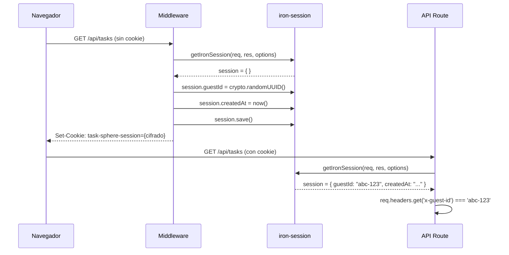
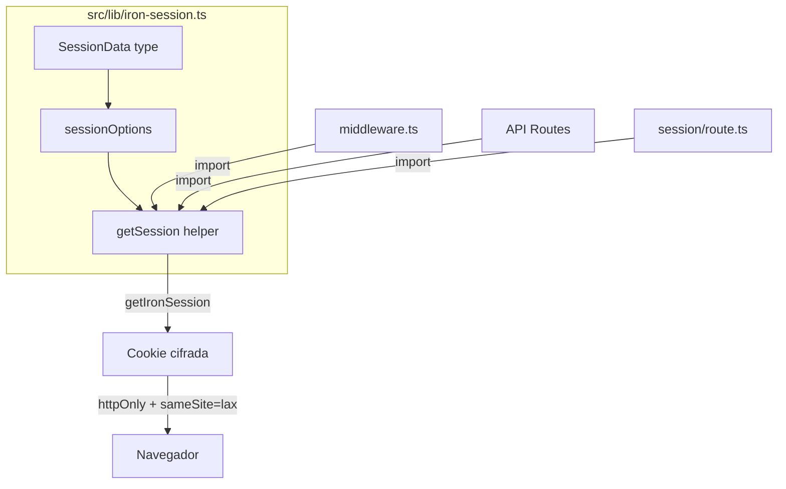

# Design: Configurar Iron-Session

## Visual Mapping

No hay elementos HTML/Stitch — actividad de infraestructura de autenticación.

## Diagrama de Uso



## Flujo de Datos



## Código Esperado

```typescript
// src/lib/iron-session.ts
import { getIronSession } from 'iron-session'
import type { SessionOptions, IronSession } from 'iron-session'
import { NextRequest, NextResponse } from 'next/server'

export interface SessionData {
  guestId?: string
  createdAt?: string
}

export const sessionOptions: SessionOptions = {
  password: process.env.IRON_SESSION_PASSWORD || 'complex_password_at_least_32_chars_long_here',
  cookieName: 'task-sphere-session',
  cookieOptions: {
    secure: process.env.NODE_ENV === 'production',
    httpOnly: true,
    sameSite: 'lax',
    maxAge: 60 * 60 * 24 * 7, // 7 días en segundos
  },
}

export async function getSession(
  request: NextRequest,
  response: NextResponse,
): Promise<IronSession<SessionData>> {
  return getIronSession<SessionData>(request, response, sessionOptions)
}
```

## Consideraciones de Seguridad

| Aspecto | Decisión | Justificación |
|---|---|---|
| Password mínima | 32 chars | Iron-Session requiere password >= 32 chars para AES-256-GCM |
| httpOnly | true | Previene acceso a cookie desde JavaScript (XSS) |
| sameSite | 'lax' | Permite GET requests desde enlaces externos (mejor UX que 'strict') |
| secure | true en prod | Cookie solo se envía por HTTPS |
| maxAge | 7 días | Balance entre UX (no pedir nuevo guestId seguido) y limpieza de datos |
| Fallback password | Hardcodeado para dev | Producción requiere variable de entorno |
