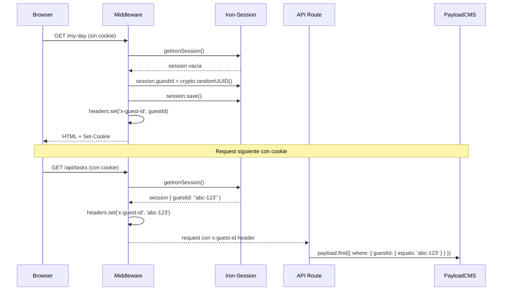

# Design: Implementar middleware de Next.js

## Visual Mapping

No hay elementos HTML/Stitch directos — el middleware es infraestructura invisible. Sin embargo, el prototipo "1.Stack Vacio" asume que el usuario tiene una sesión activa para crear su primera tarea — el middleware es el primer paso para que eso funcione.

## Diagrama de Flujo



## Mapa de Rutas (Matcher)

```mermaid
graph LR
    subgraph "Middleware intercepta"
        A[/my-day]
        B[/important]
        C[/planned]
        D[/tasks]
        E[/settings]
        F[/api/tasks]
        G[/api/lists]
        H[/api/session]
        I[/api/export]
    end

    subgraph "Middleware NO intercepta"
        J[/admin]
        K[/api/auth]
        L[/_next/*]
        M[/static/*]
        N[/favicon.ico]
    end
```

## Código Esperado

```typescript
// src/middleware.ts
import { getIronSession } from 'iron-session'
import { NextResponse } from 'next/server'
import type { NextRequest } from 'next/server'
import { sessionOptions, type SessionData } from '@/lib/iron-session'

export async function middleware(request: NextRequest) {
  const response = NextResponse.next()
  const session = await getIronSession<SessionData>(request, response, sessionOptions)

  if (!session.guestId) {
    session.guestId = crypto.randomUUID()
    session.createdAt = new Date().toISOString()
    await session.save()
  }

  const requestHeaders = new Headers(request.headers)
  requestHeaders.set('x-guest-id', session.guestId)

  return NextResponse.next({
    request: { headers: requestHeaders },
  })
}

export const config = {
  matcher: '/((?!_next|api/auth|admin|static|favicon.ico).*)',
}
```
