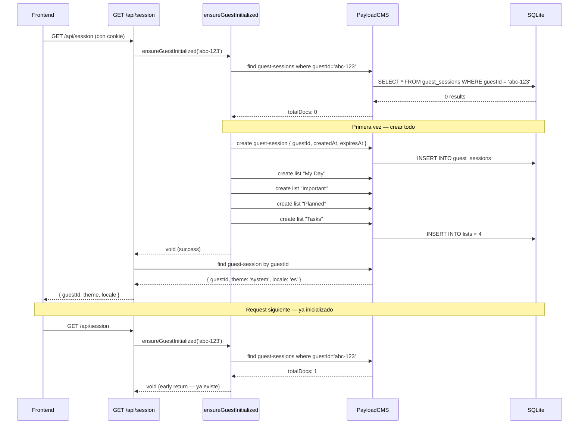

# Design: Implementar lazy guest initialization

## Visual Mapping

| Elemento Stitch | Impacto | Colección Payload |
|---|---|---|
| "1.Stack Vacio" — estado sin tareas | Aparece si guest es nuevo (aún sin lists ni tasks) | `guest-sessions` + `lists` |
| Sidebar — 4 listas default | Primer render muestra My Day, Important, Planned, Tasks | `lists` (creadas por init) |
| Config Main — preferencias | Tema/locale default aplicados | `guest-sessions.theme = 'system'`, `locale = 'es'` |

## Diagrama de Flujo



## Código Esperado

```typescript
// src/lib/payload-client.ts
import { getPayload } from 'payload'
import config from '@payload-config'

const DEFAULT_LISTS = [
  { name: 'My Day', icon: 'today', color: '#004ac6', isDefault: true, sortOrder: 0 },
  { name: 'Important', icon: 'star', color: '#ba1a1a', isDefault: false, sortOrder: 1 },
  { name: 'Planned', icon: 'calendar_today', color: '#735c00', isDefault: false, sortOrder: 2 },
  { name: 'Tasks', icon: 'list', color: '#434655', isDefault: false, sortOrder: 3 },
]

export async function ensureGuestInitialized(guestId: string): Promise<void> {
  try {
    const payloadConfig = await config
    const payload = await getPayload({ config: payloadConfig })

    const existing = await payload.find({
      collection: 'guest-sessions',
      where: { guestId: { equals: guestId } },
      limit: 1,
    })

    if (existing.totalDocs > 0) return // ya inicializado

    const now = new Date()
    const expiresAt = new Date(now.getTime() + 7 * 24 * 60 * 60 * 1000)

    await payload.create({
      collection: 'guest-sessions',
      data: {
        guestId,
        createdAt: now.toISOString(),
        lastActiveAt: now.toISOString(),
        expiresAt: expiresAt.toISOString(),
      },
    })

    for (const list of DEFAULT_LISTS) {
      await payload.create({
        collection: 'lists',
        data: { ...list, guestId },
      })
    }
  } catch (error) {
    console.warn('[ensureGuestInitialized] Failed to initialize guest:', guestId, error)
    // Fallo silencioso — el guest opera sin datos persistidos
  }
}
```
