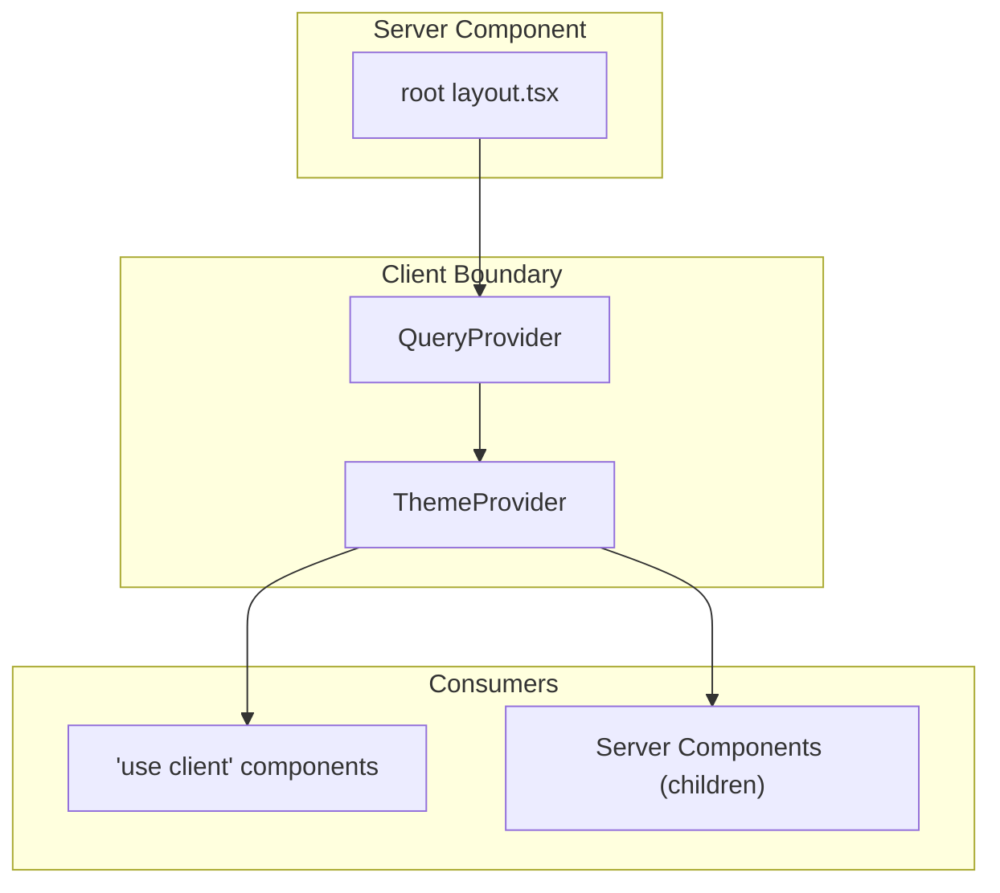

# Design: Configurar providers React

## Visual Mapping

| Elemento Stitch | Componente Técnico | Propósito |
|---|---|---|
| Tema claro/oscuro (global) | `ThemeProvider` + `.dark` class | Los prototipos tienen modo oscuro con clase `dark` en `<html>` |
| Listas, tareas, datos dinámicos | `QueryProvider` → `useQuery` hooks | Cache de datos servidor, revalidación automática |
| Preferencia de tema persistente | `localStorage` + `useEffect` | La pantalla "8.Config Main" permite cambiar tema — persiste entre sesiones |

## Árbol de Componentes



## Código Esperado

```tsx
// src/providers/QueryProvider.tsx
'use client'

import { QueryClient, QueryClientProvider } from '@tanstack/react-query'
import { useState } from 'react'

export function QueryProvider({ children }: { children: React.ReactNode }) {
  const [queryClient] = useState(
    () =>
      new QueryClient({
        defaultOptions: {
          queries: {
            staleTime: 30_000,
            gcTime: 300_000,
            retry: 1,
          },
        },
      }),
  )

  return (
    <QueryClientProvider client={queryClient}>
      {children}
    </QueryClientProvider>
  )
}
```

```tsx
// src/providers/ThemeProvider.tsx
'use client'

import { createContext, useContext, useEffect, useState } from 'react'

type Theme = 'light' | 'dark' | 'system'

interface ThemeContextValue {
  theme: Theme
  setTheme: (theme: Theme) => void
}

const ThemeContext = createContext<ThemeContextValue>({
  theme: 'system',
  setTheme: () => {},
})

export function useTheme() {
  return useContext(ThemeContext)
}

function getInitialTheme(): Theme {
  if (typeof window !== 'undefined') {
    const stored = localStorage.getItem('theme') as Theme | null
    if (stored) return stored
  }
  return 'system'
}

function resolveTheme(theme: Theme): boolean {
  if (theme === 'system') {
    return window.matchMedia('(prefers-color-scheme: dark)').matches
  }
  return theme === 'dark'
}

export function ThemeProvider({ children }: { children: React.ReactNode }) {
  const [theme, setThemeState] = useState<Theme>('system')
  const [mounted, setMounted] = useState(false)

  useEffect(() => {
    setThemeState(getInitialTheme())
    setMounted(true)
  }, [])

  useEffect(() => {
    if (!mounted) return
    const isDark = resolveTheme(theme)
    document.documentElement.classList.toggle('dark', isDark)
    localStorage.setItem('theme', theme)
  }, [theme, mounted])

  useEffect(() => {
    if (theme !== 'system') return
    const mediaQuery = window.matchMedia('(prefers-color-scheme: dark)')
    const handler = () => {
      document.documentElement.classList.toggle('dark', mediaQuery.matches)
    }
    mediaQuery.addEventListener('change', handler)
    return () => mediaQuery.removeEventListener('change', handler)
  }, [theme])

  const setTheme = (newTheme: Theme) => {
    setThemeState(newTheme)
  }

  return (
    <ThemeContext.Provider value={{ theme, setTheme }}>
      {children}
    </ThemeContext.Provider>
  )
}
```

```tsx
// src/app/(frontend)/layout.tsx (modificado)
import React from 'react'
import './styles.css'
import { QueryProvider } from '@/providers/QueryProvider'
import { ThemeProvider } from '@/providers/ThemeProvider'

export const metadata = {
  title: 'Task Sphere',
  description: 'Task Sphere — Gestión de tareas simple y elegante',
}

export default async function RootLayout({ children }: { children: React.ReactNode }) {
  return (
    <html lang="es" suppressHydrationWarning>
      <body>
        <QueryProvider>
          <ThemeProvider>
            {children}
          </ThemeProvider>
        </QueryProvider>
      </body>
    </html>
  )
}
```
