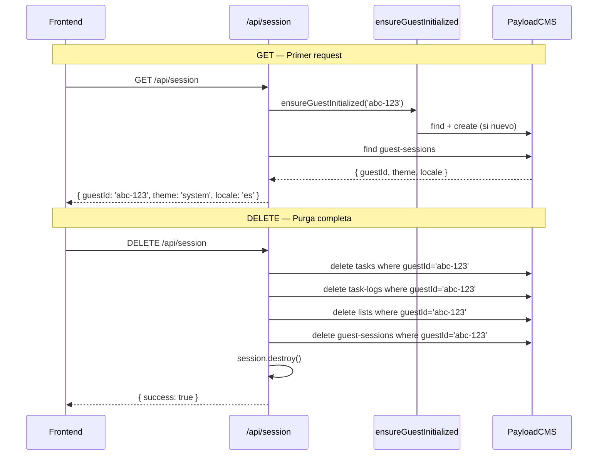

# Design: Crear API Route de sesión

## Visual Mapping

| Elemento Stitch | Endpoint | Propósito |
|---|---|---|
| "2.Stack My Day" (sidebar) | GET /api/session | Obtener guestId para filtrar tareas y listas |
| "8.Config Main" (tema) | GET /api/session | Leer preferencia actual de tema |
| "8.Config Main" (borrar datos) | DELETE /api/session | Opción "Eliminar todos mis datos" |
| "13.Config Language" | GET /api/session | Leer locale actual |

## Diagrama de Flujo



## Código Esperado

```typescript
// src/app/(frontend)/api/session/route.ts
import { getPayload } from 'payload'
import { NextRequest, NextResponse } from 'next/server'
import config from '@payload-config'
import { getSession } from '@/lib/iron-session'
import { ensureGuestInitialized } from '@/lib/payload-client'

export async function GET(req: NextRequest) {
  try {
    const guestId = req.headers.get('x-guest-id')
    if (!guestId) {
      return NextResponse.json({ error: 'No session' }, { status: 401 })
    }

    await ensureGuestInitialized(guestId)

    const payloadConfig = await config
    const payload = await getPayload({ config: payloadConfig })

    const result = await payload.find({
      collection: 'guest-sessions',
      where: { guestId: { equals: guestId } },
      limit: 1,
      depth: 0,
    })

    const session = result.docs[0]
    return NextResponse.json({
      guestId: session.guestId,
      createdAt: session.createdAt,
      locale: session.locale,
      theme: session.theme,
      notificationsEnabled: session.notificationsEnabled,
    })
  } catch (error) {
    console.error('[GET /api/session]', error)
    return NextResponse.json({ error: 'Service unavailable' }, { status: 503 })
  }
}

export async function DELETE(req: NextRequest) {
  try {
    const guestId = req.headers.get('x-guest-id')
    if (!guestId) {
      return NextResponse.json({ error: 'No session' }, { status: 401 })
    }

    const payloadConfig = await config
    const payload = await getPayload({ config: payloadConfig })

    await payload.delete({ collection: 'tasks', where: { guestId: { equals: guestId } } })
    await payload.delete({ collection: 'task-logs', where: { guestId: { equals: guestId } } })
    await payload.delete({ collection: 'lists', where: { guestId: { equals: guestId } } })
    await payload.delete({ collection: 'guest-sessions', where: { guestId: { equals: guestId } } })

    const res = NextResponse.json({ success: true })
    const session = await getSession(req, res)
    session.destroy()
    await session.save()

    return res
  } catch (error) {
    console.error('[DELETE /api/session]', error)
    return NextResponse.json({ error: 'Service unavailable' }, { status: 503 })
  }
}
```
