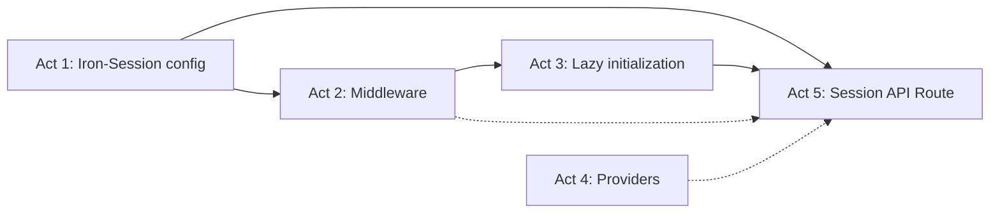

# Phase 2 Enrichment: Auth & Session Infrastructure

> **Fase:** `2.Session-Auth-Infrastructure/`  
> **Derivado de:** `plan.md` (Fase 2), `design.md` (Secciones 5.C, 5.D, 6.6), `spec.md` (Sección 1 — Bandera Técnica #3)

---

## Resumen de la Fase

Implementar el flujo completo de sesión guest anónima: middleware de Next.js que crea/lee cookies Iron-Session cifradas, inyección del `x-guest-id` header para downstream, inicialización lazy del guest en PayloadCMS (GuestSession + 4 listas default), providers de TanStack Query y Theme, y API Route de gestión de sesión.

**Objetivo clave:** El middleware NO bloquea el request para inicializar datos en DB. La cookie Iron-Session es la fuente de verdad de la identidad; PayloadCMS es un cache de persistencia. Si la DB no responde, el guest opera con defaults.

---

## Análisis de Impacto en PayloadCMS

| Colección | Slug | Impacto en esta Fase | Dependencia de Fase 1 |
|---|---|---|---|
| `GuestSessions` | `guest-sessions` | **Lectura y escritura** vía `ensureGuestInitialized()` desde el API Route de sesión | Sí — debe existir de Fase 1 |
| `Lists` | `lists` | **Escritura** de 4 listas default durante la inicialización lazy del guest | Sí — debe existir de Fase 1 |
| `Tasks` | `tasks` | Sin impacto directo en esta fase | — |
| `TaskLogs` | `task-logs` | Sin impacto directo en esta fase | — |
| `FocusSessions` | `focus-sessions` | Sin impacto directo en esta fase | — |
| `Users` | `users` | Sin impacto (solo admin) | — |
| `Media` | `media` | Sin impacto | — |

**Prerrequisito:** Fase 1 debe estar completa. Las colecciones `GuestSessions` y `Lists` deben estar registradas en `payload.config.ts` y sus tipos generados en `payload-types.ts`.

**Nuevos endpoints de PayloadCMS consumidos (via REST interno):**
- `POST /api/guest-sessions` — creación de sesión guest
- `GET /api/guest-sessions?where[guestId][equals]={id}` — verificar existencia
- `POST /api/lists` — creación de listas default
- `GET /api/lists?where[guestId][equals]={id}` — listar listas del guest

---

## Listado de Actividades

| # | Actividad | Archivos Destino | PayloadCMS Involucrado |
|---|---|---|---|
| 1 | Configurar Iron-Session | `src/lib/iron-session.ts` | — (solo config de cookie) |
| 2 | Implementar middleware Next.js | `src/middleware.ts` | — (solo lectura/escritura de cookie) |
| 3 | Implementar lazy guest initialization | `src/lib/payload-client.ts` | `guest-sessions` (CRUD), `lists` (create defaults) |
| 4 | Configurar providers React | `src/providers/QueryProvider.tsx`, `src/providers/ThemeProvider.tsx`, `src/app/(frontend)/layout.tsx` | — (solo frontend) |
| 5 | Crear API Route de sesión | `src/app/(frontend)/api/session/route.ts` | `guest-sessions` (lectura), `tasks` + `lists` (purga) |

---

## Detalle de Hitos por Actividad

### Actividad 1: Configurar Iron-Session

**Descripción técnica:** Crear el módulo de configuración de Iron-Session con las opciones de cookie cifrada y el tipo `SessionData` que se usará en el middleware y API Routes.

**Hitos:**

| # | Hito | Descripción | Criterio de Aceptación |
|---|---|---|---|
| 1.1 | Definir SessionData | Crear interfaz `SessionData` con `guestId?: string` y `createdAt?: string` | Tipo exportable y reutilizable |
| 1.2 | Definir sessionOptions | Configurar `password` desde `process.env.IRON_SESSION_PASSWORD` (fallback para dev), `cookieName: 'task-sphere-session'`, `cookieOptions.secure: true` en producción, `httpOnly: true`, `sameSite: 'lax'`, `maxAge: 604800` (7 días) | Opciones completas y seguras |
| 1.3 | Exportar config | Exportar `sessionOptions`, `SessionData`, y un helper `getSession(req, res)` que envuelva `getIronSession` | Puede importarse desde middleware y API Routes |

### Actividad 2: Implementar middleware de Next.js

**Descripción técnica:** Crear el middleware global de Next.js que intercepta cada request, lee o crea la cookie Iron-Session, e inyecta el `x-guest-id` en los headers para que las API Routes y PayloadCMS access control puedan usarlo.

**Hitos:**

| # | Hito | Descripción | Criterio de Aceptación |
|---|---|---|---|
| 2.1 | Estructura base del middleware | Crear `src/middleware.ts` con función `middleware(request: NextRequest)` que retorna `NextResponse.next()` | Archivo compila, middleware se ejecuta en cada request |
| 2.2 | Leer sesión existente | Usar `getIronSession()` con `sessionOptions` para leer la cookie `task-sphere-session` del request | Si existe cookie válida, `session.guestId` contiene el UUID |
| 2.3 | Crear sesión nueva | Si `session.guestId` es undefined: generar `crypto.randomUUID()`, asignar `session.guestId` y `session.createdAt`, ejecutar `await session.save()` | Nueva cookie cifrada se envía al cliente |
| 2.4 | Inyectar x-guest-id header | Crear `requestHeaders` a partir de `request.headers`, añadir `x-guest-id` con el valor de `session.guestId`, retornar `NextResponse.next({ request: { headers: requestHeaders } })` | Todas las API Routes pueden leer `req.headers.get('x-guest-id')` |
| 2.5 | Configurar matcher | Añadir `export const config = { matcher: '/((?!_next|api/auth|admin|static|favicon.ico).*)' }` para excluir rutas de PayloadCMS admin y assets estáticos | Admin panel de PayloadCMS funciona sin cookie guest |

### Actividad 3: Implementar lazy guest initialization

**Descripción técnica:** Crear el helper `ensureGuestInitialized()` que se ejecuta en el primer request de datos de cada guest. Verifica si existe una `GuestSession` en PayloadCMS para el `guestId` actual; si no existe, la crea junto con las 4 listas default (My Day, Important, Planned, Tasks).

**Hitos:**

| # | Hito | Descripción | Criterio de Aceptación |
|---|---|---|---|
| 3.1 | Crear payload-client.ts | Crear `src/lib/payload-client.ts` con helper `getPayloadClient()` que importe config async y retorne instancia de Payload | Helper reutilizable en todas las API Routes |
| 3.2 | Implementar ensureGuestInitialized | Función async que: (1) busca `guest-sessions` por `guestId`, (2) si no existe, crea `GuestSession` con campos `guestId`, `createdAt`, `lastActiveAt`, `expiresAt` (+7d), (3) crea 4 `List` default con nombres e iconos definidos | En el primer request, la DB tiene GuestSession + 4 lists para el guest |
| 3.3 | Idempotencia | Si `ensureGuestInitialized` se llama múltiples veces para el mismo guestId, no duplica datos (la búsqueda previa retorna early) | Múltiples llamadas = mismo resultado |
| 3.4 | Manejo de errores | Si PayloadCMS no responde (DB bloqueada), la función falla silenciosamente — el guest opera sin datos persistidos hasta el próximo request | No hay crash, el frontend muestra estado vacío |

### Actividad 4: Configurar providers React

**Descripción técnica:** Crear los providers de TanStack Query (caching cliente-servidor) y Theme (modo claro/oscuro con detección de preferencia del sistema). Integrarlos en el layout raíz.

**Hitos:**

| # | Hito | Descripción | Criterio de Aceptación |
|---|---|---|---|
| 4.1 | Crear QueryProvider | Componente cliente (`'use client'`) que envuelve children con `QueryClientProvider` de TanStack Query. Crear `QueryClient` con opciones: `staleTime: 30_000`, `gcTime: 300_000`, `retry: 1` | Todas las consultas TanStack Query funcionan en la app |
| 4.2 | Crear ThemeProvider | Componente cliente que: (1) detecta `prefers-color-scheme` via `matchMedia`, (2) aplica clase `dark` al `<html>` cuando corresponde, (3) persiste preferencia en `localStorage`, (4) expone contexto `{ theme, setTheme }` | Dark mode funciona y persiste entre sesiones |
| 4.3 | Integrar en layout raíz | En `src/app/(frontend)/layout.tsx`: importar y anidar `QueryProvider > ThemeProvider > {children}`. Actualizar `<html>` para soportar `className` dinámico. Añadir metadata correcta (title: "Task Sphere", description: "...") | Layout funcional con providers anidados |

### Actividad 5: Crear API Route de sesión

**Descripción técnica:** Crear el endpoint REST para que el frontend consulte el estado de la sesión actual y pueda purgar todos los datos del guest.

**Hitos:**

| # | Hito | Descripción | Criterio de Aceptación |
|---|---|---|---|
| 5.1 | GET /api/session | Leer `x-guest-id` del header (inyectado por middleware), ejecutar `ensureGuestInitialized()`, buscar `GuestSession` en PayloadCMS, retornar `{ guestId, createdAt, theme, locale }` | Frontend recibe datos de sesión al cargar |
| 5.2 | DELETE /api/session | Leer `x-guest-id`, eliminar todas las `Tasks` del guest, todas las `Lists`, el `TaskLog`, y la `GuestSession`. Luego destruir la cookie Iron-Session. Retornar `{ success: true }` | Guest completamente purgado; nuevo visitante comienza de cero |
| 5.3 | Error handling | Si `x-guest-id` no existe (middleware no se ejecutó), retornar 401. Si PayloadCMS falla, retornar 503 con mensaje amigable | Respuestas HTTP consistentes |
| 5.4 | Type-safe response | La respuesta de GET /api/session debe tiparse con `SessionData` de Iron-Session + campos de `GuestSession` | Cliente TypeScript recibe datos correctamente tipados |

---

## Justificación Arquitectónica

Este desglose sigue los principios definidos en `design.md`:

1. **Thin API Proxy Pattern:** La Actividad 5 (API Route) es el primer endpoint del patrón "thin proxy" definido en `design.md` 1.A. Valida la sesión y delega a PayloadCMS — no contiene lógica de negocio.

2. **Lazy Initialization (design.md 6.6):** La Actividad 3 implementa la inicialización diferida del guest. El middleware (Actividad 2) solo crea la cookie — nunca bloquea el request para escribir en DB. Esto garantiza TTI < 1.5s incluso en primera carga.

3. **Cookie as Source of Truth (design.md §0, Trade-off #3):** La sesión guest sobrevive a caídas de PayloadCMS porque la cookie Iron-Session contiene la identidad. Si `ensureGuestInitialized()` falla, el frontend opera con datos vacíos hasta el próximo request.

4. **Separation of Concerns:** Cada actividad tiene una responsabilidad única:
   - Iron-Session config (Act 1) = definición de tipos y opciones
   - Middleware (Act 2) = interceptación de requests
   - Payload client (Act 3) = inicialización en DB
   - Providers (Act 4) = estado del frontend
   - API Route (Act 5) = interfaz REST para el frontend

### Mapa de Dependencias entre Actividades

- Act 1 → Act 2 (middleware necesita sessionOptions)
- Act 2 → Act 3 (middleware inyecta guestId; lazy init usa guestId)
- Act 1 + Act 3 → Act 5 (API route necesita sessionOptions + ensureGuestInitialized)
- Act 4 es independiente y puede ejecutarse en paralelo con Act 1-3

### Dependencia con Fase 1

Esta fase requiere que las colecciones `GuestSessions` y `Lists` estén creadas y registradas en PayloadCMS (Fase 1, Actividades 1-2). Sin ellas, `ensureGuestInitialized()` no puede escribir en DB y el session API route falla.
