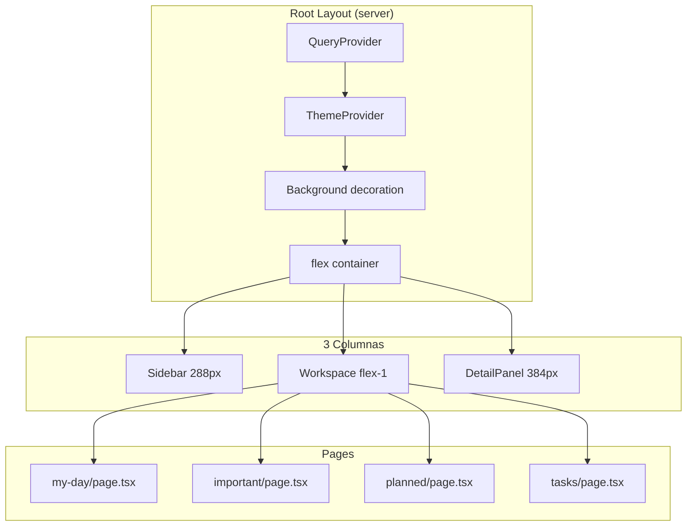

# Design: Crear layout de 3 columnas

## Visual Mapping

| Elemento Stitch (2.Stack My Day) | Componente Técnico | Token Tailwind |
|---|---|---|
| Panel lateral izquierdo glass | `<Sidebar />` (Act 2) | `w-sidebar-width` (288px), `glass-panel` |
| Área central de tareas | `<main>` workspace | `flex-1`, `p-container-padding` (3rem) |
| Panel derecho de detalle | `<DetailPanel />` | `w-detail-panel-width` (384px) |
| Fondo con blur circles | `div` decoration | `bg-primary/5`, `blur-3xl`, `pointer-events-none` |
| Superficies translúcidas | `GlassPanel` wrapper | `glass-panel` class |

## Diagrama de Layout



## Layout Desktop

```text
+-----------------------------------------------------------------+
| +----------+  +--------------------------+  +----------------+ |
| |          |  |  +--------------------+  |  |                | |
| | SIDEBAR  |  |  |      TopBar        |  |  |  DETAIL        | |
| | 288px    |  |  +--------------------+  |  |  PANEL         | |
| | glass    |  |  |                    |  |  |  384px         | |
| |          |  |  |     WORKSPACE      |  |  |  glass         | |
| | Logo     |  |  |     flex-1         |  |  |                | |
| | Nav      |  |  |     p-3rem         |  |  |  TaskDetail    | |
| | Lists    |  |  |                    |  |  |                | |
| |          |  |  |  EmptyState /      |  |  |                | |
| | Profile  |  |  |  TaskList          |  |  |                | |
| +----------+  |  |                    |  |  +----------------+ |
|               |  +--------------------+  |                     |
|               +--------------------------+                     |
+-----------------------------------------------------------------+
```

## Código Esperado

### layout.tsx (modificado)

```tsx
import React from 'react'
import './styles.css'
import { QueryProvider } from '@/providers/QueryProvider'
import { ThemeProvider } from '@/providers/ThemeProvider'

export const metadata = {
  title: 'Task Sphere',
  description: 'Task Sphere — Gestión de tareas simple y elegante',
}

export default async function RootLayout({ children }: { children: React.ReactNode }) {
  return (
    <html lang="es" suppressHydrationWarning>
      <body>
        <QueryProvider>
          <ThemeProvider>
            <div className="fixed top-[-200px] right-[-200px] w-[600px] h-[600px] bg-primary/5 rounded-full blur-3xl pointer-events-none -z-10" />
            <div className="fixed bottom-[-100px] left-[-100px] w-[400px] h-[400px] bg-secondary/5 rounded-full blur-3xl pointer-events-none -z-10" />
            <div className="flex min-h-screen">
              <aside className="w-sidebar-width h-screen sticky top-0 overflow-y-auto glass-panel hidden lg:flex flex-col border-r border-subtle-light dark:border-subtle-dark" />
              <main className="flex-1 min-h-screen overflow-y-auto p-container-padding max-lg:p-container-padding-mobile">
                {children}
              </main>
              <aside className="w-detail-panel-width h-screen sticky top-0 overflow-y-auto glass-panel hidden lg:flex flex-col border-l border-subtle-light dark:border-subtle-dark" />
            </div>
          </ThemeProvider>
        </QueryProvider>
      </body>
    </html>
  )
}
```

### GlassPanel.tsx

```tsx
export function GlassPanel({
  children,
  className = '',
}: {
  children: React.ReactNode
  className?: string
}) {
  return <div className={`glass-panel ${className}`}>{children}</div>
}
```

### DetailPanel.tsx

```tsx
'use client'

export function DetailPanel({
  children,
  open = false,
  onClose,
  className = '',
}: {
  children: React.ReactNode
  open?: boolean
  onClose?: () => void
  className?: string
}) {
  return (
    <aside
      className={`w-detail-panel-width h-screen sticky top-0 overflow-y-auto glass-panel flex-col border-l border-subtle-light dark:border-subtle-dark ${open ? 'flex' : 'hidden'} lg:flex ${className}`}
    >
      {onClose && (
        <button
          onClick={onClose}
          className="absolute top-3 right-3 p-1 rounded-full hover:bg-surface-container transition-colors lg:hidden"
          aria-label="Cerrar panel"
        >
          <span className="material-symbols-outlined text-on-surface-variant">close</span>
        </button>
      )}
      {children}
    </aside>
  )
}
```
