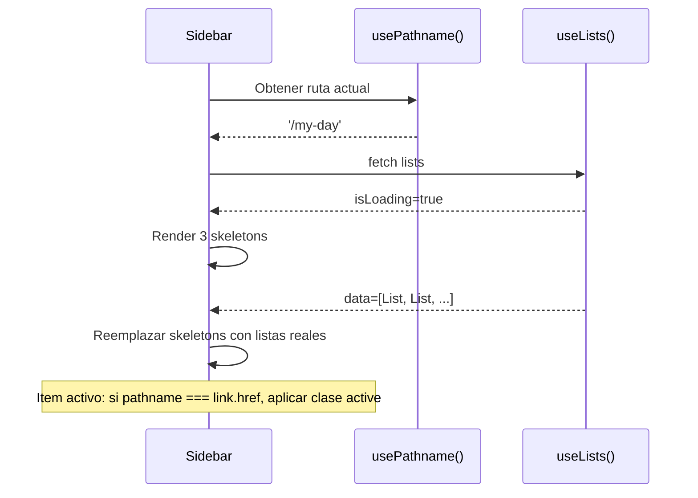

# Design: Implementar Sidebar

## Visual Mapping

| Elemento Stitch (HTML) | Componente React | Token/Clase |
|---|---|---|
| Logo `blur_on` + "Ethereal Focus" | `div.logo` | `bg-primary rounded-xl`, `font-headline-md text-primary` |
| Nav My Day (activo) | `<Link href="/my-day">` | `bg-primary-container/10 text-primary border-l-4 border-primary` |
| Nav Important (inactivo) | `<Link href="/important">` | `text-on-surface-variant hover:bg-surface-variant/50` |
| Nav Planned | `<Link href="/planned">` | icono `calendar_month` |
| Nav Tasks | `<Link href="/tasks">` | icono `task_alt` |
| Sección Lists | `useLists()` + map | Skeleton: `animate-pulse`, datos: icon + name |
| Botón New List | `<button>` | `bg-primary text-white rounded-xl` |
| Footer avatar | `div` placeholder | `w-10 h-10 rounded-full bg-surface-container-high` |
| Footer Settings | `<Link href="/settings">` | icono `settings` |
| Footer Help | `<Link href="/help">` | icono `help` |

## Árbol del Componente

```mermaid
graph TD
    SB[Sidebar.tsx - 'use client']
    SB --> LOGO[Logo: blur_on + Ethereal Focus]
    SB --> NAV[Navegación: 4 Links]
    SB --> LISTS[Sección Lists]
    LISTS --> SKEL[Skeleton loading 3x]
    LISTS --> ITEMS[useLists().map render]
    SB --> NEWLIST[Botón New List]
    SB --> FOOTER[Footer]
    FOOTER --> AVATAR[Avatar placeholder]
    FOOTER --> NAME["Guest"]
    FOOTER --> LINKS[Settings + Help]
```

## Flujo de Estado



## Código Esperado (estructura principal)

```tsx
// src/components/layout/Sidebar.tsx
'use client'

import Link from 'next/link'
import { usePathname } from 'next/navigation'

const NAV_ITEMS = [
  { href: '/my-day', label: 'My Day', icon: 'sunny' },
  { href: '/important', label: 'Important', icon: 'star' },
  { href: '/planned', label: 'Planned', icon: 'calendar_month' },
  { href: '/tasks', label: 'Tasks', icon: 'task_alt' },
]

export function Sidebar() {
  const pathname = usePathname()

  return (
    <aside className="w-sidebar-width h-full flex flex-col overflow-y-auto custom-scrollbar">
      {/* Logo */}
      <div className="px-6 mb-8">
        <div className="flex items-center gap-3 mb-2">
          <div className="w-10 h-10 rounded-xl bg-primary flex items-center justify-center text-white">
            <span className="material-symbols-outlined" style={{ fontVariationSettings: "'FILL' 1" }}>blur_on</span>
          </div>
          <div>
            <h1 className="font-headline-md font-bold text-primary">Ethereal Focus</h1>
            <p className="font-label-sm text-on-surface-variant">Stay productive</p>
          </div>
        </div>
      </div>

      {/* Navigation */}
      <nav className="flex-1 px-4 space-y-1">
        {NAV_ITEMS.map((item) => {
          const isActive = pathname === item.href
          return (
            <Link
              key={item.href}
              href={item.href}
              className={`flex items-center gap-3 px-4 py-3 transition-all duration-200 rounded-r-lg ${
                isActive
                  ? 'bg-primary-container/10 text-primary font-semibold border-l-4 border-primary'
                  : 'text-on-surface-variant hover:bg-surface-variant/50'
              }`}
            >
              <span className="material-symbols-outlined">{item.icon}</span>
              <span className="font-body-md">{item.label}</span>
            </Link>
          )
        })}

        {/* Lists section */}
        <div className="pt-8">
          <p className="font-label-sm text-on-surface-variant uppercase tracking-wider px-4 pb-2">Lists</p>
          {/* useLists() rendering — ver Actividad 6 */}
          <div className="space-y-1">
            {/* Skeleton loading state */}
            {[1, 2, 3].map((i) => (
              <div key={i} className="w-full h-10 bg-surface-container-high rounded-lg animate-pulse" />
            ))}
          </div>
        </div>

        {/* New List button */}
        <div className="pt-4 px-0">
          <button className="w-full py-2.5 px-4 bg-primary text-white rounded-xl font-body-md font-semibold flex items-center justify-center gap-2 hover:bg-primary-container transition-all active:scale-[0.98]">
            <span className="material-symbols-outlined">add</span>
            New List
          </button>
        </div>
      </nav>

      {/* Footer */}
      <div className="px-4 mt-auto border-t border-subtle-light dark:border-subtle-dark pt-4 pb-2">
        <div className="flex items-center gap-3 px-4 py-3 mb-1">
          <div className="w-10 h-10 rounded-full bg-surface-container-high flex items-center justify-center text-on-surface-variant">
            <span className="material-symbols-outlined">person</span>
          </div>
          <div>
            <p className="font-body-md font-semibold text-on-surface">Guest</p>
          </div>
        </div>
        <Link href="/settings" className="flex items-center gap-3 px-4 py-3 text-on-surface-variant hover:bg-surface-variant/50 transition-all rounded-lg">
          <span className="material-symbols-outlined">settings</span>
          <span className="font-body-md">Settings</span>
        </Link>
        <Link href="/help" className="flex items-center gap-3 px-4 py-3 text-on-surface-variant hover:bg-surface-variant/50 transition-all rounded-lg">
          <span className="material-symbols-outlined">help</span>
          <span className="font-body-md">Help</span>
        </Link>
      </div>
    </aside>
  )
}
```
