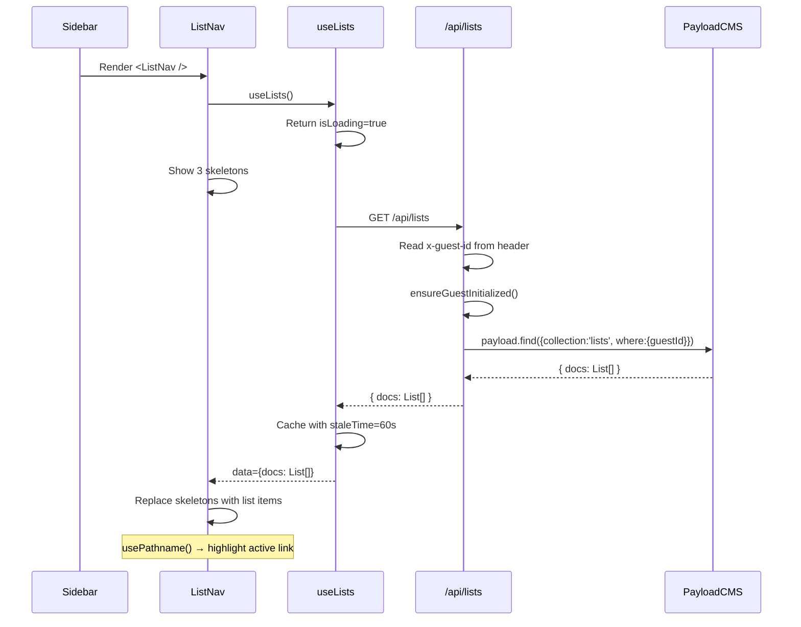

# Design: Implementar hook useLists y ListNav

## Visual Mapping

| Elemento UI | Componente | Fuente de datos |
|---|---|---|
| Sección Lists en Sidebar | `<ListNav />` | `useLists()` hook → `/api/lists` → PayloadCMS |
| Skeleton loading | 3x `div.animate-pulse` | Estado `isLoading` |
| Item de lista | `<Link href="/lists/{id}">` + icono + nombre | `List.icon` + `List.name` |
| Lista activa | Clase `bg-primary-container/10 text-primary border-l-4 border-primary` | `pathname === href` |
| Lista inactiva | Clase `text-on-surface-variant hover:bg-surface-variant/50` | `pathname !== href` |

## Diagrama de Flujo



## Diagrama de Routing de API

```text
Request: GET /api/lists
Header: x-guest-id (inyectado por middleware Iron-Session)

Route Handler:
1. Read guestId from headers
2. If no guestId → 401
3. ensureGuestInitialized(payload, guestId) — crea session + 4 default lists si no existen
4. payload.find({ collection: 'lists', where: { guestId }, sort: 'sortOrder' })
5. Return { docs: List[] }
```

## Código Esperado

### API Route

```ts
// src/app/(frontend)/api/lists/route.ts
import { NextRequest, NextResponse } from 'next/server'
import { getPayload } from 'payload'
import config from '@payload-config'

export async function GET(req: NextRequest) {
  const guestId = req.headers.get('x-guest-id')
  if (!guestId) {
    return NextResponse.json({ error: 'No session' }, { status: 401 })
  }

  const payloadConfig = await config
  const payload = await getPayload({ config: payloadConfig })

  const { ensureGuestInitialized } = await import('@/lib/payload-client')
  await ensureGuestInitialized(payload, guestId)

  const lists = await payload.find({
    collection: 'lists',
    where: { guestId: { equals: guestId } },
    sort: 'sortOrder',
  })

  return NextResponse.json(lists)
}
```

### Hook useLists

```ts
// src/hooks/useLists.ts
'use client'

import { useQuery } from '@tanstack/react-query'
import type { List } from '@/payload-types'

const LISTS_KEY = 'lists'

export function useLists() {
  return useQuery<{ docs: List[] }>({
    queryKey: [LISTS_KEY],
    queryFn: async () => {
      const res = await fetch('/api/lists')
      if (!res.ok) throw new Error('Failed to fetch lists')
      return res.json()
    },
    staleTime: 60_000,
  })
}

export function useList(id: string) {
  const { data, isLoading } = useLists()
  const list = data?.docs?.find((l) => l.id === id)
  return { data: list, isLoading }
}
```

### Componente ListNav

```tsx
// src/components/lists/ListNav.tsx
'use client'

import Link from 'next/link'
import { usePathname } from 'next/navigation'
import { useLists } from '@/hooks/useLists'

export function ListNav() {
  const pathname = usePathname()
  const { data, isLoading, error } = useLists()

  if (error) return null // silent fail

  return (
    <div className="flex flex-col gap-0.5">
      <span className="font-label-sm text-on-surface-variant px-3 py-2 uppercase tracking-wider">
        Lists
      </span>

      {isLoading ? (
        <>
          {[1, 2, 3].map((i) => (
            <div
              key={i}
              className="h-10 rounded-xl bg-surface-container-high animate-pulse mx-3"
            />
          ))}
        </>
      ) : data?.docs?.length === 0 ? (
        <p className="font-body-md text-on-surface-variant px-3 py-2">No lists yet</p>
      ) : (
        data?.docs?.map((list) => {
          const href = `/lists/${list.id}`
          const isActive = pathname === href
          return (
            <Link
              key={list.id}
              href={href}
              className={`flex items-center gap-3 px-3 py-2 rounded-xl transition-colors ${
                isActive
                  ? 'bg-primary-container/10 text-primary border-l-4 border-primary font-semibold'
                  : 'text-on-surface-variant hover:bg-surface-variant/50 border-l-4 border-transparent'
              }`}
            >
              <span className="material-symbols-outlined text-xl">{list.icon || 'list'}</span>
              <span className="font-body-md truncate flex-1">{list.name}</span>
            </Link>
          )
        })
      )}
    </div>
  )
}
```

## Tipos

```ts
// Uso de tipos de payload-types.ts
import type { List } from '@/payload-types'

// List contiene: id, name, icon?, color?, guestId, isDefault?, sortOrder?
```

## Integración en Sidebar

```diff
// src/components/layout/Sidebar.tsx
 import { 4 NavLinks } from './NavLinks'
+import { ListNav } from '@/components/lists/ListNav'
-{/* Hardcoded lists placeholder */}
+<ListNav />
```
