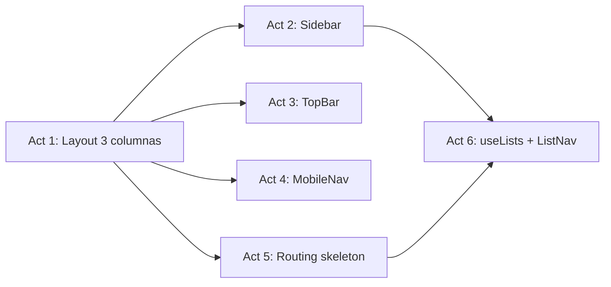

# Phase 3 Enrichment: UI Shell — Layout & Navigation

> **Fase:** `3.UI-Shell-Layout/`  
> **Derivado de:** `plan.md` (Fase 3), `design.md` (Sección 4 — estructura de directorios), `spec.md` (Sección 6.1 — tokens de layout), prototipos HTML `2.Stack My Day`, `8.Config Main`, `4.Stack Important`

---

## Resumen de la Fase

Construir el esqueleto visual completo de la aplicación: layout de 3 columnas (sidebar 288px glass, workspace fluido, detail panel 384px), componentes de navegación (sidebar con listas y perfil, topbar, mobile bottom nav), y la estructura de routing con páginas skeleton para los 4 stacks principales.

**Nota:** Esta fase no tiene impacto directo en colecciones de PayloadCMS. Toda la data que se muestra (listas en sidebar) se consume vía API Routes que se implementan en Fase 4. En esta fase los componentes se construyen con datos mock/placeholder y se conectan en Fase 4.

---

## Análisis de Impacto en PayloadCMS

| Colección | Slug | Impacto en esta Fase |
|---|---|---|
| `Lists` | `lists` | **Lectura indirecta** — el Sidebar y ListNav se diseñan esperando datos de esta colección, pero la conexión real (API Route + TanStack Query) se implementa en Actividad 6 (hook `useLists`) y se integra plenamente en Fase 4 |
| `Tasks` | `tasks` | Sin impacto directo — los stacks se crean como páginas skeleton |
| `GuestSessions` | `guest-sessions` | Sin impacto — el perfil del guest se muestra con datos mock |
| `Users`, `Media`, `TaskLogs`, `FocusSessions` | — | Sin impacto |

**Prerrequisito:** Fase 2 completa (middleware + providers funcionando para que las páginas rendericen correctamente con el layout y tema).

---

## Listado de Actividades

| # | Actividad | Archivos Destino | Stitch (UI) |
|---|---|---|---|
| 1 | Crear layout de 3 columnas | `src/app/(frontend)/layout.tsx`, `src/components/layout/DetailPanel.tsx`, `src/components/common/GlassPanel.tsx` | 2.Stack My Day (estructura general) |
| 2 | Implementar Sidebar | `src/components/layout/Sidebar.tsx` | 2.Stack My Day (sidebar) |
| 3 | Implementar TopBar | `src/components/layout/TopBar.tsx` | 2.Stack My Day (header) |
| 4 | Implementar MobileNav | `src/components/layout/MobileNav.tsx` | 4.Stack Important (mobile nav) |
| 5 | Crear páginas de routing skeleton | `src/app/(frontend)/(stacks)/my-day/page.tsx`, `important/page.tsx`, `planned/page.tsx`, `tasks/page.tsx`, `src/app/(frontend)/page.tsx` | — (routing) |
| 6 | Implementar hook useLists | `src/hooks/useLists.ts`, `src/app/(frontend)/api/lists/route.ts`, `src/components/lists/ListNav.tsx` | 2.Stack My Day (listas en sidebar) |

---

## Detalle de Hitos por Actividad

### Actividad 1: Crear layout de 3 columnas

**Descripción técnica:** Actualizar el layout raíz para implementar la estructura de 3 columnas del diseño Ethereal Focus. El layout debe ser un Server Component que envuelva las páginas con la estructura sidebar + workspace + detail panel opcional. Crear el componente `DetailPanel` (wrapper del panel derecho de 384px) y `GlassPanel` (componente reutilizable con glassmorphism).

**Hitos:**

| # | Hito | Descripción | Criterio de Aceptación |
|---|---|---|---|
| 1.1 | Refactorizar layout raíz | Convertir `src/app/(frontend)/layout.tsx` en layout de 3 columnas: sidebar `<aside>` fijo `w-sidebar-width` (288px) con `glass-panel`, workspace `<main>` flex-1 con `p-container-padding` (3rem desktop, 1rem mobile), detail panel `<aside>` fijo `w-detail-panel-width` (384px) con `glass-panel` y `hidden lg:flex` para responsive | Layout de 3 columnas visible en desktop; detail panel oculto en mobile |
| 1.2 | Background decoration | Añadir elementos decorativos: blur circles posicionados fixed (top-right primary/5, bottom-left secondary/5) replicando los prototipos HTML | Efecto "aero/zen" de fondo visible |
| 1.3 | Componente GlassPanel | Crear `src/components/common/GlassPanel.tsx` como wrapper `
` con clases `glass-panel` y `transition-all`. Aceptar `className` prop para personalización | Componente reutilizable en Sidebar, DetailPanel y cualquier superficie glass |
| 1.4 | Componente DetailPanel | Crear `src/components/layout/DetailPanel.tsx` como wrapper del panel derecho. Debe aceptar `children` y opcionalmente `open` state para mostrar/ocultar. Incluir botón de cierre (X) | Panel derecho funcional, oculto por defecto en mobile |

### Actividad 2: Implementar Sidebar

**Descripción técnica:** Implementar el componente Sidebar replicando fielmente el prototipo HTML `2.Stack My Day`. Incluye: logo + nombre "Ethereal Focus", navegación principal (My Day, Important, Planned, Tasks), sección "Lists" con listas dinámicas, botón "New List" (placeholder que abre modal en Fase 5), y footer con perfil del guest + enlaces Settings/Help.

**Hitos:**

| # | Hito | Descripción | Criterio de Aceptación |
|---|---|---|---|
| 2.1 | Estructura del Sidebar | Componente `'use client'` con `<aside>` fijo `w-sidebar-width`, `h-full`, `flex-col`. Logo: icono `blur_on` en contenedor primary rounded-xl + texto "Ethereal Focus". Navegación con 4 links usando Material Symbols y etiquetas | Sidebar visible y funcional, coincide con prototipo |
| 2.2 | Sección Lists dinámica | Renderizar listas del guest usando `useLists()` hook (Actividad 6). Mostrar cada lista con su icono + nombre. Si no hay listas aún (loading), mostrar 3 Skeleton items | Listas se renderizan desde datos de PayloadCMS |
| 2.3 | Botón New List | Botón primario "New List" con icono `add`. Por ahora es placeholder (muestra alert o no-op). El modal real se implementa en Fase 5 | Botón visible y clickeable |
| 2.4 | Footer del Sidebar | Sección inferior con: avatar circular (placeholder), nombre "Guest", enlace Settings (icono `settings`), enlace Help (icono `help`), separador border-t | Footer completo y navegable |

### Actividad 3: Implementar TopBar

**Descripción técnica:** Crear la barra superior de cada stack que muestra el título de la vista actual, la fecha, y botones de acción (sort, focus mode). Debe ser un componente sticky con efecto glass.

**Hitos:**

| # | Hito | Descripción | Criterio de Aceptación |
|---|---|---|---|
| 3.1 | Estructura TopBar | Componente `<header>` sticky top-0 con `glass-panel`, `z-20`. Lado izquierdo: título `h1` con `text-headline-md` y `text-primary` + fecha con `text-label-sm`. Lado derecho: botones de acción | TopBar visible en todas las páginas de stacks |
| 3.2 | Botones de acción | Botón sort (icono `sort`) y botón focus mode (icono `lightbulb`). Hover states con `bg-surface-container` y `rounded-full`. Placeholder funcional (botones sin acción real) | Botones visibles y con feedback hover |
| 3.3 | Props de personalización | TopBar debe aceptar props: `title: string` (título del stack), `date?: string` (fecha opcional, default: today formatted), `actions?: ReactNode` para botones adicionales | Componente reutilizable en los 4 stacks |

### Actividad 4: Implementar MobileNav

**Descripción técnica:** Crear la navegación inferior para mobile con 4 iconos (My Day, Important, Planned, Tasks). Visible solo en viewports pequeños.

**Hitos:**

| # | Hito | Descripción | Criterio de Aceptación |
|---|---|---|---|
| 4.1 | Estructura MobileNav | Componente `<nav>` fijo bottom-0, `w-full`, `h-16`, `bg-surface/80` con `glass-panel`, `border-t`. 4 botones con icono + label. Visible solo en `lg:hidden` | Bottom nav visible en mobile, oculto en desktop |
| 4.2 | Navegación activa | Cada botón navega a `/my-day`, `/important`, `/planned`, `/tasks`. Usar `usePathname()` para resaltar el stack activo con color primary | Navegación funcional y feedback visual del tab activo |

### Actividad 5: Crear páginas de routing skeleton

**Descripción técnica:** Crear la estructura de carpetas y páginas para los 4 stacks principales dentro de un route group compartido. Cada página renderiza el layout de 3 columnas con TopBar + contenido placeholder (texto "Coming soon" + EmptyState). La landing page redirige a `/my-day`.

**Hitos:**

| # | Hito | Descripción | Criterio de Aceptación |
|---|---|---|---|
| 5.1 | Route group (stacks) | Crear carpeta `src/app/(frontend)/(stacks)/` con archivo `layout.tsx` que renderiza Sidebar + TopBar + children + DetailPanel (sin necesidad de repetir en cada página) | Las páginas dentro de (stacks) heredan el layout completo |
| 5.2 | Páginas skeleton | Crear `my-day/page.tsx`, `important/page.tsx`, `planned/page.tsx`, `tasks/page.tsx`. Cada una renderiza TopBar con título correspondiente + EmptyState con mensaje contextual | 4 rutas funcionales que muestran el layout |
| 5.3 | Landing page redirect | Modificar `src/app/(frontend)/page.tsx` para redirigir a `/my-day` usando `redirect()` de Next.js | Visitar `/` lleva a `/my-day` |

### Actividad 6: Implementar hook useLists y ListNav

**Descripción técnica:** Crear el hook de TanStack Query para obtener las listas del guest desde PayloadCMS, la API Route que sirve los datos, y el componente `ListNav` que renderiza las listas en la sidebar con indicador de selección.

**Hitos:**

| # | Hito | Descripción | Criterio de Aceptación |
|---|---|---|---|
| 6.1 | API Route GET /api/lists | Crear `src/app/(frontend)/api/lists/route.ts` con GET que lee `x-guest-id` del header, ejecuta `ensureGuestInitialized()`, consulta PayloadCMS `payload.find({ collection: 'lists', where: { guestId } })`, retorna `{ docs: List[] }`. Respuesta 401 si no hay guestId | Endpoint devuelve listas del guest autenticado |
| 6.2 | Hook useLists | Crear `src/hooks/useLists.ts` con `useQuery({ queryKey: ['lists'], queryFn: fetch('/api/lists'), staleTime: 60000 })`. Exportar `useLists()` y `useList(id)` para obtener lista individual | Hook funcional, datos cacheados 60s |
| 6.3 | Componente ListNav | Crear `src/components/lists/ListNav.tsx` que usa `useLists()` y renderiza cada lista como un link lateral con icono + nombre. Soporta estado activo (clase `bg-primary-container/10 text-primary border-l-4 border-primary`) | Navegación de listas funcional en Sidebar |
| 6.4 | Integración en Sidebar | Reemplazar listas hardcodeadas en Sidebar (Actividad 2.2) con `<ListNav />` | Sidebar muestra listas dinámicas desde PayloadCMS |

---

## Justificación Arquitectónica

Este desglose sigue los principios definidos en `design.md`:

1. **Component-First, Data-Later:** Los componentes de layout (Act 1-4) se construyen primero con datos placeholder. La conexión a PayloadCMS (Act 6) se implementa al final de la fase. Esto permite iterar el diseño visual sin dependencias de backend.

2. **Route Group Reusable:** Las páginas de stacks comparten un `layout.tsx` dentro de `(stacks)/` que evita repetir Sidebar + TopBar + DetailPanel en cada página. Las páginas fuera de este grupo (settings, focus, help) tendrán su propio layout en fases posteriores.

3. **Glassmorphism como Contrato Visual:** El componente `GlassPanel` (Act 1.3) encapsula el patrón `backdrop-blur(12px) + rgba(255,255,255,0.7)` definido en `design.md` 5.B, asegurando consistencia en todas las superficies translúcidas.

4. **TanStack Query en la Frontera:** El hook `useLists` (Act 6) es el primer hook de datos real. Se introduce al final de la fase para validar el pipeline completo: Componente → Hook → API Route → PayloadCMS → SQLite.

### Mapa de Dependencias entre Actividades

- Act 1 → Act 2, 3, 4 (los componentes se renderizan dentro del layout)
- Act 1 → Act 5 (las páginas skeleton usan el layout)
- Act 2 + Act 5 → Act 6 (ListNav se integra en Sidebar; API route necesita la ruta)

### Dependencia con Fases Anteriores

- **Fase 1** debe estar completa: Tailwind config con tokens de layout (sidebar-width, container-padding, glass-panel) disponibles
- **Fase 2** debe estar completa: middleware inyecta `x-guest-id`, providers (QueryProvider, ThemeProvider) funcionan, layout.tsx inicial tiene los providers anidados
