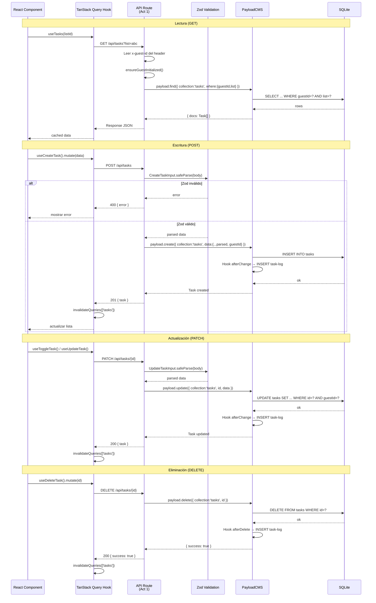

# Design: Mapeo UI → CMS — API Routes de Tasks

## 1. Visual Mapping: Elemento HTML → Estructura Payload

| Elemento HTML/Stitch | Componente React | Operación UI | API Route | Payload Field(s) | Tipo |
|---|---|---|---|---|---|
| Lista de tareas (`<div class="space-y-3">`) | `TaskList` | Leer tareas filtradas | `GET /api/tasks?list=X` | `where[list][equals]=X`, `where[guestId][equals]=Y` | Query |
| Checkbox circular (`input[type=checkbox]`) | `TaskCheckbox` | Toggle completado | `PATCH /api/tasks/{id}` | `status: 'pending' \| 'completed'`, `completedAt: date` | Select + Date |
| Texto de tarea (`p.text-task-item`) | `TaskItem` | Editar título | `PATCH /api/tasks/{id}` | `title: text` | Text |
| Input "Add a task" (`<input placeholder>`) | `AddTaskBar` | Crear tarea | `POST /api/tasks` | `title, description, list, dueDate, important` | All fields |
| Botón delete (`<span>delete</span>`) | `TaskItem` footer | Eliminar tarea | `DELETE /api/tasks/{id}` | — (hard delete) | — |
| Estrella (`<span>star</span>`) | `TaskItem` | Toggle importante | `PATCH /api/tasks/{id}` | `important: checkbox` | Checkbox |
| Fecha vencimiento (`calendar_today`) | `TaskDatePicker` | Asignar fecha | `PATCH /api/tasks/{id}` | `dueDate: date` | Date |
| Área de notas (`<textarea>`) | `TaskNotes` | Editar descripción | `PATCH /api/tasks/{id}` | `description: textarea` | Textarea |
| Drag handle (`drag_indicator`) | `TaskItem` | Reordenar | `PATCH /api/tasks/reorder` | `sortOrder: number` (batch) | Number |
| Subtareas (`Add step`) | `TaskSubsteps` | CRUD sub-pasos | `PATCH /api/tasks/{id}` | `subtasks: array` | Array |

## 2. Diagrama de Flujo de Datos



## 3. Diagrama de Dependencia entre Archivos

```mermaid
graph TD
    subgraph Actividad 1
        SCHEMAS[src/lib/schemas.ts]
        ROUTE_LIST[src/app/(frontend)/api/tasks/route.ts]
        ROUTE_ID[src/app/(frontend)/api/tasks/[id]/route.ts]
    end

    subgraph Ya Existe
        PC[src/lib/payload-client.ts]
        IS[src/lib/iron-session.ts]
        MW[src/middleware.ts]
        COL[src/collections/Tasks.ts]
        HOOK[TaskLogs hooks afterChange/afterDelete]
    end

    subgraph Consumidores
        USE_TASKS[src/hooks/useTasks.ts ← Act 6]
        TASK_LIST[TaskList.tsx ← Act 3]
        ADD_BAR[AddTaskBar.tsx ← Act 4]
    end

    ROUTE_LIST --> SCHEMAS
    ROUTE_ID --> SCHEMAS
    ROUTE_LIST --> PC
    ROUTE_ID --> PC
    ROUTE_LIST --> MW
    ROUTE_ID --> MW
    PC --> COL
    COL --> HOOK

    USE_TASKS -.-> ROUTE_LIST
    USE_TASKS -.-> ROUTE_ID
    TASK_LIST -.-> USE_TASKS
    ADD_BAR -.-> USE_TASKS
```

## 4. Tipos TypeScript (payload-types.ts relevantes)

```typescript
// Extraído de src/payload-types.ts
export interface Task {
  id: string
  title: string
  description?: string | null
  status: 'pending' | 'completed'
  important?: boolean | null
  dueDate?: string | null
  list: string | List
  guestId: string
  sortOrder?: number | null
  completedAt?: string | null
  subtasks?: {
    id?: string
    title: string
    completed?: boolean | null
  }[] | null
  createdAt: string
  updatedAt: string
}

export interface List {
  id: string
  name: string
  icon?: string | null
  color?: string | null
  guestId: string
  isDefault?: boolean | null
  sortOrder?: number | null
  createdAt: string
  updatedAt: string
}

// Schemas de entrada (Zod) — compartidos frontend/backend
export type CreateTaskInput = {
  title: string        // min 3, max 500, trimmed
  description?: string // max 5000
  list: string         // list ID
  dueDate?: string     // ISO datetime
  important?: boolean  // default false
}

export type UpdateTaskInput = {
  title?: string
  description?: string
  status?: 'pending' | 'completed'
  important?: boolean
  dueDate?: string | null
  sortOrder?: number
}
```

## 5. Seguridad: Encadenamiento de Guards

```
Request entrante
  │
  ▼
[1] Middleware (src/middleware.ts)
    • Verifica/crea cookie Iron-Session
    • Inyecta x-guest-id en headers
  │
  ▼
[2] API Route (Act 1)
    • Lee x-guest-id del header
    • Si no existe → 401
    • ensureGuestInitialized() (crea session + listas si es primer visita)
    • Valida body con Zod → si inválido → 400
    • Retry pattern SQLITE_BUSY (3 intentos)
  │
  ▼
[3] PayloadCMS Collection Access Control (src/collections/Tasks.ts)
    • read: guestId === session → filtra resultados
    • create: session existe
    • update: doc.guestId === session
    • delete: doc.guestId === session
  │
  ▼
[4] PayloadCMS Hooks (src/collections/Tasks.ts)
    • afterChange: CREATE/UPDATE → TaskLog
    • afterDelete: DELETE → TaskLog
  │
  ▼
[5] SQLite (WAL mode)
    • busy_timeout=5000
```

## 6. Estrategia de Errores Consistentes

```typescript
// Patrón de respuesta de error unificada
interface ApiError {
  error: string | { fieldErrors: Record<string, string[]>; formErrors: string[] }
}

// Códigos HTTP usados:
// 200 - Success (GET, PATCH, DELETE)
// 201 - Created (POST)
// 400 - Zod validation error
// 401 - No session (x-guest-id missing)
// 403 - Forbidden (trying to access another guest's task)
// 404 - Task not found
// 503 - Service unavailable (SQLITE_BUSY after 3 retries)
```
