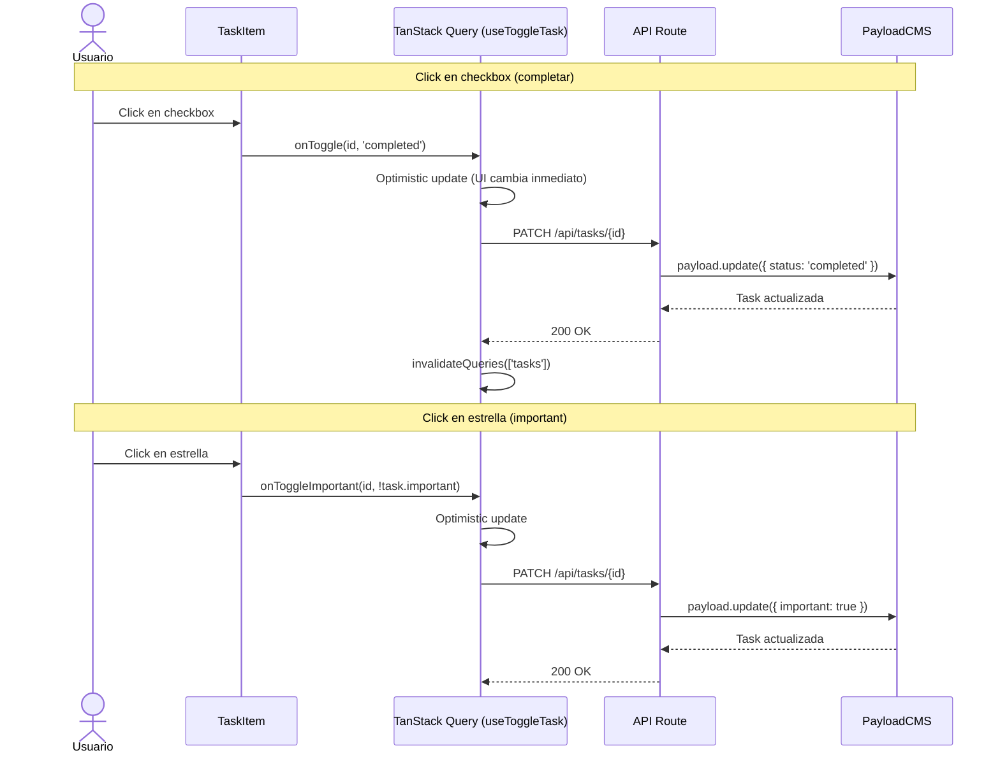
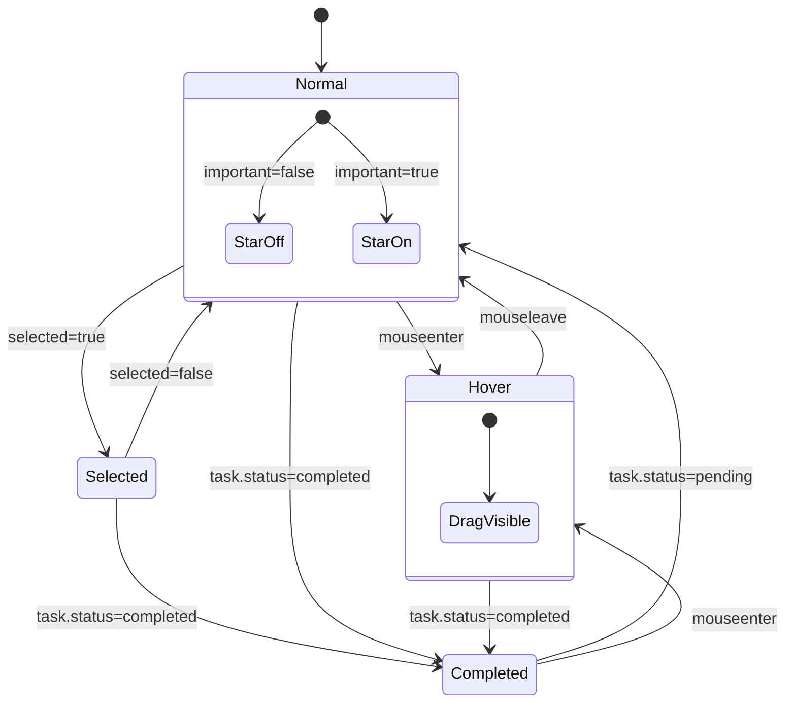

# Design: Mapeo UI → CMS — Componente TaskItem

## 1. Visual Mapping: Elemento HTML → TaskItem

| Elemento HTML (3.Task Details) | Clases CSS/Tailwind | TaskItem Elemento | Payload Field | Tipo Payload |
|---|---|---|---|---|
| `div.group` contenedor | `flex items-center gap-4 p-4 bg-surface-container-lowest rounded-xl` | `<div role="listitem">` | — (contenedor) | — |
| `input[type=checkbox]` | `w-6 h-6 rounded-full border-2 border-outline` | `<TaskCheckbox>` | `task.status` | `select: pending \| completed` |
| `p.text-task-item` | `text-on-surface font-task-item` | `<p>` título | `task.title` | `text` |
| `span.label-sm` metadata | `text-primary flex items-center gap-1` | `<span>` due date | `task.dueDate` | `date` |
| `span.label-sm` category | `text-text-secondary-light` | `<span>` list name | `task.list` (relationship) | `relationship -> lists` |
| `span.star` importante | `text-secondary` con FILL 1 | `<button>` estrella | `task.important` | `checkbox` |
| `span.drag_indicator` | `opacity-0 group-hover:opacity-100` | `<span>` drag handle | `task.sortOrder` | `number` |
| Estado "tarea completada" | `opacity-50 grayscale-[0.2] p line-through` | Clases condicionales | `task.status === 'completed'` | — |
| Estado "seleccionado" | `border-primary/20 bg-primary-fixed/10 shadow-sm` | Clases condicionales | `selected` prop | — |

## 2. Diagrama de Árbol de Componentes

```mermaid
graph TD
    subgraph "TaskList (Act 3)"
        TL[TaskList]
        TL --> TI1[TaskItem 1]
        TL --> TI2[TaskItem 2]
        TL --> TI3[TaskItem ...n]
    end

    subgraph "TaskItem (Act 2)"
        TI[TaskItem<br>'use client']
        TI --> CB[TaskCheckbox<br>Act 5 - delegado]
        TI --> TITLE[title span]
        TI --> META[metadata row]
        TI --> STAR[important button]
        TI --> DRAG[drag handle]
    end

    subgraph "Hooks (Act 6)"
        UT[useTasks hook]
        UT --> TT[useToggleTask]
        UT --> DI[useDeleteTask]
    end

    TL -->|props: listId, status| UT
    UT -->|data: Task[]| TL
    TL -->|task prop| TI
    TI -->|onToggle| TT
    TI -->|onToggleImportant| TT
    TI -->|onClick| DI
```

## 3. Diagrama de Flujo de Interacción



## 4. Estados del Componente (State Machine)



**Reglas de prioridad visual:**
1. `completed` tiene prioridad sobre todos los demás estados
2. `selected` se aplica sobre normal/hover pero no sobre completed
3. `important` es independiente de los demás (solo afecta a la estrella)

## 5. Tipo Task (desde payload-types.ts)

```typescript
// src/payload-types.ts (generado automáticamente)
export interface Task {
  id: number
  title: string
  description?: string | null
  status: 'pending' | 'completed'
  important?: boolean | null
  dueDate?: string | null
  list: number | List     // number si depth=0, List si depth>=1
  guestId: string
  sortOrder?: number | null
  completedAt?: string | null
  subtasks?: {
    title: string
    completed?: boolean | null
    id?: string | null
  }[] | null
  updatedAt: string
  createdAt: string
}

export interface List {
  id: number
  name: string
  icon?: string | null
  color?: string | null
  guestId: string
  isDefault?: boolean | null
  sortOrder?: number | null
  updatedAt: string
  createdAt: string
}
```

**Manejo de relationship `list`:** El campo `task.list` es `number | List`. Cuando se consulta con `depth: 0`, es solo el ID numérico. Con `depth: 1`, es el objeto `List` completo. TaskItem debe manejar ambos casos:

```typescript
const listName = typeof task.list === 'object' ? task.list?.name : null
const listIcon = typeof task.list === 'object' ? task.list?.icon : 'list'
```

## 6. Props Interface (contrato con TaskList)

```typescript
interface TaskItemProps {
  task: Task
  onToggle: (id: Task['id'], status: Task['status']) => void
  onToggleImportant: (id: Task['id'], important: boolean) => void
  onClick?: (id: Task['id']) => void
  selected?: boolean
}
```

## 7. Performance Consideration

TaskItem se renderiza en listas que pueden tener decenas de items. Estrategias:

- **React.memo:** Envolver con `React.memo` ya que las props cambian solo cuando la tarea cambia realmente
- **useCallback:** Los callbacks `onToggle`, `onToggleImportant`, `onClick` deben ser estables (referencia) desde el padre
- **Avoid inline styles:** Preferir clases condicionales con `cn()` o template literals sobre `style={}` para evitar re-renders
