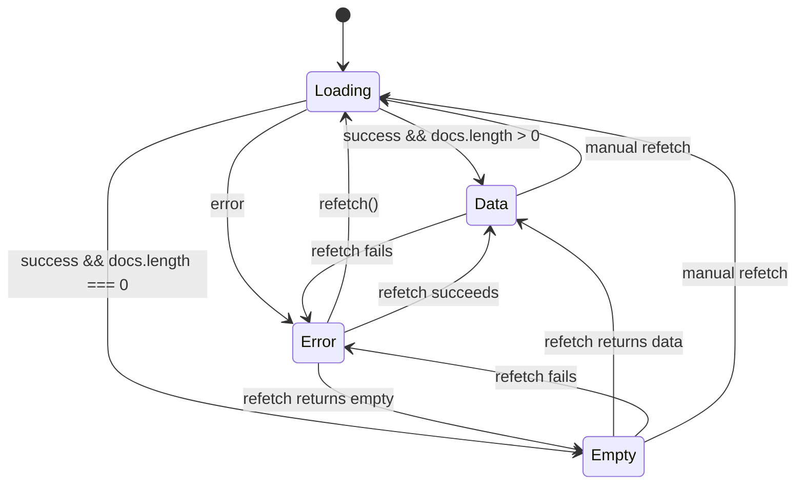
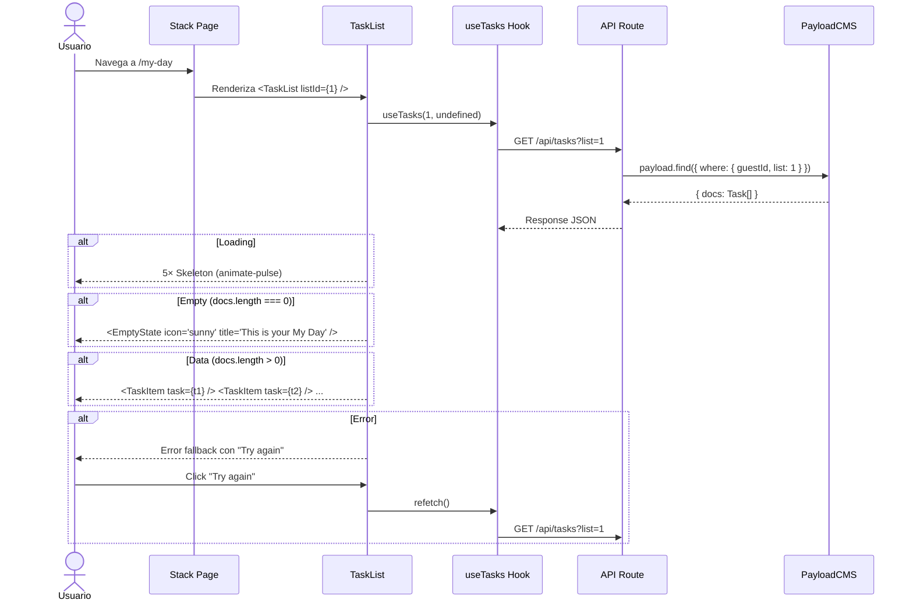
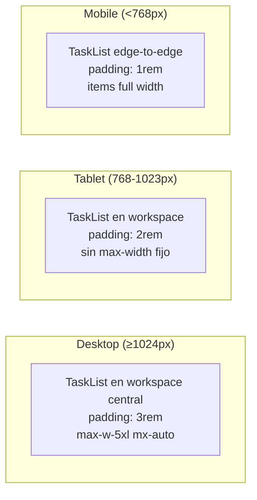

# Design: Mapeo UI → CMS — Componente TaskList

## 1. Visual Mapping: Estado HTML → TaskList State

| Estado HTML (prototipo) | Clase/Elemento | TaskList State | Componente Renderizado |
|---|---|---|---|
| Lista con items (`div.space-y-3 > div.group`) | `space-y-3` + items con `flex items-center gap-4 p-4...` | `data` | `<TaskItem>` × N dentro de `<div className="space-y-3">` |
| Stack vacío (1.Stack Vacio) | Hero icon + título + descripción + cards de sugerencia | `empty` | `<EmptyState icon="..." title="..." description="..." />` |
| (no existe en HTML) | Placeholder gris pulsante | `loading` | `<Skeleton />` × 5 |
| (no existe en HTML) | Icono error + mensaje + botón reintentar | `error` | `<div>` error fallback |

## 2. Diagrama de Árbol de Componentes

```mermaid
graph TD
    subgraph "Stack Page (Act 7)"
        SP[Stack Page<br/>my-day / important / planned / tasks]
        SP --> TB[TopBar]
        SP --> ATB[AddTaskBar]
        SP --> TL[TaskList]
    end

    subgraph "TaskList (Act 3)"
        TL[TaskList<br/>'use client']
        TL -->|isLoading| SK[Skeleton × 5]
        TL -->|isEmpty| ES[EmptyState]
        TL -->|isError| EF[Error Fallback]
        TL -->|hasData| TI[TaskItem × N]
    end

    subgraph "Data Layer (Act 6)"
        UT[useTasks hook]
        UT -->|GET /api/tasks| API
    end

    TL -->|useTasks(listId, status)| UT
    TI -->|Task props| UT
```

## 3. Diagrama de Estados (State Machine)



**Transacciones de estado:**
- La transición Loading→Data debe ser suave (sin flash de empty state)
- La transición Error→Data debe reemplazar el error por los items sin recargar la página
- El refetch manual desde error usa TanStack Query `refetch()`

## 4. Diagrama de Flujo de Datos



## 5. Tipos TypeScript

```typescript
// Desde payload-types.ts
export interface Task {
  id: number
  title: string
  description?: string | null
  status: 'pending' | 'completed'
  important?: boolean | null
  dueDate?: string | null
  list: number | List
  guestId: string
  sortOrder?: number | null
  completedAt?: string | null
  subtasks?: { title: string; completed?: boolean | null; id?: string | null }[] | null
  updatedAt: string
  createdAt: string
}

// Props del componente
interface TaskListProps {
  listId?: number
  status?: 'pending' | 'completed'
  emptyState?: {
    icon?: string
    title?: string
    description?: string
  }
}

// Interfaz del hook (definido en Act 6)
interface UseTasksReturn {
  data?: { docs: Task[]; totalDocs: number }
  isLoading: boolean
  isError: boolean
  error: Error | null
  refetch: () => Promise<...>
}
```

## 6. Responsive Behavior



**Reglas responsive en TaskList:**
- `px-container-padding` desktop, `px-container-padding-mobile` mobile (definido en tailwind.config.ts)
- Gap entre items: `space-y-3` consistente en todos los breakpoints
- TaskItem se adapta internamente (metadata row se colapsa en mobile)

## 7. Consideraciones de Performance

- **Virtualización:** Para MVP no es necesaria (el usuario guest típico tiene < 100 tareas)
- **React.memo en TaskItem:** TaskList debe asegurar que los callbacks pasados a cada TaskItem sean estables (usar `useCallback` en el hook padre)
- **Key:** Usar `task.id` como key en el map (garantiza reconciliación correcta)
- **Skeleton count:** 5 skeletons es suficiente para simular una carga típica sin ocupar demasiado viewport
