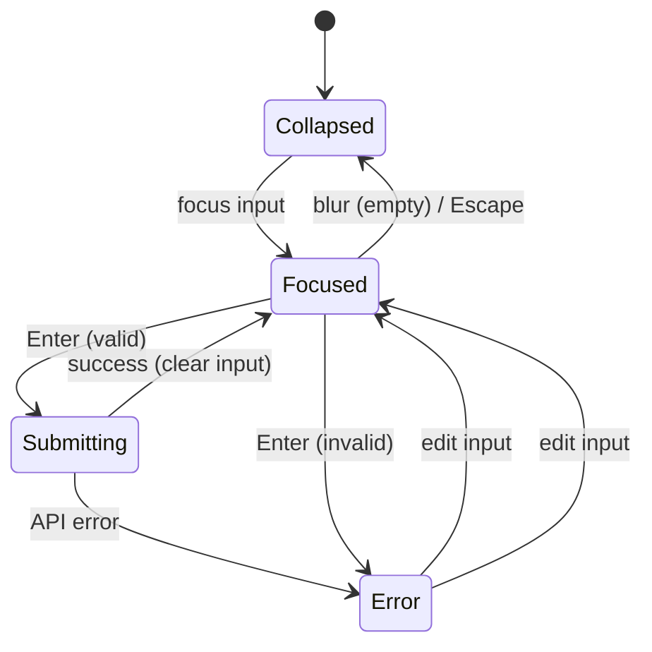
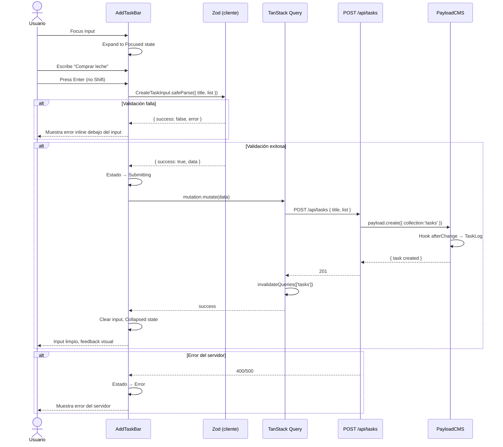
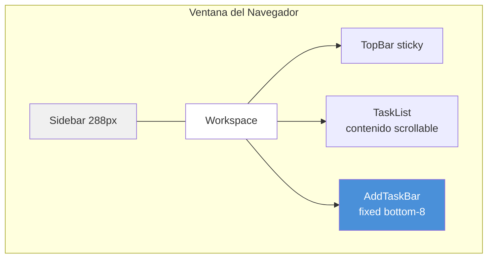

# Design: Mapeo UI → CMS — Componente AddTaskBar

## 1. Visual Mapping: Elemento HTML → AddTaskBar + Payload

| Elemento HTML (2.Stack My Day) | Clase/Estilo | AddTaskBar Elemento | Payload Field | Validación |
|---|---|---|---|---|
| `div.fixed.bottom-8` | Posicionamiento fijo al fondo | `<div>` contenedor | — | — |
| `div.bg-white/95 shadow-2xl rounded-2xl` | Glass panel con sombra | `<div>` glass container | — | — |
| `span.add` | Icono primary | Icono `add` / spinner | — | — |
| `input[placeholder]` | Texto contextual | `<input>` título | `tasks.title` | Zod min 3 chars |
| `button.calendar_month` | Toolbar icon | Botón placeholder | `tasks.dueDate` | Post-MVP |
| `button.notifications` | Toolbar icon | Botón placeholder | — | Post-MVP |
| `button.repeat` | Toolbar icon | Botón placeholder | — | Post-MVP |
| — | — | Mensaje error inline | — | Zod validation error |
| — | — | Estado submitting | — | POST response |

## 2. Diagrama de Estados



## 3. Diagrama de Flujo de Datos



## 4. Diagrama de Posicionamiento en el Layout



**Reglas de posicionamiento:**
- `fixed bottom-8`: 32px desde el borde inferior
- `left-[288px]`: comienza después de la sidebar
- `right-0`: se extiende hasta el borde derecho
- `pointer-events-none` en contenedor externo, `pointer-events-auto` en el interno
- `z-50`: sobre el contenido pero debajo de modales
- `px-12`: padding horizontal consistente con el workspace

**Responsive:**
| Breakpoint | left | padding |
|---|---|---|
| Desktop (≥1024px) | `left-[288px]` | `px-12` |
| Tablet (768-1023px) | `left-0` | `px-6` |
| Mobile (<768px) | `left-0` | `px-4` |

## 5. Tipos TypeScript

```typescript
// Zod schema (src/lib/schemas.ts — Act 1)
export const CreateTaskInput = z.object({
  title: z.string().min(3, 'Mínimo 3 caracteres').max(500).transform(s => s.trim()),
  description: z.string().max(5000).optional(),
  list: z.string().min(1, 'La lista es requerida'),
  dueDate: z.string().datetime().optional(),
  important: z.boolean().default(false),
})
export type CreateTaskInput = z.infer<typeof CreateTaskInput>

// Props del componente
interface AddTaskBarProps {
  listId: number
  listName?: string
  onTaskCreated?: () => void
}

// Estados internos
type AddTaskBarState = 'collapsed' | 'focused' | 'submitting' | 'error'

interface AddTaskBarStateInterface {
  state: AddTaskBarState
  value: string
  error: string | null
}
```

## 6. Accesibilidad

| Elemento | Atributo ARIA |
|---|---|
| Input | `aria-label="New task title"` |
| Toolbar buttons | `aria-label="Set due date"`, `aria-label="Set reminder"`, `aria-label="Repeat"` |
| Error message | `role="alert"`, `aria-live="polite"` |
| Contenedor | `role="form"` |
| Submit (Enter) | `onKeyDown` con detección de Enter sin Shift |

## 7. Consideraciones de UX

- **Transición suave:** `transition-all duration-300` en el contenedor al expandir/colapsar
- **Sin layout shift:** AddTaskBar es `fixed`, no afecta al flujo del documento
- **Toolbar informacional:** Los botones del toolbar son placeholder Post-MVP. Al clickear, mostrar breve snackbar "Coming soon" o simplemente no hacer nada
- **Placeholder dinámico:** Usar `listName` prop para personalizar: `"Add a task to '{listName}'..."`
- **Shift+Enter:** Insertar nueva línea en el input (para títulos multi-línea)
