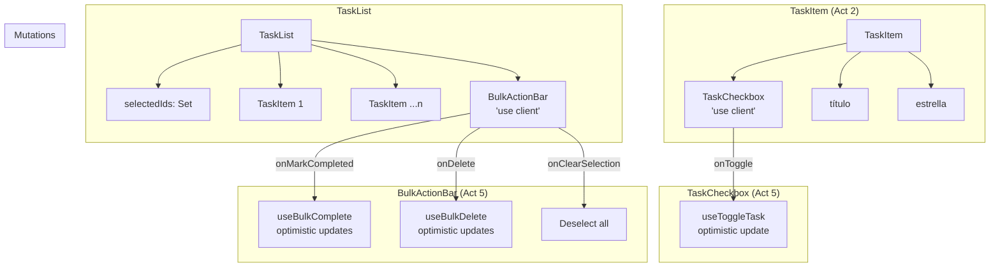
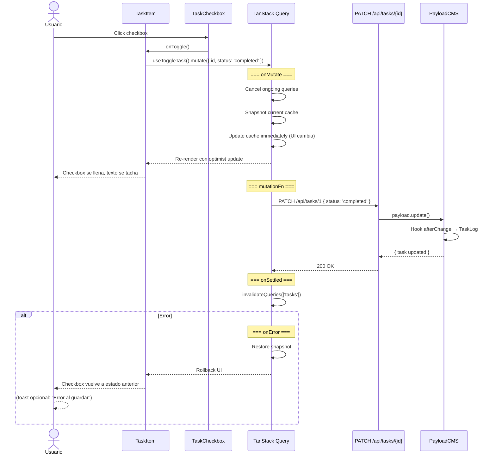
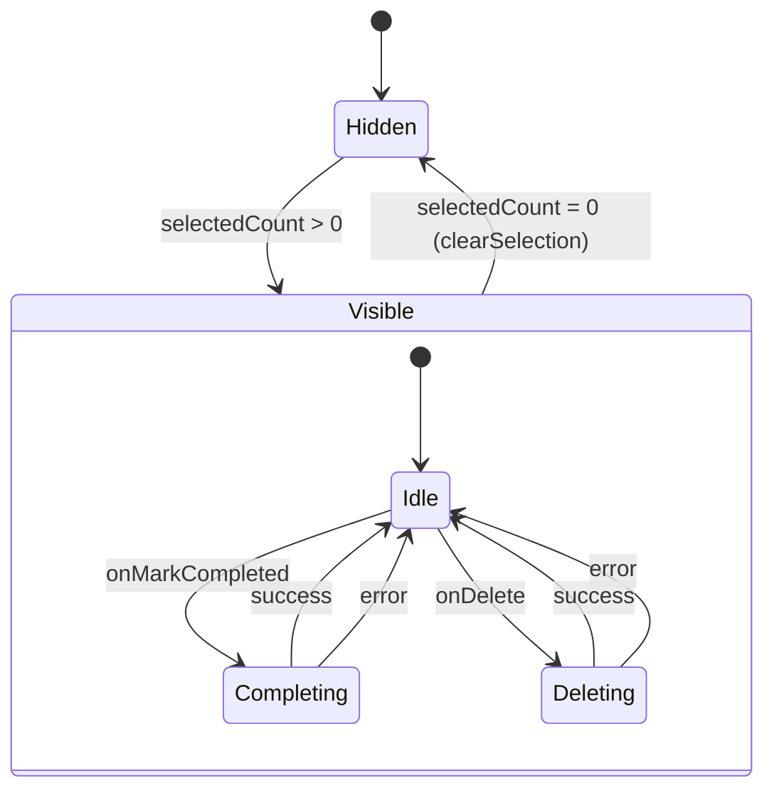

# Design: Mapeo UI → CMS — TaskCheckbox + BulkActionBar

## 1. Visual Mapping: HTML → Componentes → Payload

| Elemento HTML (2.Stack My Day) | Componente | Payload Field | Operación |
|---|---|---|---|
| `input[type=checkbox].rounded-full.border-2` (pending) | TaskCheckbox unchecked | `task.status = 'pending'` | — |
| `input[checked].rounded-full.border-primary` (checked) | TaskCheckbox checked | `task.status = 'completed'` | PATCH status |
| `div.w-6.h-6.rounded-full.bg-primary + check` (completed task) | TaskCheckbox completed | `task.status = 'completed'`, `task.completedAt` | PATCH + date |
| `header.sticky.bulk-action-bar` | BulkActionBar | — (orquestador) | — |
| `span "3 items selected"` | Contador | `selectedCount` prop | — |
| `button.check_circle "Mark as completed"` | Botón completar | `tasks[].status = 'completed'` | PATCH batch |
| `button.delete "Delete"` | Botón eliminar | `tasks[].id` | DELETE batch |
| `button.event_upcoming` | Placeholder | — | Post-MVP |
| `button.drive_file_move` | Placeholder | — | Post-MVP |

## 2. Diagrama de Árbol de Componentes



## 3. Optimistic Update Flow (TaskCheckbox)



## 4. BulkActionBar State Machine



## 5. Tipos TypeScript

```typescript
// TaskCheckbox props
interface TaskCheckboxProps {
  checked: boolean
  onToggle: () => void
  disabled?: boolean
  size?: 'sm' | 'md'       // sm=20px, md=24px
}

// BulkActionBar props
interface BulkActionBarProps {
  selectedCount: number
  onMarkCompleted: () => void
  onDelete: () => void
  onClearSelection: () => void
  onSetDueDate?: () => void
  onMoveToList?: () => void
}

// Mutación Toggle (definida en Act 6)
interface ToggleTaskParams {
  id: number
  status: 'pending' | 'completed'
}

// Task type (payload-types.ts)
export interface Task {
  id: number
  title: string
  status: 'pending' | 'completed'
  important?: boolean | null
  completedAt?: string | null
  // ... otros campos
}
```

## 6. Selección Múltiple: Modelo de Datos en TaskList

```typescript
// En TaskList (Act 3) — estado de selección
const [selectedIds, setSelectedIds] = useState<Set<number>>(new Set())

const toggleSelection = useCallback((id: number) => {
  setSelectedIds(prev => {
    const next = new Set(prev)
    if (next.has(id)) next.delete(id)
    else next.add(id)
    return next
  })
}, [])

const clearSelection = useCallback(() => {
  setSelectedIds(new Set())
}, [])

// Pasar a TaskItem
<TaskItem
  task={task}
  selected={selectedIds.has(task.id)}
  onSelect={() => toggleSelection(task.id)}  // Modo selección (checkbox adicional o long-press)
  onToggle={handleToggle}                     // Modo normal (checkbox principal)
/>

// Pasar a BulkActionBar
{selectedIds.size > 0 && (
  <BulkActionBar
    selectedCount={selectedIds.size}
    onMarkCompleted={() => bulkComplete(selectedIds)}
    onDelete={() => bulkDelete(selectedIds)}
    onClearSelection={clearSelection}
  />
)}
```

## 7. Responsive: BulkActionBar en Mobile

| Breakpoint | Layout | Comportamiento |
|---|---|---|
| Desktop (≥1024px) | Todos los botones visibles en fila | Igual que HTML |
| Tablet (768-1023px) | Botones colapsados, solo iconos | Tooltips en hover |
| Mobile (<768px) | Drawer desde abajo con acciones | Overlay + bottom sheet |

Para MVP: en mobile, los botones muestran solo el icono sin texto (tooltip opcional).
