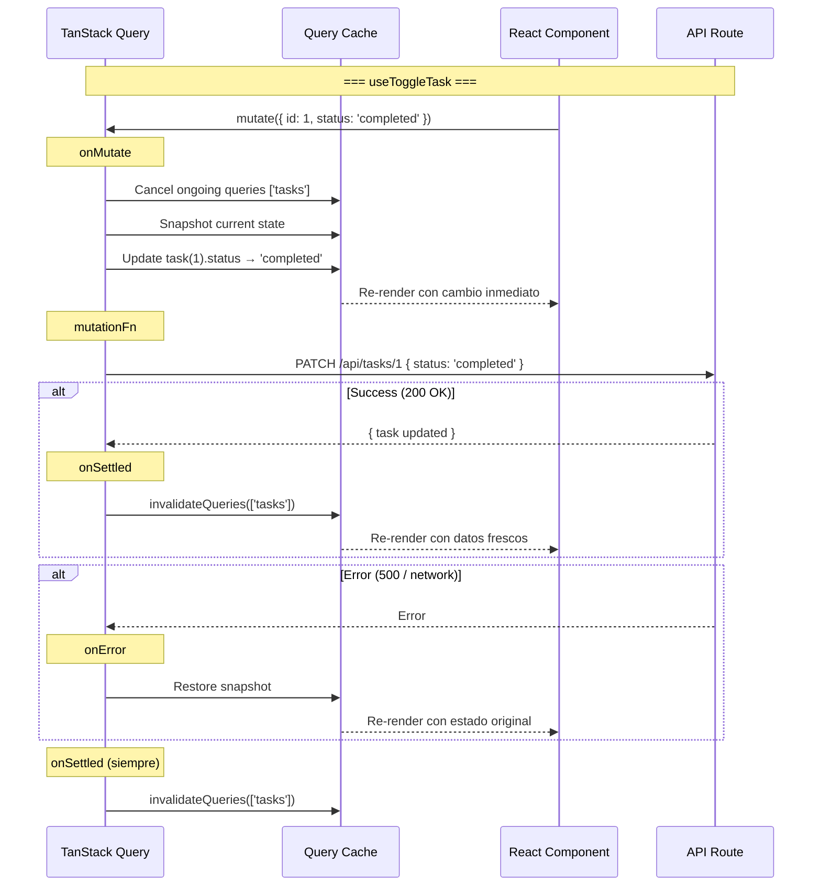

# Design: Mapeo UI → CMS — Hook useTasks

## 1. Visual Mapping: Componente UI → Hook → API → Payload

| Componente React | Hook | API Route | Payload Operation | Cache Strategy |
|---|---|---|---|---|
| `TaskList` | `useTasks(listId, status)` | `GET /api/tasks?list=X&status=Y` | `payload.find(where:{guestId,list,status})` | staleTime 30s, gcTime 5min |
| `AddTaskBar` | `useCreateTask()` | `POST /api/tasks` | `payload.create()` | invalidate ['tasks'] |
| `TaskCheckbox` (via TaskItem) | `useToggleTask(listId)` | `PATCH /api/tasks/{id}` | `payload.update({ status, completedAt })` | optimistic + invalidate |
| `TaskItem` delete | `useDeleteTask(listId)` | `DELETE /api/tasks/{id}` | `payload.delete()` | optimistic + invalidate |
| `TaskItem` edit / `TaskNotes` / `TaskDatePicker` | `useUpdateTask(listId)` | `PATCH /api/tasks/{id}` | `payload.update()` | invalidate ['tasks'] |

## 2. Diagrama de Flujo de Cache

```mermaid
graph TD
    subgraph "Query Cache"
        Q1[['tasks', 1, undefined]] --> T1["{ docs: Task[] }<br/>My Day"]
        Q2[['tasks', 2, undefined]] --> T2["{ docs: Task[] }<br/>Important"]
        Q3[['tasks', undefined, 'pending']] --> T3["{ docs: Task[] }<br/>All Pending"]
    end

    subgraph "Mutations"
        C[useCreateTask] -->|onSuccess| INV[invalidateQueries ['tasks']]
        T[useToggleTask] -->|onSettled| INV
        D[useDeleteTask] -->|onSettled| INV
        U[useUpdateTask] -->|onSuccess| INV
    end

    INV -.-> Q1
    INV -.-> Q2
    INV -.-> Q3

    style INV fill:#f9f,stroke:#333
```

## 3. Optimistic Update: Ciclo de Vida Completo



## 4. Estrategia de Query Keys

```typescript
// Estructura de query keys
const TASKS_KEY = 'tasks'

// Patrón: ['tasks', listId?, status?]
['tasks']                    // Todas las tareas (sin filtro)
['tasks', 1]                 // Tareas de lista 1
['tasks', 1, 'pending']      // Tareas pendientes de lista 1
['tasks', undefined, 'pending'] // Todas las tareas pendientes
```

**Invalidación:** Cualquier mutación invalida la raíz `['tasks']`, lo que refresca TODAS las variantes de filtro. Esto es deliberado para MVP — si hay problemas de performance, se puede migrar a invalidación selectiva.

## 5. Tipos TypeScript

```typescript
// payload-types.ts
export interface Task {
  id: number
  title: string
  description?: string | null
  status: 'pending' | 'completed'
  important?: boolean | null
  dueDate?: string | null
  list: number | List
  guestId: string
  sortOrder?: number | null
  completedAt?: string | null
  subtasks?: { title: string; completed?: boolean | null; id?: string | null }[] | null
  updatedAt: string
  createdAt: string
}

// Props de mutations
interface CreateTaskInput {
  title: string           // min 3, max 500, trimmed
  description?: string    // max 5000
  list: string            // list ID as string
  dueDate?: string        // ISO datetime
  important?: boolean     // default false
}

interface UpdateTaskInput {
  title?: string
  description?: string
  status?: 'pending' | 'completed'
  important?: boolean
  dueDate?: string | null
  sortOrder?: number
}

interface ToggleTaskParams {
  id: number
  status: 'pending' | 'completed'
}

// Retorno de useQuery
interface TasksResponse {
  docs: Task[]
  totalDocs: number
  limit: number
  totalPages: number
  page: number
  pagingCounter: number
  hasPrevPage: boolean
  hasNextPage: boolean
  prevPage: number | null
  nextPage: number | null
}
```

## 6. Diagrama de Dependencias entre Actividades

```mermaid
graph TD
    subgraph "Act 1: API Routes"
        GET[GET /api/tasks]
        POST[POST /api/tasks]
        PATCH[PATCH /api/tasks/{id}]
        DELETE[DELETE /api/tasks/{id}]
    end

    subgraph "Act 6: useTasks Hook"
        Q[useTasks query]
        C[useCreateTask]
        T[useToggleTask]
        D[useDeleteTask]
        U[useUpdateTask]
    end

    subgraph "Componentes Consumidores"
        TL[TaskList<br/>Act 3]
        ATB[AddTaskBar<br/>Act 4]
        TI[TaskItem/TaskCheckbox<br/>Acts 2+5]
        BAB[BulkActionBar<br/>Act 5]
    end

    Q --> GET
    C --> POST
    T --> PATCH
    D --> DELETE
    U --> PATCH

    TL --> Q
    ATB --> C
    TI --> T
    TI --> D
    BAB --> D
    TI --> U
```

## 7. Manejo de Errores

```typescript
// Patrón de error unificado en todas las mutations
// Los errores se propagan al componente consumidor via mutation.result.error

// En TaskList / AddTaskBar / TaskItem:
const createTask = useCreateTask()

// Mostrar error en UI
if (createTask.isError) {
  toast.error(createTask.error.message)
}

// Rollback automático en toggle/delete via onError
```

## 8. Consideraciones de Performance

- **useCallback no necesario:** useMutation retorna funciones estables por defecto
- **Query key estable:** Los parámetros `listId` y `status` deben ser estables (usar `useMemo` en el consumidor si se derivan de props)
- **gcTime 5min:** Suficiente para navegación entre stacks sin re-fetch
- **Deduplicación:** Si dos componentes montan `useTasks(1)`, solo un fetch ocurre gracias a TanStack Query
