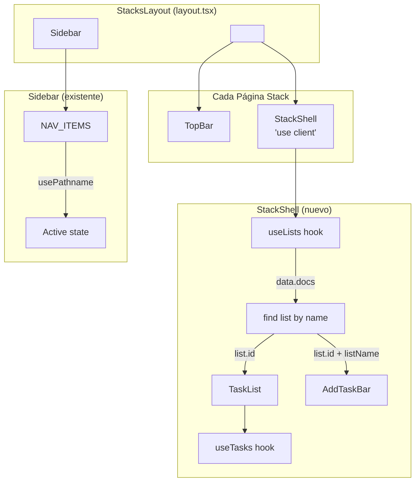
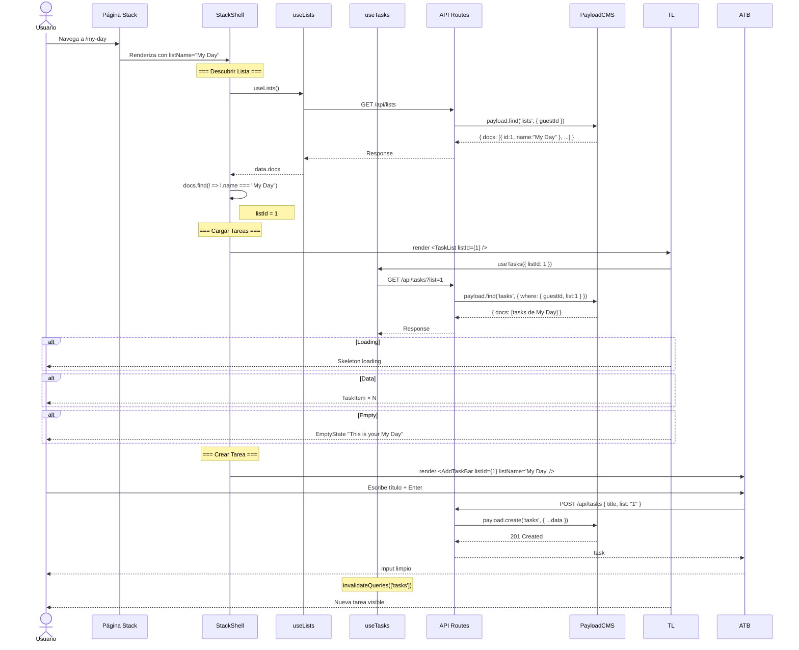

# Design: Mapeo UI → CMS — Integración de Stacks

## 1. Visual Mapping: Ruta → Componentes → Colección Payload

| Ruta | Título Stack | listName | Colección Payload | Filtro |
|---|---|---|---|---|
| `/my-day` | "My Day" | `"My Day"` | `tasks` + `lists` | `list.id = lists.find(name="My Day").id` |
| `/important` | "Important" | `"Important"` | `tasks` + `lists` | `list.id = lists.find(name="Important").id` |
| `/planned` | "Planned" | `"Planned"` | `tasks` + `lists` | `list.id = lists.find(name="Planned").id` |
| `/tasks` | "Tasks" | `"Tasks"` | `tasks` + `lists` | `list.id = lists.find(name="Tasks").id` |

## 2. Diagrama de Árbol de Componentes por Stack



## 3. Flujo de Datos: Stack → PayloadCMS



## 4. Mapa de Navegación entre Stacks

```mermaid
graph LR
    LANDING[/ → redirect] --> MYDAY[/my-day]
    
    MYDAY -->|sidebar| IMP[/important]
    MYDAY -->|sidebar| PLAN[/planned]
    MYDAY -->|sidebar| ALL[/tasks]
    
    IMP -->|sidebar| MYDAY
    IMP -->|sidebar| PLAN
    IMP -->|sidebar| ALL
    
    PLAN -->|sidebar| MYDAY
    PLAN -->|sidebar| IMP
    PLAN -->|sidebar| ALL
    
    ALL -->|sidebar| MYDAY
    ALL -->|sidebar| IMP
    ALL -->|sidebar| PLAN
    
    MYDAY -.->|AddTaskBar crea en My Day| LIST1[(My Day list)]
    IMP -.->|AddTaskBar crea en Important| LIST2[(Important list)]
    PLAN -.->|AddTaskBar crea en Planned| LIST3[(Planned list)]
    ALL -.->|AddTaskBar crea en Tasks| LIST4[(Tasks list)]
    
    style MYDAY fill:#dbe1ff
    style IMP fill:#ffe083
    style PLAN fill:#dce2f7
    style ALL fill:#e1e3e4
```

## 5. StackShell: Props y Tipos

```typescript
// StackShell props
interface StackShellProps {
  listName: string
  emptyState: {
    icon: string
    title: string
    description: string
  }
}

// Internal state
interface StackShellState {
  listId: number | null
  isLoading: boolean
  error: string | null
}
```

## 6. Sidebar Active State (ya implementado)

El Sidebar actual ya implementa la navegación activa usando `usePathname()`:

```typescript
// Sidebar.tsx (existente) — no requiere cambios
const NAV_ITEMS = [
  { href: '/my-day', label: 'My Day', icon: 'sunny' },
  { href: '/important', label: 'Important', icon: 'star' },
  { href: '/planned', label: 'Planned', icon: 'calendar_month' },
  { href: '/tasks', label: 'Tasks', icon: 'task_alt' },
]

const isActive = pathname === item.href
// → bg-primary-container/10 text-primary font-semibold border-l-4 border-primary
```

## 7. Mapa de Archivos

```diff
src/app/(frontend)/(stacks)/
├── layout.tsx                          # Sin cambios
├── my-day/
-│   └── page.tsx                       # EmptyState placeholder
+│   └── page.tsx                       # TopBar + StackShell
├── important/
-│   └── page.tsx                       # EmptyState placeholder
+│   └── page.tsx                       # TopBar + StackShell
├── planned/
-│   └── page.tsx                       # EmptyState placeholder
+│   └── page.tsx                       # TopBar + StackShell
└── tasks/
-    └── page.tsx                       # EmptyState placeholder
+    └── page.tsx                       # TopBar + StackShell

src/components/tasks/
+   └── StackShell.tsx                  # NUEVO: orquestador cliente
```

## 8. Consideraciones de Performance

- **useLists se comparte:** Las 4 páginas stack llaman a `useLists()`, pero TanStack Query lo cachea (staleTime 60s). Navegar entre stacks no dispara nuevo fetch de lists
- **useTasks por stack:** Cada stack tiene su propia query `['tasks', listId]`. Navegar entre stacks cambia el queryKey, por lo que cada stack tiene su propio caché
- **AddTaskBar inline:** Cada stack tiene su propio AddTaskBar. No hay estado compartido entre stacks — cada uno opera independientemente
