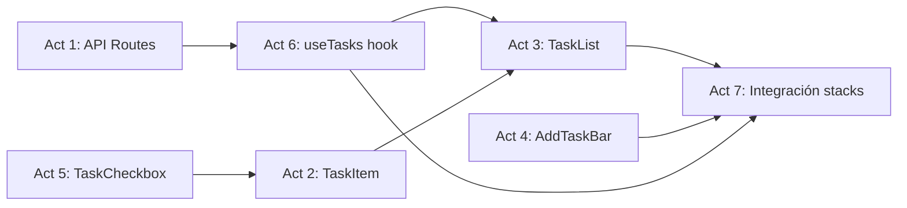

# Phase 4 Enrichment: Core Task CRUD & Integration

> **Fase:** `4.Core-Task-CRUD/`  
> **Derivado de:** `plan.md` (Fase 4), `design.md` (Secciones 1.B — Tasks collection, 6.5 — TanStack Query lifecycle, 5.D — API Route pattern), `spec.md` (Sección 2.2 — Tasks schema, Sección 5.2 — Gherkin scenarios)

---

## Resumen de la Fase

Implementar el flujo CRUD completo de tareas: API Routes custom con validación Zod + Iron-Session, componentes de UI (TaskItem, TaskList, AddTaskBar, TaskCheckbox, BulkActionBar, EmptyState, Skeleton), hook `useTasks` de TanStack Query con optimistic updates para toggle y delete, e integración final en los 4 stacks (My Day, Important, Planned, All Tasks).

**Esta es la fase más crítica del MVP** — conecta por primera vez el frontend (Fase 3) con PayloadCMS (Fase 1) a través del pipeline completo: Componente → Hook → API Route → PayloadCMS Collection → SQLite.

---

## Análisis de Impacto en PayloadCMS

| Colección | Slug | Impacto en esta Fase |
|---|---|---|
| `Tasks` | `tasks` | **CRUD completo** — lectura con filtros, creación, actualización (status, important, title), eliminación. Los hooks afterChange/afterDelete ya están implementados en Fase 1 y se activan automáticamente |
| `TaskLogs` | `task-logs` | **Escritura indirecta** — los hooks de Tasks escriben automáticamente en TaskLogs. No se toca directamente |
| `Lists` | `lists` | **Lectura** — para filtrar tareas por lista (relationship) |
| `GuestSessions` | `guest-sessions` | **Lectura** — `ensureGuestInitialized()` se llama desde las API Routes para garantizar que el guest existe en DB |
| `Users`, `Media`, `FocusSessions` | — | Sin impacto |

**Endpoints PayloadCMS consumidos (via REST interno desde API Routes):**
- `GET /api/tasks?where[guestId][equals]={id}&where[list][equals]={listId}` — listar tareas
- `POST /api/tasks` — crear tarea
- `PATCH /api/tasks/{id}` — actualizar tarea
- `DELETE /api/tasks/{id}` — eliminar tarea
- `GET /api/lists?where[guestId][equals]={id}` — obtener listas del guest (para el filtro My Day)

**Prerrequisito:** Fases 1, 2 y 3 completas. Colección `Tasks` registrada y tipos generados. Middleware Iron-Session inyectando `x-guest-id`. Layout de 3 columnas y rutas de stacks funcionando.

---

## Listado de Actividades

| # | Actividad | Archivos Destino | Colección PayloadCMS |
|---|---|---|---|
| 1 | Crear API Routes de Tasks | `src/app/(frontend)/api/tasks/route.ts`, `src/app/(frontend)/api/tasks/[id]/route.ts` | `tasks` (CRUD), `guest-sessions` (ensureInitialized) |
| 2 | Implementar componente TaskItem | `src/components/tasks/TaskItem.tsx` | — (solo UI) |
| 3 | Implementar componente TaskList | `src/components/tasks/TaskList.tsx`, `src/components/common/EmptyState.tsx`, `src/components/common/Skeleton.tsx` | — (solo UI) |
| 4 | Implementar componente AddTaskBar | `src/components/tasks/AddTaskBar.tsx` | — (solo UI + fetch POST) |
| 5 | Implementar componente TaskCheckbox + BulkActionBar | `src/components/tasks/TaskCheckbox.tsx`, `src/components/tasks/BulkActionBar.tsx` | — (solo UI + fetch PATCH) |
| 6 | Implementar hook useTasks | `src/hooks/useTasks.ts`, `src/lib/schemas.ts` | — (capa de datos) |
| 7 | Integrar TaskList en páginas stack | stacks `my-day`, `important`, `planned`, `tasks` | `tasks` (lectura con filtros) |

---

## Detalle de Hitos por Actividad

### Actividad 1: Crear API Routes de Tasks

**Descripción técnica:** Implementar las API Routes REST para el CRUD de tareas. Son el "thin proxy" definido en `design.md` 1.A: leen `x-guest-id` del header (inyectado por middleware), validan el body con Zod, delegan a PayloadCMS, y retornan la respuesta. Incluyen `ensureGuestInitialized()` para garantizar que el guest exista en DB antes de operar.

**Hitos:**

| # | Hito | Descripción | Criterio de Aceptación |
|---|---|---|---|
| 1.1 | GET /api/tasks | Leer `x-guest-id`, ejecutar `ensureGuestInitialized()`, construir filtro `where` con `guestId` + `list` (opcional) + `status` (opcional), ejecutar `payload.find({ collection: 'tasks', where, sort: 'sortOrder' })`, retornar `{ docs: Task[] }`. Responder 401 si no hay guestId | Endpoint lista tareas filtradas por guestId y opcionalmente por lista/status |
| 1.2 | POST /api/tasks | Validar body con `CreateTaskInput` de Zod (title min 3 chars, description opcional, list requerida). Si pasa: crear tarea en PayloadCMS con `guestId` del header. Si no pasa: retornar 400 con errores de Zod flatten. Responder 201 con la tarea creada | Creación validada y aislada por guest |
| 1.3 | PATCH /api/tasks/{id} | Validar body con `UpdateTaskInput` (campos opcionales: title, description, status, important, dueDate, sortOrder). Actualizar en PayloadCMS con `payload.update()`. Los hooks afterChange registran automáticamente el cambio en TaskLogs | Actualización parcial de cualquier campo |
| 1.4 | DELETE /api/tasks/{id} | Eliminar tarea con `payload.delete()`. El hook afterDelete registra la operación en TaskLogs. Retornar `{ success: true }` | Eliminación con auditoría automática |
| 1.5 | Zod schemas compartidos | Crear/actualizar `src/lib/schemas.ts` con `CreateTaskInput` (title: string min 3, description: string max 5000 opcional, list: string, dueDate: datetime opcional, important: boolean default false) y `UpdateTaskInput` (todos opcionales, dueDate nullable). Exportar tipos inferidos | Schemas reutilizables desde frontend y API Routes |
| 1.6 | Retry pattern SQLITE_BUSY | Envolver cada operación PayloadCMS con `withRetry()` (3 intentos, jitter exponencial: 100ms, 200ms, 400ms). Si todos fallan, retornar 503 | Resiliencia ante concurrencia SQLite |

### Actividad 2: Implementar componente TaskItem

**Descripción técnica:** Componente de tarea individual que reproduce el diseño del prototipo HTML `3.Task Details`. Incluye checkbox circular, texto de la tarea (con truncate), metadata (fecha, categoría), icono de estrella (important), y drag handle para reordenamiento futuro.

**Hitos:**

| # | Hito | Descripción | Criterio de Aceptación |
|---|---|---|---|
| 2.1 | Estructura base | Componente `'use client'` que renderiza un `
` con `group`, `flex`, `items-center`, `gap-4`, `p-4`, `bg-surface-container-lowest`, `rounded-xl`, `border border-transparent`. Estados: normal, hover (`hover:border-outline-variant hover:shadow-sm`), selected (`border-primary/20 bg-primary-fixed/10`), completed (`opacity-50`) | Coincide visualmente con prototipo 3.Task Details |
| 2.2 | Contenido dinámico | Props: `task: Task` (desde payload-types). Renderizar: checkbox (delegado a TaskCheckbox, Actividad 5), título con `text-task-item`, metadata row con icono + texto (dueDate o category), estrella (toggle important), drag handle `drag_indicator` visible en hover | Todos los campos de Task se renderizan |
| 2.3 | Tarea completada | Si `task.status === 'completed'`: añadir clase `opacity-50`, título con `line-through`, checkbox reemplazado por círculo primary con checkmark blanco | Coincide con prototipo (tarea "Morning meditation") |
| 2.4 | Acciones | Click en checkbox → `onToggle(task.id)`. Click en estrella → `onToggleImportant(task.id)`. Props `onToggle`, `onToggleImportant`, `onClick` para abrir detail panel | Acciones propagadas al padre |

### Actividad 3: Implementar componente TaskList

**Descripción técnica:** Lista de tareas que usa `useTasks()` hook para obtener datos y renderiza una colección de `TaskItem`. Maneja estados de carga (Skeleton), vacío (EmptyState), y error.

**Hitos:**

| # | Hito | Descripción | Criterio de Aceptación |
|---|---|---|---|
| 3.1 | Estructura TaskList | Componente que recibe `listId?` y `status?` como props, usa `useTasks(listId, status)`, renderiza `
` con `map` de `TaskItem`. Si `isLoading`: mostrar 5 `<Skeleton>` items. Si `data.docs.length === 0`: mostrar `<EmptyState>`. Si `isError`: mostrar mensaje de error | TaskList maneja todos los estados |
| 3.2 | Componente EmptyState | `src/components/common/EmptyState.tsx`. Renderizar icono + mensaje contextual según el stack (ej. "No tasks for today" en My Day, "No important tasks" en Important). Props: `icon: string`, `title: string`, `description?: string` | Mensaje amigable cuando no hay tareas |
| 3.3 | Componente Skeleton | `src/components/common/Skeleton.tsx`. Renderizar placeholder con `animate-pulse` y `bg-surface-container-high`. Coincidir altura y border-radius de TaskItem para evitar layout shift | Sin salto visual durante carga |

### Actividad 4: Implementar componente AddTaskBar

**Descripción técnica:** Input flotante anclado al fondo del workspace para crear nuevas tareas. Al hacer focus, se expande mostrando toolbar con opciones (calendar, notifications, repeat). Incluye validación Zod en cliente antes de enviar.

**Hitos:**

| # | Hito | Descripción | Criterio de Aceptación |
|---|---|---|---|
| 4.1 | Estructura AddTaskBar | Input fijo al fondo del workspace: `
` con `bg-white/95`, `border`, `shadow-2xl`, `rounded-2xl`, `p-2`, `flex`. Icono `add` primary a la izquierda, `<input>` flex-1 con placeholder contextual "Add a task to '[List Name]'..." | Coincide con prototipo 3.Task Details |
| 4.2 | Expand on focus | Al focus: expandir a multi-línea con toolbar de acciones (calendar_month, notifications, repeat). Cada botón con hover state `bg-surface-variant rounded-lg`. El input debe soportar `Enter` para crear y `Shift+Enter` para nueva línea | Toolbar visible al enfocar |
| 4.3 | Validación y envío | Al presionar Enter (sin Shift): validar título con `CreateTaskInput` de Zod en cliente. Si inválido: mostrar error inline. Si válido: ejecutar `useCreateTask().mutate({ title, list })`, limpiar input, mostrar feedback de creación | Creación validada antes de enviar al servidor |

### Actividad 5: Implementar componente TaskCheckbox + BulkActionBar

**Descripción técnica:** Checkbox circular animado que alterna el estado de la tarea con optimistic update. Barra de acciones masivas que aparece al seleccionar múltiples tareas (completar todas, eliminar seleccionadas).

**Hitos:**

| # | Hito | Descripción | Criterio de Aceptación |
|---|---|---|---|
| 5.1 | TaskCheckbox | Checkbox circular de 20px: `
`. En hover: `border-primary`. Al checkear: fondo `bg-primary` con checkmark blanco usando Material Symbol `check`. Animación CSS `transition-all duration-200` | Checkbox interactivo y animado |
| 5.2 | Optimistic toggle | Usar `useToggleTask()` mutation. `onMutate`: snapshot de queries actuales, actualizar cache inmediatamente (cambiar status + completedAt). `onError`: rollback al snapshot. `onSettled`: invalidar queries de tasks | UI refleja cambio inmediato; rollback si falla |
| 5.3 | BulkActionBar | Barra sticky que aparece cuando hay tareas seleccionadas. Muestra "X items selected", botones "Mark as completed" (check_circle), "Set due date" (event_upcoming), "Move to..." (drive_file_move), divider, "Delete" (delete, color error). Animación slide-in desde arriba | Coincide con prototipo 2.Stack My Day (bulk selection mode) |

### Actividad 6: Implementar hook useTasks

**Descripción técnica:** Suite de hooks de TanStack Query para operaciones CRUD de tareas. Incluye `useTasks()` para consultas con filtros, y mutations (`useToggleTask`, `useDeleteTask`, `useCreateTask`, `useUpdateTask`) con estrategias de invalidación.

**Hitos:**

| # | Hito | Descripción | Criterio de Aceptación |
|---|---|---|---|
| 6.1 | useTasks query | `useQuery({ queryKey: ['tasks', listId, status], queryFn: () => fetch(/api/tasks?list=...&status=...).then(r => r.json()), staleTime: 30_000, gcTime: 300_000 })`. Retornar `{ docs: Task[], totalDocs: number }` | Consulta con filtros y cache configurable |
| 6.2 | useCreateTask mutation | `useMutation({ mutationFn: (data: CreateTaskInput) => fetch POST /api/tasks })`. Sin optimistic update. `onSuccess`: invalidar `['tasks']`. `onError`: mostrar error | Creación con invalidación |
| 6.3 | useToggleTask mutation | `useMutation({ mutationFn: ({ id, status }) => fetch PATCH /api/tasks/{id} })`. Con optimistic update: `onMutate` hace snapshot + update cache, `onError` hace rollback, `onSettled` invalida queries | Toggle con optimistic update full cycle |
| 6.4 | useDeleteTask mutation | `useMutation({ mutationFn: (id) => fetch DELETE /api/tasks/{id} })`. Con optimistic update: eliminar del cache inmediatamente, rollback en error | Delete con optimistic update |
| 6.5 | useUpdateTask mutation | `useMutation({ mutationFn: ({ id, ...data }) => fetch PATCH /api/tasks/{id} })`. Sin optimistic update (para evitar flickering en edición de texto). `onSuccess`: invalidar queries | Edición sin optimistic update |

### Actividad 7: Integrar TaskList en páginas stack

**Descripción técnica:** Reemplazar los skeletons/placeholders de las 4 páginas stack (creadas en Fase 3) con `TaskList` funcional conectada a PayloadCMS. Cada stack filtra tareas según su propósito.

**Hitos:**

| # | Hito | Descripción | Criterio de Aceptación |
|---|---|---|---|
| 7.1 | My Day funcional | `my-day/page.tsx` usa `useLists()` para obtener la lista "My Day" (isDefault: true), luego `useTasks(listId=myDayList.id)`. Renderiza TopBar con título "My Day" + fecha + AddTaskBar + TaskList + EmptyState contextual | Stack My Day funcional con tareas del día |
| 7.2 | Important funcional | `important/page.tsx` usa `useLists()` + `useTasks(listId=importantList.id)`. Mismo patrón que My Day pero para la lista Important | Stack Important funcional |
| 7.3 | Planned funcional | `planned/page.tsx` usa `useLists()` + `useTasks(listId=plannedList.id)`. Mismo patrón | Stack Planned funcional |
| 7.4 | All Tasks funcional | `tasks/page.tsx` usa `useLists()` + `useTasks(listId=allTasksList.id)`. Mismo patrón | Stack All Tasks funcional |
| 7.5 | Navegación activa | Sidebar y MobileNav destacan el stack activo según la ruta actual. Usar `usePathname()` para comparar y aplicar clase `bg-primary-container/10 text-primary border-l-4 border-primary` | Feedback visual de navegación |

---

## Justificación Arquitectónica

Este desglose sigue los principios definidos en `design.md`:

1. **Thin API Proxy Pattern (design.md 1.A):** Las API Routes (Act 1) son la implementación concreta del patrón. Cada ruta: (a) lee `x-guest-id` del header, (b) valida con Zod, (c) delega a PayloadCMS. Sin lógica de negocio — solo orquestación.

2. **Optimistic Updates Selectivos (design.md §0, Trade-off #2):** Solo `useToggleTask` y `useDeleteTask` (Act 6.3, 6.4) usan optimistic updates. `useCreateTask` y `useUpdateTask` (Act 6.2, 6.5) esperan confirmación del servidor. Esto evita flickering en creación/edición de texto.

3. **Component-Data Separation:** Los componentes (Act 2-5) son puramente de presentación. Reciben datos y callbacks por props. El hook `useTasks` (Act 6) es la única capa que conoce la estructura de la API. Esto permite testear componentes de forma aislada.

4. **Stacks como Filtros, No Datos Duplicados:** Los 4 stacks (Act 7) no almacenan datos propios. Son filtros sobre la misma colección `tasks` usando el campo `list` (relationship). "My Day", "Important", "Planned" y "Tasks" son listas predefinidas en la colección `lists`.

### Mapa de Dependencias entre Actividades

- Act 1 → Act 6 (el hook necesita los endpoints)
- Act 2 + Act 5 → Act 3 (TaskList compone TaskItems con TaskCheckbox)
- Act 3 + Act 4 + Act 6 → Act 7 (los stacks integran todos los componentes + datos)

### Dependencia con Fases Anteriores

- **Fase 1:** Colección `Tasks` con hooks afterChange/afterDelete + tipos generados
- **Fase 2:** Middleware Iron-Session inyectando `x-guest-id` + QueryProvider funcional
- **Fase 3:** Layout de 3 columnas + rutas de stacks + Sidebar con ListNav
