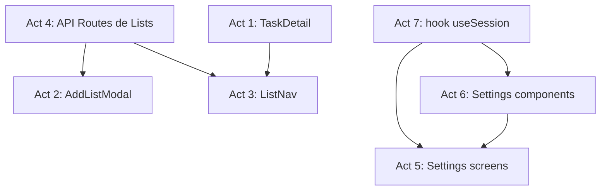

# Phase 5 Enrichment: Advanced UX — Detail Panel, Lists & Configuration

> **Fase:** `5.Advanced-UX-Screens/`
> **Derivado de:** `plan.md` (Fase 5), `design.md` (Secciones 3.B — List API contracts, 3.C — Zod CreateListInput, 4 — estructura de directorios de settings y lists), `spec.md` (Sección 2.2 — Lists schema, pantallas de settings, Task Detail)

---

## Resumen de la Fase

Completar la experiencia de usuario con el **panel de detalle de tarea**, la **gestión de listas** (modal de creación + navegación lateral), y las **pantallas de configuración** (apariencia, notificaciones, integraciones). También se implementa el hook `useSession` para leer y actualizar preferencias del guest.

**Valor:** Esta fase cierra el stack de productividad — el usuario ya puede: (Fase 4) crear/completar/eliminar tareas; ahora puede (Fase 5) editar detalles, organizar en listas, y personalizar su experiencia.

---

## Análisis de Impacto en PayloadCMS

| Colección | Slug | Impacto en esta Fase |
|---|---|---|
| `Lists` | `lists` | **CRUD completo** — lectura de listas del guest, creación con icono+color, actualización (rename, reorder), eliminación |
| `GuestSessions` | `guest-sessions` | **Lectura/Escritura** — `useSession` lee y parchea `theme`, `locale`, `notificationsEnabled`, `integrations` |
| `Tasks` | `tasks` | **Lectura por ID** — TaskDetail obtiene una tarea individual (`GET /api/tasks/{id}`) y aplica PATCH para actualizar campos anidados (notes, dueDate, substeps) |
| `Users`, `Media`, `TaskLogs`, `FocusSessions` | — | Sin impacto directo |

**Endpoints PayloadCMS consumidos (via REST interno desde API Routes):**
- `GET /api/lists?where[guestId][equals]={id}&sort[sortOrder]=asc` — listar listas del guest
- `POST /api/lists` — crear lista
- `PATCH /api/lists/{id}` — actualizar lista
- `DELETE /api/lists/{id}` — eliminar lista
- `GET /api/guest-sessions?where[guestId][equals]={id}&limit=1` — leer sesión del guest
- `PATCH /api/guest-sessions/{sessionId}` — actualizar preferencias (theme, locale, etc.)
- `GET /api/tasks/{id}` — leer tarea individual para Detail Panel
- `PATCH /api/tasks/{id}` — actualizar campos de detalle (notes, dueDate, substeps, list)

---

## Listado de Actividades

### Actividad 1: Implementar TaskDetail (panel derecho)

**Descripción técnica:** Crear el componente `TaskDetail.tsx` que se renderiza en el panel derecho (384px) al seleccionar una tarea. Muestra todas las propiedades editables de una tarea: checkbox + título + estrella en header, sección de sub-pasos ("Add step"), selectores de fecha y repetición (placeholders), selector de categoría/lista, y editor de notas. Incluye footer con botón de eliminar y metadatos de creación.

**Hitos técnicos:**

| # | Hito | Descripción | Criterio de Aceptación |
|---|---|---|---|
| 1.1 | Estructura y states | Crear `src/components/tasks/TaskDetail.tsx` con props `taskId: string \| null`, `onClose: () => void`. Estados: `idle` (muestra panel vacío con "Select a task"), `loading` (skeleton), `details` (contenido completo), `error` (fallback). Usar `useTask(id)` query para obtener datos | Panel se abre/cierra al seleccionar/deseleccionar tarea |
| 1.2 | Header y metadata | Header con TaskCheckbox + título inline-edit + estrella (importante). Secciones "Remind me" y "Repeat" como placeholders visuales | Título editable inline, estrella toggleable |
| 1.3 | Due Date con DatePicker | Crear `src/components/tasks/TaskDatePicker.tsx` con input date nativo + botón "Tomorrow". Actualiza `dueDate` vía `useUpdateTask()` | Fecha seleccionada persiste en DB |
| 1.4 | Notas y sub-pasos | Crear `src/components/tasks/TaskNotes.tsx` (textarea expandible, auto-guardado con debounce) y `src/components/tasks/TaskSubsteps.tsx` (lista de sub-pasos con checkbox + input inline para añadir). Footer con botón "Delete task" + `createdAt` formateado | Notas y sub-pasos persisten |

---

### Actividad 2: Implementar AddListModal

**Descripción técnica:** Crear el modal de creación/edición de listas con overlay blur. Incluye input de nombre, grid de 12 iconos (Material Symbols), color theme picker, y guardado con Zod + POST /api/lists.

**Hitos técnicos:**

| # | Hito | Descripción | Criterio de Aceptación |
|---|---|---|---|
| 2.1 | Modal overlay y estructura | Crear `src/components/lists/AddListModal.tsx` con props `isOpen, onClose, onSuccess, editList?: List`. Overlay con `bg-black/50 backdrop-blur-sm`, animación fade-in/scale-in. Modo creación vs edición según `editList` | Modal abre/cierra con animación suave |
| 2.2 | Formulario con Zod | Input de nombre con validación Zod (`CreateListInput: name min 1 max 100`). Grid de 12 iconos predefinidos (Material Symbols: `list, star, work, shopping, music, book, fitness, home, heart, school, flight, flag`). Selección de color con 8 preset swatches + custom hex input | Validación cliente + server, icono y color seleccionables |
| 2.3 | Submit y feedback | POST a `/api/lists` con TanStack Query `useMutation`. Loading state en botón. Toast/snackbar de éxito. Query invalidation de `useLists` al completar | Lista creada aparece en sidebar sin recargar |

---

### Actividad 3: Implementar ListNav

**Descripción técnica:** Componente de navegación de listas en la sidebar que muestra todas las listas del guest con icono + nombre + indicador de selección.

**Hitos técnicos:**

| # | Hito | Descripción | Criterio de Aceptación |
|---|---|---|---|
| 3.1 | ListNav base | Crear `src/components/lists/ListNav.tsx` que consume `useLists()` y renderiza cada lista como un item clickeable con icono + nombre + color dot. Indicador de selección: `bg-primary-container/10 text-primary border-l-4 border-primary` en item activo | Listas del guest se renderizan dinámicamente |
| 3.2 | Navegación y selección | Al hacer clic en una lista, navegar a `/lists/{id}` con `useRouter()`. Estado activo sincronizado con `useParams()`. Scrollbar invisible (estilizado con Tailwind) | Navegación fluida, indicador activo correcto |
| 3.3 | Drag & drop reorder | Implementar reordenamiento con arrastrar y soltar (HTML5 Drag & Drop API nativa). Al soltar, llamar a PATCH batch con `sortOrder` actualizado. Optimistic update para feedback inmediato | Listas reordenables, orden persiste en DB |

---

### Actividad 4: Crear API Routes de Lists

**Descripción técnica:** Implementar endpoints REST personalizados para Lists con validación Zod, retry SQLITE_BUSY, y acceso controlado por `guestId`.

**Hitos técnicos:**

| # | Hito | Descripción | Criterio de Aceptación |
|---|---|---|---|
| 4.1 | GET + POST /api/lists | `src/app/(frontend)/api/lists/route.ts`. GET: lista listas del guest ordenadas por `sortOrder`. POST: crea lista con guestId del header, valida con `CreateListInput` Zod, retorna `List` creada | GET retorna listas del guest, POST crea y retorna |
| 4.2 | PATCH + DELETE /api/lists/[id] | `src/app/(frontend)/api/lists/[id]/route.ts`. PATCH: actualiza nombre/icono/color/orden. DELETE: elimina lista (soft-check: no eliminar default lists). Ambos validan que la lista pertenezca al guest | PATCH actualiza, DELETE elimina (excepto default) |
| 4.3 | Retry + error handling | Wrapper `withRetry()` para SQLITE_BUSY. Errores Zod retornan 400 con detalles. Lista no encontrada o no pertenece al guest retorna 404 | Manejo robusto de errores |

---

### Actividad 5: Implementar Settings screens

**Descripción técnica:** Crear 4 páginas de configuración dentro de `src/app/(frontend)/settings/` con sub-navegación lateral.

**Hitos técnicos:**

| # | Hito | Descripción | Criterio de Aceptación |
|---|---|---|---|
| 5.1 | Settings layout y navegación | Crear `src/app/(frontend)/settings/layout.tsx` con sidebar de SettingsNav y contenedor para child pages. Usar `<SettingsNav />` como componente de navegación secundaria | Layout consistente en todas las páginas de settings |
| 5.2 | Config Main | `src/app/(frontend)/settings/page.tsx` — página principal con resumen de configuración actual (tema, idioma, estado notificaciones, integraciones activas). Botones de acceso directo a cada sub-página | Vista general de configuración |
| 5.3 | Appearance page | `src/app/(frontend)/settings/appearance/page.tsx` — contiene `<ThemeToggle />` (Light/Dark/System con preview) y `<LanguageSelect />` (ES/EN). Persiste en `guest-sessions.theme` y `guest-sessions.locale` vía `useUpdateSession()` | Cambio de tema/locale persiste y se aplica inmediatamente |
| 5.4 | Notifications + Integrations pages | `src/app/(frontend)/settings/notifications/page.tsx` — contiene `<NotificationToggles />` para notificaciones desktop. `src/app/(frontend)/settings/integrations/page.tsx` — contiene grid de `<IntegrationCard />` con Google Calendar funcional y placeholders para Slack, Outlook | Toggles persisten, integraciones muestran estado conectado/desconectado |

---

### Actividad 6: Implementar Settings components

**Descripción técnica:** Crear los 5 componentes de UI reutilizables para las páginas de configuración.

**Hitos técnicos:**

| # | Hito | Descripción | Criterio de Aceptación |
|---|---|---|---|
| 6.1 | SettingsNav | Crear `src/components/settings/SettingsNav.tsx` — navegación lateral con links a `/settings`, `/settings/appearance`, `/settings/notifications`, `/settings/integrations`. Item activo con highlight + icono Material Symbol por sección | Navegación interna funcional |
| 6.2 | ThemeToggle + LanguageSelect | Crear `src/components/settings/ThemeToggle.tsx` — 3 botones (Light/Dark/System) con iconos y preview visual. Crear `src/components/settings/LanguageSelect.tsx` — dropdown ES/EN con banderas emoji. Ambos usan `useUpdateSession()` para persistir | Cambio visual inmediato + persistencia |
| 6.3 | NotificationToggles + IntegrationCard | Crear `src/components/settings/NotificationToggles.tsx` — toggles para "Task reminders", "Daily summary", "Sound". Crear `src/components/settings/IntegrationCard.tsx` — card con icono + nombre + estado (Connected/Disconnected) + botón Connect/Configure | Toggles e integraciones funcionales |

---

### Actividad 7: Implementar hook useSession

**Descripción técnica:** Crear el hook de TanStack Query para leer y actualizar la sesión del guest: preferencias (tema, locale, notificaciones, integraciones).

**Hitos técnicos:**

| # | Hito | Descripción | Criterio de Aceptación |
|---|---|---|---|
| 7.1 | useSession query | Crear `src/hooks/useSession.ts`. `useSession()` — useQuery para GET /api/session. Retorna `{ data: SessionData \| undefined, isLoading, error }`. Cache staleTime: 5 min (las preferencias cambian poco) | Sesión cargada al montar la app |
| 7.2 | useUpdateSession mutation | `useUpdateSession()` — useMutation para PATCH /api/session. Body: `Partial<Pick<GuestSession, 'theme' \| 'locale' \| 'notificationsEnabled' \| 'integrations'>>`. Invalidación automática de `useSession` tras éxito | Preferencias actualizadas y cache invalidado |
| 7.3 | Integration con ThemeProvider | El hook `useSession` debe integrarse con `<ThemeProvider />` para que cambios de tema desde settings se reflejen inmediatamente en el DOM (clase `dark` en `<html>`). Usar `useEffect` para sincronizar | Cambio de tema en settings se aplica en vivo |

---

## Justificación Arquitectónica

1. **ListNav ya creado parcialmente en Fase 3 (Act 6)**: En Fase 3 se creó una versión temprana de ListNav integrada en Sidebar. Esta fase la reemplaza con la versión completa que incluye drag & drop reorder y conexión a API real.

2. **API Routes de Lists separadas de Tasks**: Aunque siguen el mismo patrón (Zod + Iron-Session header + retry), la lógica de negocio de listas (protección de default lists, reordenamiento batch) justifica endpoints separados para mantener cohesión.

3. **useSession como hub de preferencias**: En lugar de dispersar queries de tema/locale/notificaciones en componentes individuales, se centralizan en un solo hook que expone tanto lectura como mutación. ThemeProvider se suscribe a `useSession().data.theme` para aplicar el tema en vivo.

4. **TaskDetail como panel, no página**: A diferencia de los stacks (páginas completas), TaskDetail se renderiza como panel lateral (384px) dentro de `DetailPanel.tsx` (creado en Fase 3). Esto evita navegación pesada y permite vista dividida.

5. **Placeholders estratégicos**: Las secciones "Remind me" y "Repeat" en TaskDetail, y las integraciones no-Google en Settings, se implementan como placeholders visuales (sin lógica de negocio). Esto permite iterar post-MVP sin deuda técnica.

---

## Dependencias entre Actividades

- **Act 4** (API Routes) es prerrequisito de Act 2 (AddListModal) y Act 3 (ListNav) — sin endpoints no hay datos.
- **Act 1** (TaskDetail) depende del hook `useTask()` de Fase 4 (useTasks) y de `useUpdateTask()` para persistir cambios.
- **Act 6** (Settings components) + **Act 7** (useSession) son independientes y pueden implementarse en paralelo.
- **Act 5** (Settings screens) consume Act 6 + Act 7.
