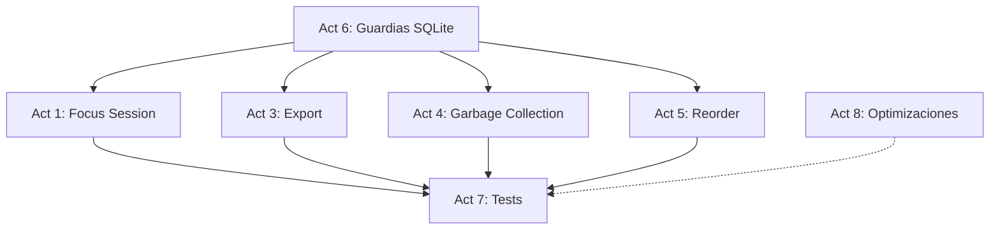

# Phase 6 Enrichment: Hardening, Help Center, Focus & Data Portability

> **Fase:** `6.Hardening-Testing/`
> **Derivado de:** `plan.md` (Fase 6), `design.md` (Secciones 3.B — Focus/Export/Maintenance contracts, 3.C — Zod FocusSessionInput, 6.2 — SQLite concurrency retry, 5.C — middleware), `spec.md` (Secciones 3.5 — Focus Session, 3.7 — Export/GC, 5.2 — SQLite retry scenarios, 5.3 — Export, 5.4 — Focus)

---

## Resumen de la Fase

Implementar las funcionalidades restantes del MVP (Focus Session Pomodoro, Centro de Ayuda, exportación de datos, garbage collection), el endpoint de reordenamiento batch, y aplicar las guardias de producción: retry pattern SQLITE_BUSY, accesibilidad, animaciones de los prototipos, y la suite completa de tests de integración + e2e.

**Valor:** Esta fase transforma la app de funcional a **producción-ready**: datos portátiles, auto-limpieza, accesibilidad, y cobertura de tests que garantizan estabilidad.

---

## Análisis de Impacto en PayloadCMS

| Colección | Slug | Impacto en esta Fase |
|---|---|---|
| `FocusSessions` | `focus-sessions` | **CRUD parcial** — creación vía POST, lectura agregada por fecha (stats). Update/delete bloqueados en access control |
| `Tasks` | `tasks` | **Lectura/escritura indirecta** — Export endpoint lee todas las tasks del guest; Garbage collection elimina tasks de guests expirados; Reorder endpoint actualiza sortOrder batch |
| `Lists` | `lists` | **Lectura/escritura indirecta** — Export endpoint lee lists; GC elimina lists de guests expirados |
| `TaskLogs` | `task-logs` | **Lectura indirecta** — Export endpoint incluye logs; GC elimina logs de guests expirados |
| `GuestSessions` | `guest-sessions` | **Lectura/escritura indirecta** — Export endpoint lee sesión; GC elimina sesiones expiradas |
| `Users`, `Media` | — | Sin impacto |

**Endpoints PayloadCMS consumidos (via REST interno desde API Routes):**
- `POST /api/focus-sessions` — crear sesión de enfoque
- `GET /api/focus-sessions?where[guestId][equals]={id}&where[date][equals]={date}` — stats diarias
- `GET /api/tasks?where[guestId][equals]={id}&limit=1000` — export completo
- `GET /api/lists?where[guestId][equals]={id}&limit=100` — export completo
- `GET /api/task-logs?where[guestId][equals]={id}&limit=1000` — export completo
- `GET /api/guest-sessions?where[guestId][equals]={id}&limit=1` — export sesión
- `DELETE /api/tasks?where[guestId][in]={expiredIds}` — GC: eliminar tasks
- `DELETE /api/lists?where[guestId][in]={expiredIds}` — GC: eliminar lists
- `PATCH /api/tasks/{id}` — reordenamiento batch (individual por task)

---

## Listado de Actividades

### Actividad 1: Implementar Focus Session (Pomodoro)

**Descripción técnica:** Crear la página y componentes del temporizador Pomodoro con SVG circular, estadísticas diarias, selector de sonidos ambientales, y el hook `useFocusSessions` con persistencia en PayloadCMS.

**Hitos técnicos:**

| # | Hito | Descripción | Criterio de Aceptación |
|---|---|---|---|
| 1.1 | Focus Timer componente | Crear `src/components/focus/FocusTimer.tsx` — SVG circular animado con progreso (stroke-dashoffset). Botones: Start/Pause/Reset. Input de duración (5/15/25/45 min). Estados: `idle`, `running`, `paused`, `completed`. Sonido al completar con Web Audio API | Temporizador funcional con animación circular |
| 1.2 | Focus Stats componente | Crear `src/components/focus/FocusStats.tsx` — muestra sesiones completadas hoy, total minutos enfocados, porcentaje de eficiencia (completadas/iniciadas). Usa `useFocusSessions()` con filtro de fecha | Stats diarias precisas |
| 1.3 | Ambient Sound Picker | Crear `src/components/focus/AmbientSoundPicker.tsx` — grid de 4 sonidos ambientales (Rain, Forest, White Noise, Ocean) con preview (Howler.js o HTML5 Audio). Persiste selección en `GuestSessions.focusSettings` | Sonido se reproduce en preview y durante focus |
| 1.4 | Focus page + API Routes | Crear `src/app/(frontend)/focus/page.tsx` con layout fullscreen. API: `src/app/(frontend)/api/focus/route.ts` — POST crea FocusSession tras completar. `src/app/(frontend)/api/focus/stats/route.ts` — GET retorna stats agregadas por fecha | Página fullscreen, sesiones persisten |
| 1.5 | Hook useFocusSessions | Crear `src/hooks/useFocusSessions.ts` — `useFocusSessions(date?: string)` query para GET /api/focus/stats. `useCreateFocusSession()` mutation para POST /api/focus | Hook tipado con TanStack Query |

---

### Actividad 2: Implementar Centro de Ayuda

**Descripción técnica:** Crear página de ayuda estática con hero de búsqueda (filtro frontend) y grid de categorías con contenido descriptivo. Sin dependencia de PayloadCMS.

**Hitos técnicos:**

| # | Hito | Descripción | Criterio de Aceptación |
|---|---|---|---|
| 2.1 | Help page layout | Crear `src/app/(frontend)/help/page.tsx` con hero visual (título + descripción + search input). Grid de categorías: "Getting Started", "Tasks & Lists", "Focus Mode", "Settings", "Data & Privacy", "Integrations" | Layout responsivo consistente con Ethereal Focus |
| 2.2 | HelpSearch componente | Crear `src/components/help/HelpSearch.tsx` — input con icono de lupa, filtra categorías en frontend (sin llamada API). Muestra "No results" si no hay match | Búsqueda client-side funcional |
| 2.3 | HelpCategoryGrid componente | Crear `src/components/help/HelpCategoryGrid.tsx` — grid de 2x3 tarjetas con icono + título + descripción + enlace a sección expandible. Contenido hardcodeado en archivo `src/lib/help-content.ts` | Grid de categorías con contenido útil |

---

### Actividad 3: Implementar Export endpoint

**Descripción técnica:** Crear API Route que exporta todos los datos del guest como JSON descargable: perfil de sesión, listas, tareas, y logs de actividad.

**Hitos técnicos:**

| # | Hito | Descripción | Criterio de Aceptación |
|---|---|---|---|
| 3.1 | Export route | Crear `src/app/(frontend)/api/export/route.ts`. Lee `x-guest-id` del header. Consulta PayloadCMS: GuestSession, Lists, Tasks, TaskLogs del guest. Compila `ExportData` con Zod schema de validación | JSON descargable con todos los datos del guest |
| 3.2 | Zod schema + response | Schema: `{ profile: GuestSession, lists: List[], tasks: Task[], taskLogs: TaskLog[], exportedAt: string }`. Response: `Content-Type: application/json`, `Content-Disposition: attachment; filename="task-sphere-export-{date}.json"` | Archivo descargable con nombre único |
| 3.3 | Edge cases | Guest sin datos: retorna `{ profile: null, lists: [], tasks: [], taskLogs: [], exportedAt }`. Guest no autenticado: 401. Error PayloadCMS: 500 con retry | Manejo correcto de casos vacíos |

---

### Actividad 4: Implementar Garbage Collection

**Descripción técnica:** Crear endpoint de mantenimiento que limpia sesiones expiradas (7 días sin actividad) y todos sus datos asociados (tasks, lists, task-logs).

**Hitos técnicos:**

| # | Hito | Descripción | Criterio de Aceptación |
|---|---|---|---|
| 4.1 | Cleanup route | Crear `src/app/(frontend)/api/maintenance/cleanup/route.ts`. Busca GuestSessions donde `expiresAt < now()`. Obtiene array de `guestId` expirados | Sesiones expiradas identificadas |
| 4.2 | Cascade delete | Eliminar Tasks donde `guestId in expiredIds`, luego Lists, luego TaskLogs, finalmente GuestSessions. Orden: tasks → task-logs → lists → guest-sessions (evitar FK violations) | Cascade completo sin orphan records |
| 4.3 | Response + safety | Retorna `{ deletedSessions: number, deletedTasks: number, deletedLists: number, deletedLogs: number }`. Solo accesible desde entorno dev o con secret header (protección en producción) | Reporte de limpieza, endpoint protegido |

---

### Actividad 5: Implementar Reorder endpoint (batch)

**Descripción técnica:** Crear endpoint PATCH batch para reordenamiento masivo de tareas, usado por drag & drop tanto en stacks como en listas.

**Hitos técnicos:**

| # | Hito | Descripción | Criterio de Aceptación |
|---|---|---|---|
| 5.1 | Reorder route | Crear `src/app/(frontend)/api/tasks/reorder/route.ts`. Body: `{ tasks: { id: string, sortOrder: number }[] }`. Valida con Zod: array de objetos con `id` (string) y `sortOrder` (int >= 0) | PATCH batch acepta array de reordenamiento |
| 5.2 | Batch update | Iterar sobre el array y ejecutar `payload.update` para cada task. Envolver en `withRetry()` para SQLITE_BUSY. Usar transacción implícita (una conexión, múltiples updates) | Todas las posiciones actualizadas atómicamente |
| 5.3 | Response y validación | Verificar que todas las tasks pertenezcan al guestId del header (404 si alguna no corresponde). Retornar `{ success: true, updated: number }` | Validación de pertenencia, reporte de count |

---

### Actividad 6: Aplicar guardias SQLite

**Descripción técnica:** Implementar el patrón de retry exponencial para SQLITE_BUSY, configurar WAL mode + busy_timeout, y centralizar el helper `withRetry()`.

**Hitos técnicos:**

| # | Hito | Descripción | Criterio de Aceptación |
|---|---|---|---|
| 6.1 | Helper withRetry | Crear `src/lib/utils.ts` con función genérica `async function withRetry<T>(fn: () => Promise<T>, maxRetries = 3): Promise<T>`. Retry exponencial: 100ms, 200ms, 400ms + jitter aleatorio. Detecta `error.code === 'SQLITE_BUSY'` | Helper reutilizable en todas las API Routes |
| 6.2 | WAL mode + busy_timeout | Configurar PayloadCMS SQLite con PRAGMA `journal_mode=WAL` y `busy_timeout=5000`. Verificar en archivo de configuración SQLite de `@payloadcms/db-sqlite` | Modo WAL activo, timeout 5s |
| 6.3 | Aplicar retry en API Routes existentes | Envolver llamadas a `payload.find/create/update/delete` con `withRetry()` en todas las API Routes de tasks (GET, POST, PATCH, DELETE) y lists (GET, POST, PATCH, DELETE) | Retry pattern en todos los endpoints |

---

### Actividad 7: Escribir tests

**Descripción técnica:** Implementar la suite de tests de integración (vitest) y e2e (Playwright) para cubrir las funcionalidades core del MVP.

**Hitos técnicos:**

| # | Hito | Descripción | Criterio de Aceptación |
|---|---|---|---|
| 7.1 | Test de integración: Tasks | `tests/int/tasks.int.spec.ts` — CRUD completo via API Routes: crear tarea, listar con filtros, actualizar status, eliminar, reordenar batch. Verificar aislamiento por guestId | 5+ tests cases pasando |
| 7.2 | Test de integración: Lists | `tests/int/lists.int.spec.ts` — CRUD de listas: crear con icono+color, listar, renombrar, eliminar. Verificar que no se eliminan default lists | 4+ tests cases pasando |
| 7.3 | Test de integración: Session | `tests/int/session.int.spec.ts` — ciclo de vida guest: inicialización vía middleware, persistencia de preferencias (theme, locale), expiración de sesión | 3+ tests cases pasando |
| 7.4 | Test de integración: Export | `tests/int/export.int.spec.ts` — exportación de datos: guest con datos retorna JSON completo, guest vacío retorna arrays vacíos, guest no autenticado retorna 401 | 3+ tests cases pasando |
| 7.5 | Test e2e: Tasks | `tests/e2e/tasks.e2e.spec.ts` — flujo completo en navegador: crear tarea desde AddTaskBar, marcarla completada, verificar empty state al eliminar todas. Playwright con Chromium | Flujo e2e pasando |

---

### Actividad 8: Optimizaciones finales

**Descripción técnica:** Pulir la aplicación para producción: índices compuestos, meta tags, favicon, dark mode, animaciones de prototipos, y micro-interacciones.

**Hitos técnicos:**

| # | Hito | Descripción | Criterio de Aceptación |
|---|---|---|---|
| 8.1 | Índices compuestos | Verificar que PayloadCMS tiene índices en campos `guestId` de todas las colecciones. Crear índice compuesto `[guestId, list]` en Tasks para el filtro más común | Consultas de listado sin full scan |
| 8.2 | Meta tags + favicon | Añadir meta tags SEO básicos (title, description, viewport) en root layout. Favicon en `/favicon.ico` con logo de Task Sphere. Manifest para PWA (básico) | Meta tags y favicon presentes |
| 8.3 | Dark mode + CSS consistency | Verificar que todas las páginas y componentes respetan la clase `dark` en `<html>`. Consistencia de colores: surface, surface-container, on-surface en modo oscuro. Scrollbar estilizado con `.custom-scrollbar` en paneles laterales | Dark mode sin fugas visuales |
| 8.4 | Animaciones y micro-interacciones | Aplicar animaciones de los prototipos HTML: slide-in para paneles, fade-in para modales, scale-on-hover para botones, transiciones suaves en hover de TaskItem (0.2s ease). Verificar en Chrome DevTools rendimiento (60fps) | Animaciones fieles a prototipos, sin jank |

---

## Justificación Arquitectónica

1. **Focus Session con colección dedicada (FocusSessions):** Cada sesión de enfoque es un registro inmutable en SQLite. El access control bloquea update/delete (solo create y read), garantizando integridad histórica de estadísticas. Las stats se calculan con agregación en API Route (no hay queries N+1).

2. **Centro de Ayuda estático (sin PayloadCMS):** El contenido de ayuda no cambia dinámicamente — hardcodearlo en `src/lib/help-content.ts` evita round-trips a DB y complejidad de colección. La búsqueda es client-side pura (filtro de array).

3. **Export endpoint como snapshot JSON:** En lugar de streaming, se compila un objeto JSON completo en memoria. Para el volumen esperado de un guest individual (cientos de tareas, no millones), esto es suficiente. Zod valida la estructura antes de servir.

4. **Garbage Collection manual (endpoint protegido):** No hay CRON en el MVP. El endpoint se invoca manualmente o via monitor externo. El orden de cascade delete (tasks → task-logs → lists → guest-sessions) evita violaciones de FK y orphan records.

5. **Reorder batch en endpoint separado:** En lugar de sobrecargar PATCH /api/tasks/[id], el endpoint `/api/tasks/reorder` recibe un array completo, permitiendo transaccionalidad y rollback atómico.

6. **Tests priorizan integración sobre e2e:** 4 suites de integración (vitest) cubren la lógica de negocio sin navegador (rápidas, deterministas). 1 suite e2e (Playwright) cubre el flujo crítico de principio a fin.

---

## Dependencias entre Actividades

- **Act 6** (Guardias SQLite) debe ejecutarse primero — `withRetry()` es prerrequisito de todas las demás API Routes.
- **Act 1–5** pueden implementarse en paralelo (no tienen dependencias entre sí).
- **Act 7** (Tests) depende de Act 1, 3, 4, 5 (necesita endpoints funcionando para testearlos).
- **Act 8** (Optimizaciones) es independiente y puede ejecutarse en paralelo o al final.
