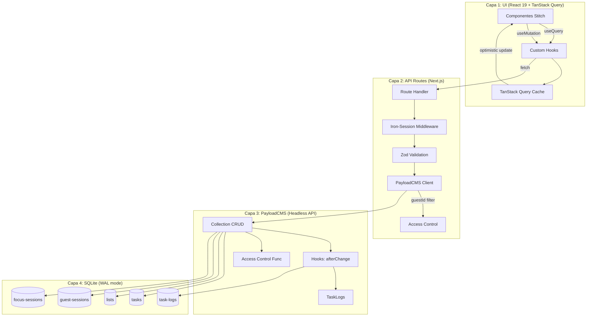

# Task Sphere — Diseño Técnico (design.md)

> **Versión:** 1.0.0  
> **Derivado de:** `spec.md`, `todo-args.md`, `ui-resources/**` (Ethereal Focus)  
> **Propósito:** Plano ejecutable de arquitectura fullstack — decisiones, patrones, contratos y guardias

---

## 0. Preguntas Clave de Arquitectura (Trade-offs)

Antes de detallar el diseño, estas son las compensaciones identificadas que requieren decisión:

1. **REST nativo de PayloadCMS vs API Routes custom con Iron-Session** — Usar PayloadCMS REST directamente requiere pasar el `guestId` como header/cookie y configurar Access Control por colección. Las API Routes custom permiten inyectar Iron-Session + Zod en un solo lugar, pero añaden una capa de traducción. **Decisión tomada:** API Routes custom (thin proxy) que validan Iron-Session, aplican Zod, y delegan a PayloadCMS CRUD. Esto centraliza la lógica de sesión y validación sin acoplar PayloadCMS a Iron-Session.

2. **Optimistic Updates en todas las mutaciones vs solo en toggle/delete** — Las actualizaciones optimistas en creación/edición de texto pueden causar flickering si el servidor rechaza el payload. **Decisión:** Optimistic updates solo para `toggle status`, `toggle important` y `delete`. Creación y edición de texto esperan confirmación del servidor (uso de `isPending` con skeleton UI).

3. **GuestSession como colección PayloadCMS vs tabla independiente** — Si PayloadCMS falla, el guest pierde su sesión. Si la sesión está solo en cookie (Iron-Session), sobrevive a caídas de DB. **Decisión:** La cookie Iron-Session es la fuente de verdad de la sesión. `GuestSessions` en PayloadCMS es un cache de persistencia para preferencias y GC. Si la DB no responde, el guest opera con datos por defecto hasta que la DB se recupere.

4. **TanStack Query SSR vs Client-only** — Las consultas SSR requieren integración con Next.js `HydrationBoundary` y `prefetchQuery`. Para un MVP anónimo con datos locales, el overhead no se justifica. **Decisión:** TanStack Query en modo client-only con `initialData` opcional desde Server Components para la carga inicial (listas + tasks del día).

5. **Tailwind config con tokens custom vs CSS variables** — Los tokens de Ethereal Focus son ~60 colores + tipografía + spacing. **Decisión:** Tailwind config con extensión de theme (ya probado en los HTML prototypes) + CSS variables para `glass-panel` y `backdrop-blur`. Los tokens se definen en `tailwind.config.ts` y se sincronizan con `:root` CSS variables para acceso programático.

---

## 1. Decisiones de Arquitectura Fullstack

### 1.A. Patrón de Flujo de Datos y Capas



**Patrón: Thin API Proxy + PayloadCMS Backend**

```
[React Component] 
    → [useQuery/useMutation Hook]    ← TanStack Query cache layer
    → [Next.js API Route]             ← Iron-Session + Zod (thin proxy)
    → [Payload REST API]              ← CRUD delegado
    → [SQLite]                        ← Persistencia
```

Este patrón se justifica porque:
- **Iron-Session** no puede integrarse directamente con PayloadCMS REST (PayloadCMS espera su propio auth JWT)
- **Zod** valida en el borde del servidor antes de llegar a PayloadCMS, evitando requests inválidos
- **guestId** se inyecta automáticamente desde la sesión, no desde el cliente (seguridad: el cliente nunca envía su guestId)

### 1.B. Diseño de Persistencia (PayloadCMS)

#### Colección: Tasks

```typescript
// src/collections/Tasks.ts
import type { CollectionConfig } from 'payload'

export const Tasks: CollectionConfig = {
  slug: 'tasks',
  admin: { useAsTitle: 'title', defaultColumns: ['title', 'status', 'list', 'dueDate'] },
  access: {
    read: ({ req }) => {
      const guestId = req.headers.get('x-guest-id')
      return { guestId: { equals: guestId } }
    },
    create: ({ req }) => !!req.headers.get('x-guest-id'),
    update: ({ req }) => {
      const guestId = req.headers.get('x-guest-id')
      return { guestId: { equals: guestId } }
    },
    delete: ({ req }) => {
      const guestId = req.headers.get('x-guest-id')
      return { guestId: { equals: guestId } }
    },
  },
  fields: [
    { name: 'title', type: 'text', required: true, maxLength: 500 },
    { name: 'description', type: 'textarea', maxLength: 5000 },
    {
      name: 'status',
      type: 'select',
      options: [
        { label: 'Pending', value: 'pending' },
        { label: 'Completed', value: 'completed' },
      ],
      defaultValue: 'pending',
      required: true,
    },
    { name: 'important', type: 'checkbox', defaultValue: false },
    { name: 'dueDate', type: 'date', admin: { date: { pickerAppearance: 'dayAndTime' } } },
    { name: 'list', type: 'relationship', relationTo: 'lists', required: true },
    { name: 'guestId', type: 'text', required: true, index: true },
    { name: 'sortOrder', type: 'number' },
    { name: 'completedAt', type: 'date' },
    {
      name: 'subtasks',
      type: 'array',
      fields: [
        { name: 'title', type: 'text', required: true },
        { name: 'completed', type: 'checkbox', defaultValue: false },
      ],
    },
  ],
  hooks: {
    afterChange: [
      async ({ doc, previousDoc, operation, req }) => {
        // Crear entrada en TaskLogs
        const { payload } = req
        await payload.create({
          collection: 'task-logs',
          data: {
            task: doc.id,
            guestId: doc.guestId,
            operation: operation.toUpperCase(),
            previousState: previousDoc ? JSON.stringify(previousDoc) : null,
            newState: JSON.stringify(doc),
            timestamp: new Date().toISOString(),
          },
        })
      },
    ],
    afterDelete: [
      async ({ doc, req }) => {
        const { payload } = req
        await payload.create({
          collection: 'task-logs',
          data: {
            task: doc.id,
            guestId: doc.guestId,
            operation: 'DELETE',
            previousState: JSON.stringify(doc),
            newState: null,
            timestamp: new Date().toISOString(),
          },
        })
      },
    ],
  },
}
```

**Nota:** El `x-guest-id` header lo inyectan las API Routes custom de Next.js desde Iron-Session. PayloadCMS access control lo usa para filtrar. Esto evita que un guest pueda leer/escribir datos de otro.

#### Colección: Lists

```typescript
// src/collections/Lists.ts
import type { CollectionConfig } from 'payload'

export const Lists: CollectionConfig = {
  slug: 'lists',
  admin: { useAsTitle: 'name', defaultColumns: ['name', 'guestId', 'isDefault'] },
  access: {
    read: ({ req }) => {
      const guestId = req.headers.get('x-guest-id')
      return { guestId: { equals: guestId } }
    },
    create: ({ req }) => !!req.headers.get('x-guest-id'),
    update: ({ req }) => {
      const guestId = req.headers.get('x-guest-id')
      return { guestId: { equals: guestId } }
    },
    delete: ({ req }) => {
      const guestId = req.headers.get('x-guest-id')
      return { guestId: { equals: guestId } }
    },
  },
  fields: [
    { name: 'name', type: 'text', required: true, maxLength: 100 },
    { name: 'icon', type: 'text', defaultValue: 'list' },
    { name: 'color', type: 'text' },
    { name: 'guestId', type: 'text', required: true, index: true },
    { name: 'isDefault', type: 'checkbox', defaultValue: false },
    { name: 'sortOrder', type: 'number' },
  ],
}
```

#### Colección: TaskLogs

```typescript
// src/collections/TaskLogs.ts
import type { CollectionConfig } from 'payload'

export const TaskLogs: CollectionConfig = {
  slug: 'task-logs',
  admin: { useAsTitle: 'id', defaultColumns: ['operation', 'task', 'guestId', 'timestamp'] },
  access: {
    read: () => false,           // Solo visible en admin panel para depuración
    create: () => true,          // Solo hooks internos
    update: () => false,
    delete: () => false,
  },
  fields: [
    { name: 'task', type: 'relationship', relationTo: 'tasks', required: true },
    { name: 'guestId', type: 'text', required: true },
    {
      name: 'operation',
      type: 'select',
      options: [
        { label: 'Create', value: 'CREATE' },
        { label: 'Update', value: 'UPDATE' },
        { label: 'Delete', value: 'DELETE' },
      ],
      required: true,
    },
    { name: 'previousState', type: 'json' },
    { name: 'newState', type: 'json' },
    { name: 'timestamp', type: 'date', required: true, defaultValue: () => new Date().toISOString() },
  ],
}
```

#### Colección: GuestSessions

```typescript
// src/collections/GuestSessions.ts
import type { CollectionConfig } from 'payload'

export const GuestSessions: CollectionConfig = {
  slug: 'guest-sessions',
  admin: { useAsTitle: 'guestId', defaultColumns: ['guestId', 'createdAt', 'expiresAt', 'lastActiveAt'] },
  access: {
    read: ({ req }) => {
      const guestId = req.headers.get('x-guest-id')
      return { guestId: { equals: guestId } }
    },
    create: () => true,
    update: ({ req }) => {
      const guestId = req.headers.get('x-guest-id')
      return { guestId: { equals: guestId } }
    },
    delete: () => false,       // Solo GC interno
  },
  fields: [
    { name: 'guestId', type: 'text', required: true, unique: true, index: true },
    { name: 'createdAt', type: 'date', required: true },
    { name: 'lastActiveAt', type: 'date', required: true },
    { name: 'expiresAt', type: 'date', required: true },
    {
      name: 'locale',
      type: 'select',
      options: [
        { label: 'Español', value: 'es' },
        { label: 'English', value: 'en' },
      ],
    },
    {
      name: 'theme',
      type: 'select',
      options: [
        { label: 'Light', value: 'light' },
        { label: 'Dark', value: 'dark' },
        { label: 'System', value: 'system' },
      ],
      defaultValue: 'system',
    },
    { name: 'notificationsEnabled', type: 'checkbox', defaultValue: true },
    { name: 'integrations', type: 'json' },
    { name: 'focusSettings', type: 'json' },
  ],
  hooks: {
    beforeChange: [
      async ({ data, req }) => {
        if (data.lastActiveAt) {
          const lastActive = new Date(data.lastActiveAt)
          data.expiresAt = new Date(lastActive.getTime() + 7 * 24 * 60 * 60 * 1000).toISOString()
        }
      },
    ],
  },
}
```

#### Colección: FocusSessions

```typescript
// src/collections/FocusSessions.ts
import type { CollectionConfig } from 'payload'

export const FocusSessions: CollectionConfig = {
  slug: 'focus-sessions',
  admin: { useAsTitle: 'id' },
  access: {
    read: ({ req }) => {
      const guestId = req.headers.get('x-guest-id')
      return { guestId: { equals: guestId } }
    },
    create: ({ req }) => !!req.headers.get('x-guest-id'),
    update: () => false,
    delete: () => false,
  },
  fields: [
    { name: 'guestId', type: 'text', required: true, index: true },
    { name: 'duration', type: 'number', required: true, min: 1, max: 120 },
    { name: 'completed', type: 'checkbox', defaultValue: false },
    { name: 'completedAt', type: 'date' },
    { name: 'date', type: 'date', required: true, defaultValue: () => new Date().toISOString().split('T')[0] },
  ],
}
```

### 1.C. Sistema de Ordenamiento (Drag & Drop)

El ordenamiento dinámico de tareas y listas usa **sortOrder numérico** como estrategia inicial:

```typescript
// Reordenamiento optimista
async function reorderTasks(taskId: string, newIndex: number, listId: string) {
  const tasks = await queryClient.getQueryData(['tasks', listId])
  const reordered = arrayMove(tasks, currentIndex, newIndex)

  // Actualización optimista inmediata
  queryClient.setQueryData(['tasks', listId], reordered)

  // Persistencia: actualizar sortOrder de todos los items afectados
  const updates = reordered.map((task, index) => ({
    id: task.id,
    sortOrder: index,
  }))

  await fetch('/api/tasks/reorder', {
    method: 'PATCH',
    body: JSON.stringify({ tasks: updates }),
  })
}
```

Para el MVP el sortOrder numérico es suficiente. Para futuros sprints con uso intensivo de drag & drop, migrar a **LexoRank** (ordenamiento lexicográfico fraccional) que evita re-escribir todos los items en cada movimiento.

#### Endpoint de Reordenamiento (Batch)

```
PATCH /api/tasks/reorder
Headers: x-guest-id (de Iron-Session)
Body: {
  tasks: [
    { id: "abc", sortOrder: 0 },
    { id: "def", sortOrder: 1 },
  ]
}
Response: 200 OK
```

---

## 2. Stack Tecnológico Definido

| Tecnología | Versión | Justificación |
|---|---|---|
| **Next.js** | 16.2.6 | App Router, Server Components, Turbopack. El proyecto ya usa esta versión. |
| **React** | 19.2.6 | Server Components, Actions. Requerido por Next.js 16. |
| **PayloadCMS** | 3.85.1 | Headless API + Admin Panel + Hooks + Access Control + SQLite adapter. Ya instalado. |
| **@payloadcms/db-sqlite** | 3.85.1 | Base de datos local embebida. Sin servidor externo. Ideal para MVP anónimo. |
| **TypeScript** | 5.x | Type-safety end-to-end. PayloadCMS genera tipos automáticamente. |
| **Tailwind CSS** | 4.x (via CDN en prototipos, a instalar local) | Utility-first. Los prototipos HTML ya usan Tailwind — migración directa a clases. |
| **TanStack Query** | v5 | Cache cliente-servidor, optimistic updates, mutations, retry. |
| **Iron-Session** | 8.x | Cookies cifradas sin estado. No requiere DB de sesiones. Ideal para guests. |
| **Zod** | 3.x | Validación de esquemas en API Routes. Schemas compartidos cliente/servidor. |
| **SQLite (WAL)** | — | Write-Ahead Logging para concurrencia. Manejo de SQLITE_BUSY con retry. |
| **Sharp** | 0.34.2 | Optimización de imágenes. Ya incluido con PayloadCMS. |
| **Material Symbols** | — | Iconos de interfaz. Ya usado en prototipos HTML via Google Fonts. |

### Eliminaciones del Stack Original

| Tecnología | Motivo de Eliminación |
|---|---|
| Prisma ORM | PayloadCMS ya abstrae SQLite. Dual ORM = conflictos de esquema + race conditions. |
| Passport.js | Iron-Session es suficiente para autenticación guest. Passport.js añade complejidad innecesaria para anonymous auth. |
| GraphQL | PayloadCMS lo soporta, pero REST es suficiente para las operaciones CRUD del MVP. GraphQL se añadiría si hay necesidades complejas de joins. |

---

## 3. Esquema de Datos y Contratos (Fullstack)

### 3.A. PayloadCMS → Tipos generados automáticamente

```bash
pnpm generate:types  # Genera src/payload-types.ts con interfaces Task, List, TaskLog, GuestSession, FocusSession
```

Los tipos generados se usan tanto en el frontend como en los API Routes, garantizando type-safety:

```typescript
// src/payload-types.ts (generado automáticamente — estructura esperada)
export interface Task {
  id: string
  title: string
  description?: string | null
  status: 'pending' | 'completed'
  important?: boolean | null
  dueDate?: string | null
  list: string | List
  guestId: string
  sortOrder?: number | null
  completedAt?: string | null
  subtasks?: {
    id?: string
    title: string
    completed?: boolean | null
  }[] | null
  createdAt: string
  updatedAt: string
}

export interface List {
  id: string
  name: string
  icon?: string | null
  color?: string | null
  guestId: string
  isDefault?: boolean | null
  sortOrder?: number | null
  createdAt: string
  updatedAt: string
}

export interface TaskLog {
  id: string
  task: string | Task
  guestId: string
  operation: 'CREATE' | 'UPDATE' | 'DELETE'
  previousState?: Record<string, unknown> | null
  newState?: Record<string, unknown> | null
  timestamp: string
}

export interface GuestSession {
  id: string
  guestId: string
  createdAt: string
  lastActiveAt: string
  expiresAt: string
  locale?: 'es' | 'en' | null
  theme?: 'light' | 'dark' | 'system' | null
  notificationsEnabled?: boolean | null
  integrations?: Record<string, unknown> | null
  focusSettings?: Record<string, unknown> | null
}

export interface FocusSession {
  id: string
  guestId: string
  duration: number
  completed?: boolean | null
  completedAt?: string | null
  date: string
}
```

### 3.B. Contratos de API (endpoints custom)

```typescript
// Tipo para el header de guestId
type GuestHeaders = { 'x-guest-id': string }

// --- Tasks ---
GET    /api/tasks?list={listId}&status={status}       → { docs: Task[], totalDocs: number }
POST   /api/tasks                                      → Task (body: CreateTaskInput)
PATCH  /api/tasks/{id}                                 → Task (body: Partial<UpdateTaskInput>)
DELETE /api/tasks/{id}                                 → { success: true }
PATCH  /api/tasks/reorder                              → { success: true } (body: { tasks: { id: string, sortOrder: number }[] })

// --- Lists ---
GET    /api/lists                                      → { docs: List[] }
POST   /api/lists                                      → List (body: { name: string, icon?: string, color?: string })
PATCH  /api/lists/{id}                                 → List
DELETE /api/lists/{id}                                 → { success: true }

// --- Session ---
GET    /api/session                                    → { guestId: string, createdAt: string }
DELETE /api/session                                    → { success: true } (purga datos del guest)

// --- Export ---
GET    /api/export                                     → ExportData (JSON descargable)

// --- Focus ---
POST   /api/focus                                      → FocusSession (body: { duration: number })
GET    /api/focus?date={date}                          → { sessions: FocusSession[], stats: { total, completed, totalMinutes } }

// --- Maintenance ---
GET    /api/maintenance/cleanup                        → { deletedSessions: number, deletedTasks: number }
```

### 3.C. Zod Schemas (Compartidos)

```typescript
// src/lib/schemas.ts
import { z } from 'zod'

export const CreateTaskInput = z.object({
  title: z.string().min(3, 'Mínimo 3 caracteres').max(500).transform(s => s.trim()),
  description: z.string().max(5000).optional(),
  list: z.string().min(1),
  dueDate: z.string().datetime().optional(),
  important: z.boolean().default(false),
})

export const UpdateTaskInput = z.object({
  title: z.string().min(3).max(500).transform(s => s.trim()).optional(),
  description: z.string().max(5000).optional(),
  status: z.enum(['pending', 'completed']).optional(),
  important: z.boolean().optional(),
  dueDate: z.string().datetime().nullable().optional(),
  sortOrder: z.number().int().min(0).optional(),
})

export const CreateListInput = z.object({
  name: z.string().min(1, 'El nombre es requerido').max(100).transform(s => s.trim()),
  icon: z.string().max(50).optional(),
  color: z.string().regex(/^#[0-9a-fA-F]{6}$/, 'Formato hex inválido').optional(),
})

export const CreateFocusSessionInput = z.object({
  duration: z.number().int().min(1).max(120),
})

export type CreateTaskInput = z.infer<typeof CreateTaskInput>
export type UpdateTaskInput = z.infer<typeof UpdateTaskInput>
export type CreateListInput = z.infer<typeof CreateListInput>
```

---

## 4. Estructura de Directorios (Scalable Path)

```
task-sphere/
├── src/
│   ├── collections/                    # PayloadCMS Collections
│   │   ├── Tasks.ts                    # CRUD + hooks afterChange/afterDelete
│   │   ├── Lists.ts                    # CRUD con access control por guestId
│   │   ├── TaskLogs.ts                 # Solo escritura por hook
│   │   ├── GuestSessions.ts            # Sesiones con expiración
│   │   ├── FocusSessions.ts            # Pomodoro sessions
│   │   ├── Users.ts                    # Existente — admin auth
│   │   └── Media.ts                    # Existente — uploads
│   │
│   ├── app/
│   │   ├── (frontend)/                 # Route group — páginas públicas
│   │   │   ├── layout.tsx              # Root layout: TanStack Provider + Iron-Session middleware
│   │   │   ├── page.tsx                # Landing → redirect a /my-day
│   │   │   ├── my-day/
│   │   │   │   └── page.tsx            # Stack My Day (2.Stack My Day)
│   │   │   ├── important/
│   │   │   │   └── page.tsx            # Stack Important (4.Stack Important)
│   │   │   ├── planned/
│   │   │   │   └── page.tsx            # Stack Planned (5.Stack Planned)
│   │   │   ├── tasks/
│   │   │   │   └── page.tsx            # Stack All Tasks (6.Stack All Tasks)
│   │   │   ├── task/
│   │   │   │   └── [id]/
│   │   │   │       ├── page.tsx        # Task Detail view (3.Task Details)
│   │   │   │       └── loading.tsx     # Skeleton loader
│   │   │   ├── lists/
│   │   │   │   ├── page.tsx            # List manager (7.Add List modal trigger)
│   │   │   │   └── [id]/
│   │   │   │       └── page.tsx        # Tareas de una lista específica
│   │   │   ├── settings/
│   │   │   │   ├── page.tsx            # Config Main (8.Config Main)
│   │   │   │   ├── appearance/
│   │   │   │   │   └── page.tsx        # Language + Theme (13.Config Language)
│   │   │   │   ├── notifications/
│   │   │   │   │   └── page.tsx        # Alert Desktop (10.Config Alert Desktop)
│   │   │   │   └── integrations/
│   │   │   │       ├── page.tsx        # Integrations list (11.Config Integrations)
│   │   │   │       └── google-calendar/
│   │   │   │           └── page.tsx    # Google Calendar config (12.Config Integrations Google Calendar)
│   │   │   ├── focus/
│   │   │   │   └── page.tsx            # Focus Session (17.Focus Session)
│   │   │   ├── help/
│   │   │   │   └── page.tsx            # Centro de Ayuda (16.Centro de ayuda)
│   │   │   └── api/
│   │   │       ├── tasks/
│   │   │       │   ├── route.ts        # GET (list) + POST (create)
│   │   │       │   ├── [id]/
│   │   │       │   │   └── route.ts    # PATCH + DELETE
│   │   │       │   └── reorder/
│   │   │       │       └── route.ts    # PATCH batch reorder
│   │   │       ├── lists/
│   │   │       │   ├── route.ts        # GET + POST
│   │   │       │   └── [id]/
│   │   │       │       └── route.ts    # PATCH + DELETE
│   │   │       ├── session/
│   │   │       │   ├── route.ts        # GET (current session info)
│   │   │       │   └── route.ts        # DELETE (purge)
│   │   │       ├── export/
│   │   │       │   └── route.ts        # GET (download JSON)
│   │   │       ├── focus/
│   │   │       │   ├── route.ts        # POST (create session)
│   │   │       │   └── stats/
│   │   │       │       └── route.ts    # GET (stats by date)
│   │   │       └── maintenance/
│   │   │           └── cleanup/
│   │   │               └── route.ts    # GET (garbage collection)
│   │   │
│   │   └── (payload)/                  # Route group — PayloadCMS admin (generado)
│   │       ├── admin/[[...segments]]/
│   │       └── api/[...slug]/
│   │
│   ├── components/                     # React Components (Stitch → React)
│   │   ├── layout/
│   │   │   ├── Sidebar.tsx             # Glass sidebar con navegación + perfil
│   │   │   ├── DetailPanel.tsx         # Panel derecho 384px
│   │   │   ├── TopBar.tsx              # Header con título + fecha + acciones
│   │   │   └── MobileNav.tsx           # Bottom nav para mobile
│   │   ├── tasks/
│   │   │   ├── TaskItem.tsx            # Item individual (checkbox + texto + metadata)
│   │   │   ├── TaskList.tsx            # Lista completa con TanStack Query
│   │   │   ├── TaskCheckbox.tsx        # Checkbox circular animado
│   │   │   ├── AddTaskBar.tsx          # Input flotante con toolbar
│   │   │   ├── TaskDetail.tsx          # Panel de detalle completo
│   │   │   ├── TaskNotes.tsx           # Editor de notas
│   │   │   ├── TaskDatePicker.tsx      # Selector de fecha
│   │   │   ├── TaskSubsteps.tsx        # Lista de sub-pasos
│   │   │   └── BulkActionBar.tsx       # Barra de acciones masivas
│   │   ├── lists/
│   │   │   ├── ListNav.tsx             # Navegación de listas en sidebar
│   │   │   ├── AddListModal.tsx        # Modal creación de lista (iconos + color)
│   │   │   └── ListItem.tsx            # Item individual en sidebar
│   │   ├── settings/
│   │   │   ├── SettingsNav.tsx         # Sub-navegación interna
│   │   │   ├── ThemeToggle.tsx         # Light/Dark/System
│   │   │   ├── LanguageSelect.tsx      # Selector ES/EN
│   │   │   ├── NotificationToggles.tsx # Config notificaciones
│   │   │   └── IntegrationCard.tsx     # Card de integración
│   │   ├── focus/
│   │   │   ├── FocusTimer.tsx          # Temporizador SVG circular
│   │   │   ├── FocusStats.tsx          # Estadísticas diarias
│   │   │   └── AmbientSoundPicker.tsx  # Selector de sonidos
│   │   ├── help/
│   │   │   ├── HelpSearch.tsx          # Search hero
│   │   │   └── HelpCategoryGrid.tsx    # Grid de categorías
│   │   └── common/
│   │       ├── EmptyState.tsx          # Estado vacío con ilustración
│   │       ├── Skeleton.tsx            # Skeleton loader
│   │       └── GlassPanel.tsx          # Wrapper glassmorphism
│   │
│   ├── hooks/                          # TanStack Query hooks
│   │   ├── useTasks.ts                 # useQuery + useMutation para tasks
│   │   ├── useLists.ts                 # useQuery + useMutation para lists
│   │   ├── useSession.ts              # Sesión actual + logout
│   │   ├── useFocusSessions.ts         # Focus sessions + stats
│   │   └── useTheme.ts                # Tema (modo claro/oscuro)
│   │
│   ├── lib/                            # Utilidades compartidas
│   │   ├── iron-session.ts             # Config + helpers de Iron-Session
│   │   ├── schemas.ts                  # Zod schemas compartidos
│   │   ├── payload-client.ts           # Helper getPayload() + inyecta guestId header
│   │   ├── constants.ts                # Constantes (duración sesión, default lists, etc.)
│   │   └── utils.ts                    # Funciones auxiliares (cn(), formatDate(), etc.)
│   │
│   ├── providers/                      # React Context Providers
│   │   ├── QueryProvider.tsx           # TanStack QueryClientProvider
│   │   └── ThemeProvider.tsx           # Tema + detección system preference
│   │
│   ├── middleware.ts                   # Next.js middleware: Iron-Session gestión
│   │
│   ├── payload.config.ts              # Config PayloadCMS con todas las collections
│   └── payload-types.ts               # Generado automáticamente
│
├── ui-resources/                       # Prototipos HTML + DESIGN.md (no tocar)
├── tests/
│   ├── int/
│   │   ├── tasks.int.spec.ts          # Tests de integración de tareas
│   │   ├── lists.int.spec.ts
│   │   ├── session.int.spec.ts
│   │   └── export.int.spec.ts
│   └── e2e/
│       └── tasks.e2e.spec.ts          # Tests end-to-end con Playwright
│
├── spec.md                             # Especificación técnica
├── design.md                           # Este documento
├── tailwind.config.ts                  # Config con tokens de Ethereal Focus
└── package.json
```

---

## 5. Sistema de Estilos / Configuración Técnica

### 5.A. Tailwind Config (Ethereal Focus Tokens)

```typescript
// tailwind.config.ts
import type { Config } from 'tailwindcss'

const config: Config = {
  darkMode: 'class',
  content: ['./src/**/*.{ts,tsx}'],
  theme: {
    extend: {
      colors: {
        surface: '#f8f9fa',
        'surface-dim': '#d9dadb',
        'surface-bright': '#f8f9fa',
        'surface-container-lowest': '#ffffff',
        'surface-container-low': '#f3f4f5',
        'surface-container': '#edeeef',
        'surface-container-high': '#e7e8e9',
        'surface-container-highest': '#e1e3e4',
        'on-surface': '#191c1d',
        'on-surface-variant': '#434655',
        'inverse-surface': '#2e3132',
        'inverse-on-surface': '#f0f1f2',
        primary: '#004ac6',
        'on-primary': '#ffffff',
        'primary-container': '#2563eb',
        'on-primary-container': '#eeefff',
        'inverse-primary': '#b4c5ff',
        secondary: '#735c00',
        'on-secondary': '#ffffff',
        'secondary-container': '#fed01b',
        'on-secondary-container': '#6f5900',
        error: '#ba1a1a',
        'on-error': '#ffffff',
        'error-container': '#ffdad6',
        'on-error-container': '#93000a',
        outline: '#737686',
        'outline-variant': '#c3c6d7',
        'border-subtle-light': '#F3F4F6',
        'text-secondary-light': '#6B7280',
        // Dark mode tokens
        'canvas-dark': '#09090B',
        'surface-dark': '#18181B',
        'surface-elevated-dark': '#27272A',
        'text-secondary-dark': '#A1A1AA',
        'border-subtle-dark': 'rgba(39, 39, 42, 0.5)',
        'primary-fixed': '#dbe1ff',
        'primary-fixed-dim': '#b4c5ff',
        'secondary-fixed': '#ffe083',
        'secondary-fixed-dim': '#eec200',
        'tertiary-fixed': '#dce2f7',
        'tertiary-fixed-dim': '#c0c6db',
      },
      borderRadius: {
        DEFAULT: '0.25rem',
        lg: '0.5rem',
        xl: '0.75rem',
        full: '9999px',
      },
      spacing: {
        'sidebar-width': '288px',
        'detail-panel-width': '384px',
        'container-padding': '3rem',
        'container-padding-mobile': '1rem',
        'gutter-md': '1rem',
        'stack-gap': '0.25rem',
      },
      fontFamily: {
        'display-xl': ['Geist', 'sans-serif'],
        'display-xl-mobile': ['Geist', 'sans-serif'],
        'headline-md': ['Geist', 'sans-serif'],
        'label-sm': ['Geist', 'sans-serif'],
        'body-lg': ['Inter', 'sans-serif'],
        'body-md': ['Inter', 'sans-serif'],
        'task-item': ['Inter', 'sans-serif'],
      },
      fontSize: {
        'display-xl': ['36px', { lineHeight: '40px', letterSpacing: '-0.02em', fontWeight: '700' }],
        'display-xl-mobile': ['24px', { lineHeight: '32px', letterSpacing: '-0.01em', fontWeight: '700' }],
        'headline-md': ['20px', { lineHeight: '28px', fontWeight: '600' }],
        'body-lg': ['18px', { lineHeight: '28px', fontWeight: '400' }],
        'body-md': ['16px', { lineHeight: '24px', fontWeight: '400' }],
        'label-sm': ['12px', { lineHeight: '16px', letterSpacing: '0.05em', fontWeight: '500' }],
        'task-item': ['15px', { lineHeight: '20px', fontWeight: '400' }],
      },
      keyframes: {
        'slide-in': {
          '0%': { transform: 'translateY(-20px)', opacity: '0' },
          '100%': { transform: 'translateY(0)', opacity: '1' },
        },
      },
      animation: {
        'slide-in': 'slide-in 0.4s cubic-bezier(0.16, 1, 0.3, 1) forwards',
      },
    },
  },
  plugins: [],
}

export default config
```

### 5.B. Componentes CSS Globales (styles.css)

```css
/* src/app/(frontend)/styles.css */
@import url('https://fonts.googleapis.com/css2?family=Geist:wght@400;500;600;700;800&family=Inter:wght@400;500;600&family=Material+Symbols+Outlined:wght,FILL@100..700,0..1&display=swap');

.glass-panel {
  background: rgba(255, 255, 255, 0.7);
  backdrop-filter: blur(12px);
  -webkit-backdrop-filter: blur(12px);
}

.dark .glass-panel {
  background: rgba(24, 24, 27, 0.8);
}

.material-symbols-outlined {
  font-variation-settings: 'FILL' 0, 'wght' 400, 'GRAD' 0, 'opsz' 24;
}

.custom-scrollbar::-webkit-scrollbar {
  width: 4px;
}

.custom-scrollbar::-webkit-scrollbar-track {
  background: transparent;
}

.custom-scrollbar::-webkit-scrollbar-thumb {
  background: #e1e3e4;
  border-radius: 10px;
}

.dark .custom-scrollbar::-webkit-scrollbar-thumb {
  background: #27272A;
}
```

### 5.C. Middleware de Iron-Session

```typescript
// src/middleware.ts
import { withIronSessionApiRoute } from 'iron-session/next'
import { NextResponse } from 'next/server'
import type { NextRequest } from 'next/server'
import { getIronSession, SessionOptions } from 'iron-session'

export interface SessionData {
  guestId?: string
  createdAt?: string
}

const sessionOptions: SessionOptions = {
  password: process.env.IRON_SESSION_PASSWORD || 'complex_password_at_least_32_chars_long_here',
  cookieName: 'task-sphere-session',
  cookieOptions: {
    secure: process.env.NODE_ENV === 'production',
    httpOnly: true,
    sameSite: 'lax',
    maxAge: 60 * 60 * 24 * 7, // 7 días
  },
}

export async function middleware(request: NextRequest) {
  const response = NextResponse.next()
  const session = await getIronSession<SessionData>(request, response, sessionOptions)

  if (!session.guestId) {
    session.guestId = crypto.randomUUID()
    session.createdAt = new Date().toISOString()
    await session.save()

    // Inicializar guest en PayloadCMS (4 listas default + guest-session)
    // Esto se delega al primer request de datos para no bloquear el middleware
  }

  // Inyectar guestId en headers para API Routes
  const requestHeaders = new Headers(request.headers)
  requestHeaders.set('x-guest-id', session.guestId)

  return NextResponse.next({
    request: { headers: requestHeaders },
  })
}

export const config = {
  matcher: '/((?!_next|api/auth|admin|static|favicon.ico).*)',
}
```

### 5.D. API Route Pattern (Proxy a PayloadCMS)

```typescript
// src/app/(frontend)/api/tasks/route.ts
import { getPayload } from 'payload'
import config from '@payload-config'
import { NextRequest, NextResponse } from 'next/server'
import { CreateTaskInput } from '@/lib/schemas'

export async function GET(req: NextRequest) {
  const guestId = req.headers.get('x-guest-id')
  if (!guestId) return NextResponse.json({ error: 'No session' }, { status: 401 })

  const { searchParams } = new URL(req.url)
  const listId = searchParams.get('list')
  const status = searchParams.get('status')

  const payloadConfig = await config
  const payload = await getPayload({ config: payloadConfig })

  const where: Record<string, unknown> = { guestId: { equals: guestId } }
  if (listId) where.list = { equals: listId }
  if (status) where.status = { equals: status }

  const tasks = await payload.find({ collection: 'tasks', where, sort: 'sortOrder', depth: 1 })

  return NextResponse.json(tasks)
}

export async function POST(req: NextRequest) {
  const guestId = req.headers.get('x-guest-id')
  if (!guestId) return NextResponse.json({ error: 'No session' }, { status: 401 })

  const body = await req.json()
  const parsed = CreateTaskInput.safeParse(body)
  if (!parsed.success) {
    return NextResponse.json({ error: parsed.error.flatten() }, { status: 400 })
  }

  const payloadConfig = await config
  const payload = await getPayload({ config: payloadConfig })

  const task = await payload.create({
    collection: 'tasks',
    data: { ...parsed.data, guestId },
  })

  return NextResponse.json(task, { status: 201 })
}
```

---

## 6. Guardias para la Implementación (Operational Guidance)

### 6.1. Inmutabilidad del Esquema PayloadCMS

- Los slugs de colecciones (`tasks`, `lists`, `task-logs`, `guest-sessions`, `focus-sessions`) no deben renombrarse una vez en producción
- Los nombres de campos no deben cambiar después de la primera migración; si se necesita cambio, crear campo nuevo y deprecar el anterior
- Los tipos `select` deben añadir nuevos valores al final del array de options (nunca reordenar ni eliminar)

### 6.2. Resolución de Conflictos (SQLite Concurrency)

SQLite en modo WAL permite múltiples lectores simultáneos pero un solo escritor. Estrategia:

1. **Retry Pattern en API Routes:**

```typescript
async function withRetry<T>(fn: () => Promise<T>, maxRetries = 3): Promise<T> {
  for (let attempt = 0; attempt < maxRetries; attempt++) {
    try {
      return await fn()
    } catch (error: any) {
      if (error?.code === 'SQLITE_BUSY' && attempt < maxRetries - 1) {
        const delay = Math.min(100 * Math.pow(2, attempt) + Math.random() * 50, 1000)
        await new Promise(resolve => setTimeout(resolve, delay))
        continue
      }
      throw error
    }
  }
  throw new Error('Max retries exceeded')
}
```

2. **Batch Writes:** Agrupar operaciones cuando sea posible (ej. reorder batch en vez de N updates individuales)

3. **Timeout de escritura:** Configurar `busy_timeout=5000` en la conexión SQLite de PayloadCMS mediante PRAGMA

### 6.3. Seguridad en PayloadCMS

- **Nunca exponer `guestId` en URLs o respuestas públicas** — el `x-guest-id` header se inyecta desde el middleware y nunca viaja al cliente como parámetro visible
- **Access Control por colección** — cada colección filtra por `guestId` en read/update/delete
- **`TaskLogs` es write-only desde hooks** — no tiene API pública accesible
- **Rate limiting opcional** en endpoints de creación para evitar abuso local (Post-MVP)

### 6.4. Optimización de Consultas

- Índices en todos los campos `guestId` (ya definidos en los schemas de colecciones)
- Índice compuesto `[guestId, list]` para el filtro más común (tareas de una lista)
- Usar `depth: 0` o `depth: 1` en lugar de `depth: 2+` para evitar joins profundos innecesarios
- Las consultas de la sesión actual deben ser ligeras (solo guestId + tema + locale)

### 6.5. Ciclo de Vida de TanStack Query

```typescript
// src/hooks/useTasks.ts
import { useQuery, useMutation, useQueryClient } from '@tanstack/react-query'
import type { Task } from '@/payload-types'

const TASKS_KEY = 'tasks'

export function useTasks(listId?: string, status?: string) {
  return useQuery({
    queryKey: [TASKS_KEY, listId, status],
    queryFn: async () => {
      const params = new URLSearchParams()
      if (listId) params.set('list', listId)
      if (status) params.set('status', status)
      const res = await fetch(`/api/tasks?${params}`)
      if (!res.ok) throw new Error('Failed to fetch tasks')
      return res.json() as Promise<{ docs: Task[] }>
    },
    staleTime: 30_000,     // 30s antes de re-validar
    gcTime: 5 * 60_000,    // 5min en cache
  })
}

export function useToggleTask() {
  const queryClient = useQueryClient()

  return useMutation({
    mutationFn: async ({ id, status }: { id: string; status: 'pending' | 'completed' }) => {
      const res = await fetch(`/api/tasks/${id}`, {
        method: 'PATCH',
        body: JSON.stringify({ status }),
      })
      if (!res.ok) throw new Error('Failed to toggle task')
      return res.json() as Promise<Task>
    },
    onMutate: async ({ id, status }) => {
      // Cancel queries en curso
      await queryClient.cancelQueries({ queryKey: [TASKS_KEY] })

      // Snapshot del estado anterior
      const previousData = queryClient.getQueriesData<{ docs: Task[] }>({ queryKey: [TASKS_KEY] })

      // Optimistic update
      queryClient.setQueriesData<{ docs: Task[] }>({ queryKey: [TASKS_KEY] }, (old) => {
        if (!old) return old
        return {
          ...old,
          docs: old.docs.map((task) =>
            task.id === id
              ? { ...task, status, completedAt: status === 'completed' ? new Date().toISOString() : null }
              : task
          ),
        }
      })

      return { previousData }
    },
    onError: (_err, _vars, context) => {
      // Rollback
      if (context?.previousData) {
        for (const [key, data] of context.previousData) {
          queryClient.setQueryData(key, data)
        }
      }
    },
    onSettled: () => {
      queryClient.invalidateQueries({ queryKey: [TASKS_KEY] })
    },
  })
}
```

### 6.6. Inicialización de Guest (Middleware + API)

El middleware crea la cookie Iron-Session pero **no bloquea** para crear la GuestSession en PayloadCMS. La inicialización en DB es lazy:

1. Primer request GET /api/tasks → detecta que no hay GuestSession en DB → la crea + crea 4 listas default
2. El frontend recibe las tasks vacías y las listas default
3. El guest puede operar inmediatamente sin esperar

```typescript
// En el primer request de datos
async function ensureGuestInitialized(payload: Payload, guestId: string) {
  const existing = await payload.find({
    collection: 'guest-sessions',
    where: { guestId: { equals: guestId } },
    limit: 1,
  })

  if (existing.docs.length === 0) {
    // Crear sesión
    await payload.create({
      collection: 'guest-sessions',
      data: {
        guestId,
        createdAt: new Date().toISOString(),
        lastActiveAt: new Date().toISOString(),
        expiresAt: new Date(Date.now() + 7 * 24 * 60 * 60 * 1000).toISOString(),
      },
    })

    // Crear 4 listas default
    const defaultLists = [
      { name: 'My Day', icon: 'light_mode', isDefault: true },
      { name: 'Important', icon: 'star', isDefault: false },
      { name: 'Planned', icon: 'calendar_month', isDefault: false },
      { name: 'Tasks', icon: 'task_alt', isDefault: false },
    ]

    for (const list of defaultLists) {
      await payload.create({
        collection: 'lists',
        data: { ...list, guestId, sortOrder: defaultLists.indexOf(list) },
      })
    }
  }
}
```

---

## 7. Conclusión

Este diseño establece las reglas técnicas para la implementación de Task Sphere v1.0:

- **PayloadCMS** es la fuente de verdad única para datos, con 5 colecciones de negocio + hooks de auditoría + access control por guestId
- **Iron-Session** maneja la autenticación guest cifrada en cookies, sin necesidad de Passport.js ni Prisma
- **API Routes custom** actúan como proxy thin que validan sesión + Zod y delegan a PayloadCMS
- **TanStack Query** sincroniza el frontend con optimistic updates en toggle/delete y retry en errores de concurrencia
- **Ethereal Focus design tokens** están mapeados 1:1 a Tailwind config, garantizando fidelidad visual con los prototipos de Stitch

El resultado es una arquitectura cohesiva donde cada componente de UI (extraído de los 17 prototipos HTML) tiene su contraparte en una colección de PayloadCMS, cada flujo de datos está protegido por validación Zod + access control, y el sistema es resiliente a las restricciones de SQLite.
