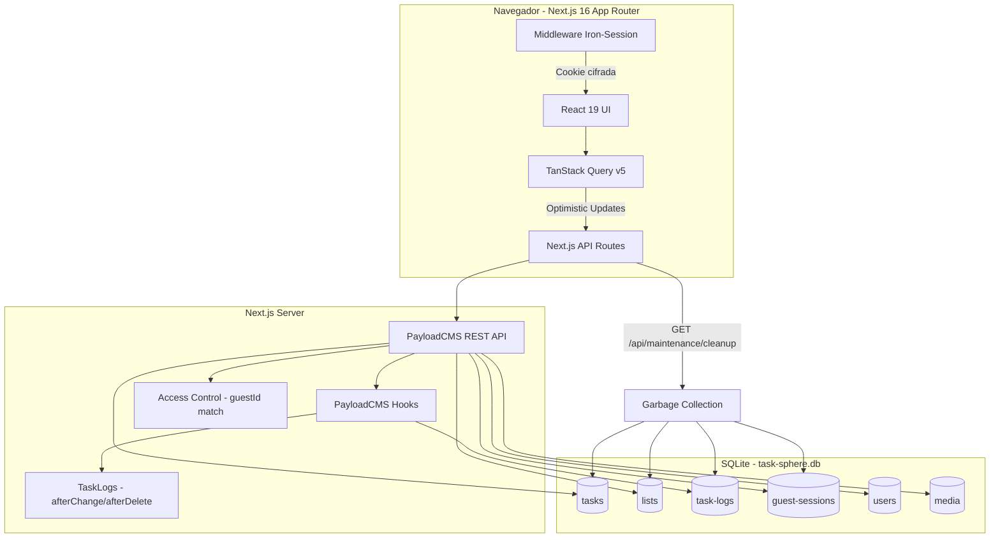
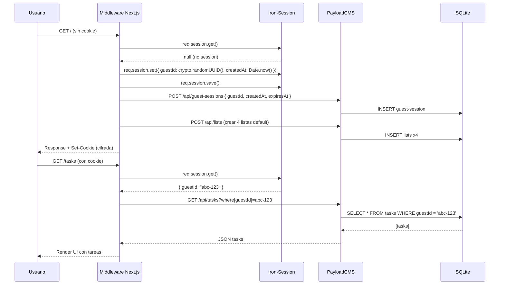
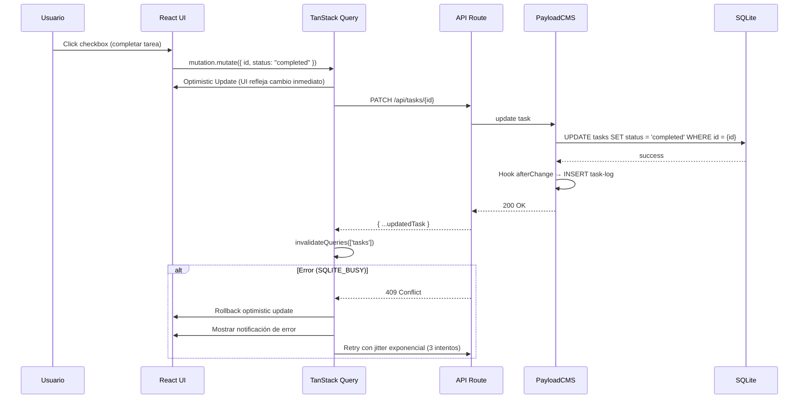
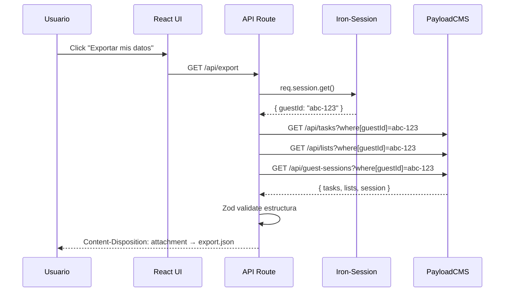

# Task Sphere — Especificación Técnica (spec.md)

> **Versión:** 1.0.0  
> **Sistema de Diseño:** Ethereal Focus  
> **Framework:** Next.js 16 (App Router) + React 19  
> **CMS/API:** PayloadCMS 3.85.1 (SQLite)  
> **Estado:** `v1.0 — MVP Anónimo`

---

## 1. Visión, Objetivos y Atributos de Marca

### 1.1 Visión del Producto

Task Sphere es una aplicación de gestión de tareas empresarial de alta fidelidad con una experiencia "digital zen". Está diseñada para high-performers que necesitan claridad mental inmediata. Opera en un modelo **Guest-First** (anónimo, sin registro) con arquitectura local vía SQLite, y está preparada para una futura conversión a usuarios persistentes.

### 1.2 Atributos de Marca (Ethereal Focus)

| Atributo | Descripción |
|---|---|
| **Disciplina visual** | Minimalismo con acentos glassmórficos. Fondos ultraligeros (`#F9FAFB` light / `#09090B` dark). |
| **Jerarquía calmada** | Primary Blue (`#004AC6`) usado con moderación como "north star" visual. |
| **Profundidad material** | Capas tonales con translucidez y `backdrop-blur` en vez de sombras pesadas. |
| **Tipografía dual** | Geist (headlines/UI) + Inter (body texto). |
| **Retroalimentación suave** | Transiciones hover/active graduales, escala al click (`scale(0.98)`). |

### 1.3 Métricas de Éxito (v1.0 MVP)

| Métrica | Objetivo |
|---|---|
| **TTI (Time to Interactive)** | < 1.5s en primera carga (Next.js SSR + SQLite local) |
| **CRUD Task Latency** | < 200ms (optimistic update en UI, confirmación asíncrona) |
| **Tamaño DB** | < 10MB después de 30 días de uso intensivo (con GC) |
| **Cobertura de colecciones** | 100% de las pantallas de UI mapeadas a colecciones de PayloadCMS |

---

### ⚠️ BANDERA TÉCNICA #1 — Prisma ORM vs PayloadCMS SQLite

**Problema:** `todo-args.md` especifica Prisma ORM v5+ como data layer. Sin embargo, el proyecto ya utiliza PayloadCMS 3.85.1 con su propio adapter SQLite (`@payloadcms/db-sqlite`). Ejecutar Prisma y PayloadCMS sobre el mismo archivo SQLite introduce:
- Riesgo de conflictos de esquema (tablas duplicadas, migraciones cruzadas)
- Condiciones de carrera por el single-writer de SQLite
- Complejidad operativa innecesaria

**Decisión:** Eliminar Prisma del stack. Toda la persistencia se manejará exclusivamente mediante **Colecciones de PayloadCMS**, que proporcionan:
- API REST/GraphQL out-of-the-box
- Hooks (beforeChange, afterChange, afterDelete)
- Access Control granular
- Generación automática de tipos TypeScript
- Admin UI para depuración

**Impacto:** Se añaden 4 nuevas colecciones a PayloadCMS (`Tasks`, `TaskLogs`, `Lists`, `GuestSessions`). Se elimina `schema.prisma` del plan de implementación.

---

### ⚠️ BANDERA TÉCNICA #2 — Next.js 16 (no 14)

**Problema:** `todo-args.md` referencia Next.js 14+. El proyecto real usa **Next.js 16.2.6** con **React 19.2.6**. 
**Decisión:** Actualizar el spec para reflejar Next.js 16 + React 19. No hay breaking changes relevantes para el alcance definido.

---

### ⚠️ BANDERA TÉCNICA #3 — Autenticación Guest (sin Passport.js)

**Problema:** `todo-args.md` especifica Passport.js + estrategia anónima customizada. 
**Decisión:** Se reemplaza Passport.js por **Iron-Session puro** + middleware de Next.js. El flujo es:
1. Middleware de Next.js intercepta cada request
2. Si no existe cookie `task-sphere-session`, genera un `guestId` via `crypto.randomUUID()`
3. Iron-Session sella `{ guestId, createdAt }` en cookie cifrada
4. Cada API route lee la sesión y vincula datos por `guestId`
5. No se necesita Passport.js — Iron-Session maneja todo el ciclo de vida

---

## 2. Modelo de Datos (PayloadCMS)

### 2.1 Colecciones del Sistema (existentes)

| Colección | Slug | Propósito |
|---|---|---|
| `Users` | `users` | Auth de administradores (admin panel). No usada para el flujo guest. |
| `Media` | `media` | Upload de imágenes (avatares, adjuntos de tareas). |

### 2.2 Colecciones de Negocio (nuevas)

#### `Tasks` — Tareas

| Campo | Tipo | Requerido | Descripción |
|---|---|---|---|
| `title` | `text` | sí (min 3 chars) | Texto de la tarea |
| `description` | `textarea` | no | Descripción extendida |
| `status` | `select: pending | completed` | sí (default: pending) | Estado de la tarea |
| `important` | `checkbox` | no | Marcada como importante (estrella) |
| `dueDate` | `date` | no | Fecha de vencimiento |
| `list` | `relationship -> lists` | sí | Lista a la que pertenece |
| `guestId` | `text` | sí | UUID de la sesión guest (índice) |
| `sortOrder` | `number` | no | Ordenamiento manual (drag & drop) |
| `completedAt` | `date` | no | Timestamp de completado |

**Hooks:**
- `afterChange` → Crear entrada en `TaskLogs` con diff del cambio
- `afterDelete` → Crear entrada en `TaskLogs` con operación DELETE

**Access Control:**
- `read`: Doc.guestId === session.guestId
- `create`: session.guestId existe
- `update`: Doc.guestId === session.guestId
- `delete`: Doc.guestId === session.guestId

#### `Lists` — Listas de Tareas

| Campo | Tipo | Requerido | Descripción |
|---|---|---|---|
| `name` | `text` | sí | Nombre de la lista (ej. "Work Projects") |
| `icon` | `text` | no | Icono Material Symbol (default: "list") |
| `color` | `text` | no | Color hexadecimal del acento |
| `guestId` | `text` | sí | UUID de la sesión guest (índice) |
| `isDefault` | `checkbox` | no | Lista por defecto (creada al registrarse el guest) |
| `sortOrder` | `number` | no | Orden en la sidebar |

**Sistema predefinido:** Al crear un guest, se generan automáticamente 4 listas:
1. "My Day" (icon: light_mode, default: true)
2. "Important" (icon: star)
3. "Planned" (icon: calendar_month)
4. "Tasks" (icon: task_alt)

#### `TaskLogs` — Auditoría

| Campo | Tipo | Requerido | Descripción |
|---|---|---|---|
| `task` | `relationship -> tasks` | sí | Tarea afectada |
| `guestId` | `text` | sí | Guest que ejecutó la acción |
| `operation` | `select: CREATE | UPDATE | DELETE` | sí | Tipo de operación |
| `previousState` | `json` | no | Snapshot del estado anterior |
| `newState` | `json` | no | Snapshot del nuevo estado |
| `timestamp` | `date` | sí (auto: now()) | Momento del cambio |

**Access Control:** Solo escritura por hook interno. Lectura solo por admin panel. No expuesto en API pública.

#### `GuestSessions` — Sesiones de Invitado

| Campo | Tipo | Requerido | Descripción |
|---|---|---|---|
| `guestId` | `text` | sí (unique) | UUID de la sesión |
| `createdAt` | `date` | sí (auto) | Creación de la sesión |
| `lastActiveAt` | `date` | sí (auto) | Última actividad |
| `expiresAt` | `date` | sí | Fecha de expiración (createdAt + 7 días) |
| `locale` | `select: es | en` | no | Preferencia de idioma |
| `theme` | `select: light | dark | system` | no | Preferencia de tema |
| `notificationsEnabled` | `checkbox` | sí (default: true) | Notificaciones desktop |
| `integrations` | `json` | no | Tokens de integración (Google Calendar, etc.) |
| `focusSettings` | `json` | no | Preferencias de Focus Session (pomodoro duración, etc.) |

**Hooks:**
- `beforeChange`: Si `lastActiveAt` se actualiza, también extiende `expiresAt` a +7 días

**Garbage Collection (endpoint de mantenimiento):**
Endpoint `GET /api/maintenance/cleanup` que:
1. Busca `GuestSessions` donde `expiresAt < now()`
2. Elimina todas las `Tasks` asociadas a esos `guestId`
3. Elimina todas las `Lists` asociadas a esos `guestId`
4. Elimina los `TaskLogs` asociados
5. Elimina la `GuestSession`

---

## 3. Mapeo Funcional (Historias de Usuario + Payload)

### 3.1 Core de Tareas

| Módulo | Historia de Usuario | Pantalla Stitch | Colección Payload | Endpoints/Hooks |
|---|---|---|---|---|
| **Ver Stack** | "Como guest, quiero ver mis tareas filtradas por lista (My Day, Important, Planned, All) para enfocarme en lo que importa." | 2.Stack My Day, 4.Stack Important, 5.Stack Planned, 6.Stack All Tasks | `tasks` | `GET /api/tasks?where[guestId][equals]={guestId}&where[list][equals]={listId}` |
| **Stack Vacío** | "Como guest sin tareas, quiero ver un estado vacío con sugerencias para empezar." | 1.Stack Vacio | `tasks` (query returns 0) | Frontend detecta array vacío y muestra empty state |
| **Crear Tarea** | "Como guest, quiero agregar una tarea con texto mínimo para capturarla rápido." | 3.Task Details (Add Task box) | `tasks` | `POST /api/tasks` validado con Zod |
| **Completar Tarea** | "Como guest, quiero marcar una tarea como completada con un solo click." | 3.Task Details (checkbox) | `tasks` | `PATCH /api/tasks/{id}` — Hook `afterChange` log en `TaskLogs` |
| **Editar Tarea** | "Como guest, quiero editar el texto de una tarea in-place." | 3.Task Details | `tasks` | `PATCH /api/tasks/{id}` |
| **Eliminar Tarea** | "Como guest, quiero eliminar una tarea con confirmación." | 3.Task Details (detail footer delete) | `tasks` | `DELETE /api/tasks/{id}` — Soft delete o hard delete |
| **Marcar Importante** | "Como guest, quiero marcar/desmarcar una tarea como importante." | 3.Task Details (star icon) | `tasks` | `PATCH /api/tasks/{id}` — toggle `important` field |
| **Programar Fecha** | "Como guest, quiero asignar una fecha de vencimiento a mi tarea." | 3.Task Details (calendar) | `tasks` | `PATCH /api/tasks/{id}` |
| **Añadir Notas** | "Como guest, quiero agregar notas enriquecidas a mi tarea." | 3.Task Details (notes section) | `tasks` | `PATCH /api/tasks/{id}` — campo description |

### 3.2 Listas

| Módulo | Historia de Usuario | Pantalla Stitch | Colección Payload | Endpoints/Hooks |
|---|---|---|---|---|
| **Crear Lista** | "Como guest, quiero crear una lista personalizada para organizar mis tareas por proyecto." | 7.Add List | `lists` | `POST /api/lists` + crear entrada en sidebar |
| **Renombrar Lista** | "Como guest, quiero renombrar una lista existente." | 7.Add List (modal edición) | `lists` | `PATCH /api/lists/{id}` |
| **Eliminar Lista** | "Como guest, quiero eliminar una lista y sus tareas." | 7.Add List | `lists` + `tasks` | `DELETE /api/lists/{id}` + cascade tasks |
| **Navegar Listas** | "Como guest, quiero cambiar entre mis listas desde la sidebar." | 2.Stack My Day (sidebar) | `lists` | `GET /api/lists?where[guestId][equals]={guestId}` |

### 3.3 Configuración

| Módulo | Historia de Usuario | Pantalla Stitch | Colección Payload | Endpoints/Hooks |
|---|---|---|---|---|
| **Ver Config** | "Como guest, quiero acceder a la configuración general desde la sidebar." | 8.Config Main | `GuestSessions` | `GET /api/guest-sessions?where[guestId][equals]={guestId}` |
| **Cambiar Tema** | "Como guest, quiero alternar entre modo claro y oscuro." | 8.Config Main (apariencia) | `GuestSessions` | `PATCH /api/guest-sessions/{id}` — campo `theme` |
| **Cambiar Idioma** | "Como guest, quiero cambiar el idioma de la interfaz." | 13.Config Language and Region | `GuestSessions` | `PATCH /api/guest-sessions/{id}` — campo `locale` |
| **Notificaciones** | "Como guest, quiero habilitar/deshabilitar notificaciones desktop." | 10.Config Alert Desktop | `GuestSessions` | `PATCH /api/guest-sessions/{id}` — campo `notificationsEnabled` |
| **Integraciones** | "Como guest, quiero ver las integraciones disponibles." | 11.Config Integrations | `GuestSessions` | Vista estática + placeholders en `integrations` JSON |
| **Google Calendar** | "Como guest, quiero conectar Google Calendar para ver eventos." | 12.Config Integrations Google Calendar | `GuestSessions` | `PATCH /api/guest-sessions/{id}` — Google OAuth tokens en `integrations` |

### 3.4 Perfil

| Módulo | Historia de Usuario | Pantalla Stitch | Colección Payload | Nota |
|---|---|---|---|---|
| **Cambiar Foto** | "Como guest, quiero subir una foto de perfil." | 14.Config Modal cambiar foto | `media` + `GuestSessions` | MVP: skip. Post-MVP requiere endpoint de upload |
| **Cambiar Contraseña** | "Como guest/quiero registrarme y cambiar mi contraseña." | 15.Config Cambiar contrasena | `users` | MVP: skip (solo guest). Post-MVP con flujo de registro |
| **Resumen Email** | "Como guest, quiero configurar resúmenes por email." | 9.Config Resume Email | `GuestSessions` (campo `emailSummary`) | MVP: skip (requiere email) |

### 3.5 Focus Session

| Módulo | Historia de Usuario | Pantalla Stitch | Colección Payload | Endpoints/Hooks |
|---|---|---|---|---|
| **Iniciar Focus** | "Como guest, quiero iniciar una sesión de enfoque con temporizador Pomodoro." | 17.Focus Session | `focusSessions` (nueva colección) | `POST /api/focus-sessions` |
| **Ver Estadísticas** | "Como guest, quiero ver mi productividad diaria." | 17.Focus Session (stats) | `focusSessions` | `GET /api/focus-sessions?where[guestId]={guestId}` agregado por fecha |

### 3.6 Centro de Ayuda

| Módulo | Historia de Usuario | Pantalla Stitch | Colección Payload | Nota |
|---|---|---|---|---|
| **Ver Ayuda** | "Como guest, quiero acceder a documentación de ayuda." | 16.Centro de ayuda | Estática (no colección) | Página estática con contenido markdown. No requiere Payload. |

### 3.7 Sesión y Exportación

| Módulo | Historia de Usuario | Endpoint | Descripción |
|---|---|---|---|
| **Exportar Datos** | "Como guest, quiero exportar mis tareas como JSON." | `GET /api/export` | API Route de Next.js que lee sesión Iron-Session, consulta Payload, devuelve JSON descargable |
| **Purgar Guest** | "Como guest, quiero eliminar todos mis datos." | `DELETE /api/guest-sessions/me` | Elimina sesión guest + tasks + lists + logs asociados |
| **GC Automático** | Tarea CRON (o endpoint manual) | `GET /api/maintenance/cleanup` | Limpia sesiones expiradas (7 días inactividad) |

---

## 4. Arquitectura y Flujos

### 4.1 Diagrama de Arquitectura General



### 4.2 Flujo de Sesión Guest



### 4.3 Flujo de Mutación con Optimistic Update



### 4.4 Flujo de Exportación de Datos



---

## 5. Criterios de Aceptación (Gherkin)

### 5.1 Sesión Invitado

```gherkin
Feature: Sesión de Invitado
  Scenario: Nuevo visitante recibe sesión anónima
    Given un usuario sin cookie "task-sphere-session"
    When accede a la aplicación
    Then se genera un guestId único
    And se crea una GuestSession en PayloadCMS con expiresAt = +7 días
    And se crean 4 listas por defecto (My Day, Important, Planned, Tasks)
    And se envía una cookie cifrada con Iron-Session

  Scenario: Visitante recurrente recupera su sesión
    Given un usuario con cookie "task-sphere-session" válida
    When accede a la aplicación
    Then se desencripta la sesión via Iron-Session
    And se actualiza lastActiveAt en GuestSession
    And se extiende expiresAt a +7 días desde ahora

  Scenario: Sesión expirada es limpiada
    Given una GuestSession con expiresAt < now()
    When se ejecuta el endpoint /api/maintenance/cleanup
    Then se eliminan todas las Tasks asociadas al guestId
    And se eliminan todas las Lists asociadas
    And se eliminan los TaskLogs asociados
    And se elimina la GuestSession
```

### 5.2 Gestión de Tareas

```gherkin
Feature: CRUD de Tareas
  Scenario: Crear tarea válida
    Given un guest con sesión activa
    When envía POST /api/tasks con title="Comprar leche" y listId="abc"
    Then PayloadCMS crea un documento en la colección tasks
    And el campo guestId coincide con la sesión actual
    And se dispara el hook afterChange creando un TaskLog con operation="CREATE"
    And la API responde 201 con la tarea creada

  Scenario: Crear tarea con título inválido
    Given un guest con sesión activa
    When envía POST /api/tasks con title=""
    Then Zod rechaza la validación en el API Route
    And la API responde 400 con error de validación
    And no se crea ningún documento en PayloadCMS

  Scenario: Completar tarea
    Given una tarea existente con status="pending"
    When el usuario hace click en el checkbox
    Then TanStack Query aplica optimistic update (UI cambia inmediatamente)
    And se envía PATCH /api/tasks/{id} con status="completed"
    And PayloadCMS actualiza el documento y setea completedAt
    And el hook afterChange registra el diff en TaskLogs
    And TanStack Query invalida la cache de tasks

  Scenario: Error de concurrencia SQLite con retry
    Given múltiples mutaciones simultáneas (rapid clicks)
    When SQLite devuelve SQLITE_BUSY (P2034)
    Then el API Route reintenta con jitter exponencial (100ms, 200ms, 400ms)
    And si el tercer intento falla, responde 409
    And TanStack Query hace rollback del optimistic update
    And se muestra notificación de error en la UI

  Scenario: Guest ve solo sus tareas
    Given dos guests con diferentes guestId
    When cada guest consulta GET /api/tasks
    Then cada guest recibe solo las tareas donde guestId coincide con su sesión
    And ningún guest puede ver tareas del otro (aislamiento por guestId)
```

### 5.3 Exportación de Datos

```gherkin
Feature: Exportación Portátil
  Scenario: Guest exporta sus datos
    Given un guest con tareas y listas creadas
    When solicita GET /api/export
    Then la API verifica la sesión via Iron-Session
    And consulta tasks, lists, y guest-session del guestId actual
    And compila un JSON con estructura { profile, lists, tasks, exportedAt }
    And Zod valida que el JSON sea conforme al esquema
    And responde con Content-Type application/json y Content-Disposition attachment

  Scenario: Guest sin datos exporta
    Given un guest sin ninguna tarea
    When solicita GET /api/export
    Then la API responde con JSON { tasks: [], lists: [], session: {...} }
    And no hay error
```

### 5.4 Focus Session

```gherkin
Feature: Focus Session
  Scenario: Iniciar sesión de enfoque
    Given un guest con sesión activa
    When inicia una Focus Session de 25 minutos
    Then se crea un documento en la colección focusSessions
    And se muestra el temporizador en pantalla completa
    And al cumplirse el tiempo, se registra la sesión como completada

  Scenario: Ver estadísticas diarias
    Given un guest con focus sessions completadas hoy
    When navega a la sección Focus
    Then ve el contador de sesiones completadas hoy
    And ve el total de minutos enfocados
    And ve el porcentaje de eficiencia diaria
```

### 5.5 Gestión de Listas

```gherkin
Feature: Listas Personalizadas
  Scenario: Crear nueva lista
    Given un guest con sesión activa
    When crea una lista con nombre "Trabajo"
    Then se crea un documento en la colección lists
    And la lista aparece en la sidebar con el icono por defecto

  Scenario: Eliminar lista con tareas
    Given una lista con 3 tareas asociadas
    When el guest elimina la lista
    Then se elimina la lista
    And todas las tareas asociadas se eliminan (cascade)

  Scenario: Listas default del sistema
    Given un guest recién creado
    Then existen 4 listas predefinidas: My Day, Important, Planned, Tasks
    And "My Day" está marcada como isDefault=true
    And todas comparten el guestId del guest
```

---

## 6. Sistema de Estilos y Contratos

### 6.1 Mapeo de Design Tokens a Tailwind CSS

#### Colores — Modo Claro

| Token | Hex | Tailwind Class | Uso |
|---|---|---|---|
| `surface` | `#f8f9fa` | `bg-surface` | Canvas base |
| `surface-container-lowest` | `#ffffff` | `bg-surface-container-lowest` | Cards, inputs |
| `surface-container-low` | `#f3f4f5` | `bg-surface-container-low` | Hover states |
| `surface-container` | `#edeeef` | `bg-surface-container` | Componentes elevados |
| `surface-container-high` | `#e7e8e9` | `bg-surface-container-high` | Sidebar activo |
| `on-surface` | `#191c1d` | `text-on-surface` | Texto primario |
| `on-surface-variant` | `#434655` | `text-on-surface-variant` | Texto secundario |
| `primary` | `#004ac6` | `bg-primary` / `text-primary` | Acciones, navegación activa |
| `primary-container` | `#2563eb` | `bg-primary-container` | Botones primarios |
| `on-primary` | `#ffffff` | `text-on-primary` | Texto sobre primary |
| `primary-fixed` | `#dbe1ff` | `bg-primary-fixed` | Fondos de primary tenue |
| `secondary` | `#735c00` | `text-secondary` | Icono estrella (importante) |
| `secondary-container` | `#fed01b` | `bg-secondary-container` | Fondo estrella |
| `error` | `#ba1a1a` | `text-error` / `bg-error` | Errores, delete |
| `error-container` | `#ffdad6` | `bg-error-container` | Fondo error |
| `outline` | `#737686` | `border-outline` | Bordes estándar |
| `outline-variant` | `#c3c6d7` | `border-outline-variant` | Bordes sutiles |
| `border-subtle-light` | `#F3F4F6` | `border-border-subtle-light` | Separadores |
| `text-secondary-light` | `#6B7280` | `text-text-secondary-light` | Metadatos, labels |

#### Colores — Modo Oscuro

| Token | Hex | Tailwind Class | Uso |
|---|---|---|---|
| `canvas-dark` | `#09090B` | `bg-canvas-dark` | Canvas base dark |
| `surface-dark` | `#18181B` | `bg-surface-dark` | Superficies dark |
| `surface-elevated-dark` | `#27272A` | `bg-surface-elevated-dark` | Cards elevados dark |
| `text-secondary-dark` | `#A1A1AA` | `text-text-secondary-dark` | Texto secundario dark |
| `border-subtle-dark` | `rgba(39,39,42,0.5)` | `border-border-subtle-dark` | Separadores dark |

#### Tipografía

| Token | Font | Size | Weight | Line Height | Letter | CSS Class |
|---|---|---|---|---|---|---|
| `display-xl` | Geist | 36px | 700 | 40px | -0.02em | `font-display-xl text-display-xl` |
| `display-xl-mobile` | Geist | 24px | 700 | 32px | -0.01em | `font-display-xl-mobile text-display-xl-mobile` |
| `headline-md` | Geist | 20px | 600 | 28px | — | `font-headline-md text-headline-md` |
| `body-lg` | Inter | 18px | 400 | 28px | — | `font-body-lg text-body-lg` |
| `body-md` | Inter | 16px | 400 | 24px | — | `font-body-md text-body-md` |
| `label-sm` | Geist | 12px | 500 | 16px | 0.05em | `font-label-sm text-label-sm` |
| `task-item` | Inter | 15px | 400 | 20px | — | `font-task-item text-task-item` |

#### Layout & Spacing

| Token | Valor | Tailwind | Uso |
|---|---|---|---|
| `sidebar-width` | 288px | `w-sidebar-width` | Ancho sidebar |
| `detail-panel-width` | 384px | `w-detail-panel-width` | Ancho panel detalle |
| `container-padding` | 3rem | `p-container-padding` | Padding workspace desktop |
| `container-padding-mobile` | 1rem | `p-container-padding-mobile` | Padding workspace mobile |
| `gutter-md` | 1rem | `gap-gutter-md` | Gap entre elementos |
| `stack-gap` | 0.25rem | `space-y-stack-gap` | Gap vertical lista |

#### Border Radius

| Token | Valor | Tailwind | Uso |
|---|---|---|---|
| `rounded-sm` | 0.25rem | `rounded-sm` | — |
| `rounded` | 0.5rem | `rounded` | Default |
| `rounded-lg` | 0.5rem | `rounded-lg` | Task items (8px) |
| `rounded-xl` | 0.75rem | `rounded-xl` | Inputs, contenedores (12px) |
| `rounded-full` | 9999px | `rounded-full` | Checkboxes, iconos |

#### Glassmorphism

```css
.glass-panel {
  background: rgba(255, 255, 255, 0.7);
  backdrop-filter: blur(12px);
  -webkit-backdrop-filter: blur(12px);
}
```

### 6.2 Contratos de Datos (TypeScript)

#### PayloadCMS Types (generados automáticamente via `pnpm generate:types`)

```typescript
// Interfaz conceptual — PayloadCMS genera los tipos reales

interface Task {
  id: string
  title: string               // min 3 chars
  description?: string
  status: 'pending' | 'completed'
  important: boolean
  dueDate?: string            // ISO 8601
  list: string | List         // relationship
  guestId: string             // indexed
  sortOrder?: number
  completedAt?: string
  createdAt: string
  updatedAt: string
}

interface List {
  id: string
  name: string
  icon?: string               // Material Symbol name
  color?: string              // hex
  guestId: string             // indexed
  isDefault: boolean
  sortOrder?: number
  createdAt: string
  updatedAt: string
}

interface TaskLog {
  id: string
  task: string | Task         // relationship
  guestId: string
  operation: 'CREATE' | 'UPDATE' | 'DELETE'
  previousState?: Record<string, unknown>
  newState?: Record<string, unknown>
  timestamp: string
}

interface GuestSession {
  id: string
  guestId: string             // unique
  createdAt: string
  lastActiveAt: string
  expiresAt: string
  locale?: 'es' | 'en'
  theme?: 'light' | 'dark' | 'system'
  notificationsEnabled: boolean
  integrations?: {
    googleCalendar?: {
      accessToken: string
      refreshToken: string
      expiresAt: string
    }
  }
  focusSettings?: {
    workDuration: number       // minutos, default 25
    breakDuration: number      // minutos, default 5
    longBreakDuration: number  // minutos, default 15
    sessionsBeforeLongBreak: number // default 4
  }
}
```

#### Zod Schemas (validación compartida)

```typescript
import { z } from 'zod'

export const CreateTaskSchema = z.object({
  title: z
    .string()
    .min(3, 'El título debe tener al menos 3 caracteres')
    .max(500, 'El título no puede exceder 500 caracteres')
    .transform((s) => s.trim())
    .refine((s) => s.length > 0, 'No se permiten espacios en blanco'),
  description: z.string().max(2000).optional(),
  list: z.string().min(1, 'La lista es requerida'),
  dueDate: z.string().datetime().optional(),
  important: z.boolean().default(false),
})

export const UpdateTaskSchema = z.object({
  title: z.string().min(3).max(500).transform((s) => s.trim()).optional(),
  description: z.string().max(2000).optional(),
  status: z.enum(['pending', 'completed']).optional(),
  important: z.boolean().optional(),
  dueDate: z.string().datetime().nullable().optional(),
})

export const ExportDataSchema = z.object({
  exportedAt: z.string().datetime(),
  profile: z.object({
    guestId: z.string().uuid(),
    createdAt: z.string().datetime(),
    theme: z.string().optional(),
    locale: z.string().optional(),
  }),
  lists: z.array(z.object({
    id: z.string(),
    name: z.string(),
    icon: z.string().optional(),
    isDefault: z.boolean(),
  })),
  tasks: z.array(z.object({
    id: z.string(),
    title: z.string(),
    status: z.enum(['pending', 'completed']),
    important: z.boolean(),
    dueDate: z.string().datetime().nullable(),
    list: z.string(),
    completedAt: z.string().datetime().nullable(),
    createdAt: z.string().datetime(),
  })),
})
```

---

## 7. Configuración de PayloadCMS

### 7.1 payload.config.ts — Colecciones a añadir

```typescript
import { buildConfig } from 'payload'
import { sqliteAdapter } from '@payloadcms/db-sqlite'
import { lexicalEditor } from '@payloadcms/richtext-lexical'
import path from 'path'
import sharp from 'sharp'

import { Users } from './collections/Users'
import { Media } from './collections/Media'
import { Tasks } from './collections/Tasks'
import { Lists } from './collections/Lists'
import { TaskLogs } from './collections/TaskLogs'
import { GuestSessions } from './collections/GuestSessions'

const filename = fileURLToPath(import.meta.url)
const dirname = path.dirname(filename)

export default buildConfig({
  admin: { user: Users.slug, importMap: { baseDir: path.resolve(dirname) } },
  collections: [Users, Media, Tasks, Lists, TaskLogs, GuestSessions],
  editor: lexicalEditor(),
  secret: process.env.PAYLOAD_SECRET || '',
  typescript: { outputFile: path.resolve(dirname, 'payload-types.ts') },
  db: sqliteAdapter({ client: { url: process.env.DATABASE_URL || '' } }),
  sharp,
  hooks: {
    // Global hook para logging auditoría (alternativa a hooks por colección)
  },
  plugins: [],
})
```

---

## 8. Estructura de Archivos (implementación)

```
src/
  collections/
    Tasks.ts                  # Colección tasks con hooks y access control
    Lists.ts                  # Colección lists
    TaskLogs.ts               # Colección task-logs (solo escritura por hook)
    GuestSessions.ts           # Colección guest-sessions
  app/
    (frontend)/
      layout.tsx              # Root layout con TanStack Query Provider
      page.tsx                # Landing → redirect a /my-day
      login/
        page.tsx              # Post-MVP: login/registro
      my-day/
        page.tsx              # Stack My Day
      important/
        page.tsx              # Stack Important
      planned/
        page.tsx              # Stack Planned
      tasks/
        page.tsx              # Stack All Tasks
      task/
        [id]/
          page.tsx            # Task Details (servidor o cliente)
      lists/
        [id]/
          page.tsx            # Vista de una lista específica
      settings/
        page.tsx              # Config Main
        appearance/
          page.tsx            # Apariencia (tema, idioma)
        notifications/
          page.tsx            # Alertas desktop
        integrations/
          page.tsx            # Integraciones
      focus/
        page.tsx              # Focus Session
      help/
        page.tsx              # Centro de ayuda
      api/
        export/
          route.ts            # GET → exportar datos del guest
        maintenance/
          cleanup/
            route.ts          # GET → garbage collection
        tasks/
          route.ts            # Custom API routes con validación Zod + Iron-Session
          [id]/
            route.ts
        lists/
          route.ts
          [id]/
            route.ts
    (payload)/
      admin/                  # PayloadCMS admin panel (generado)
      api/                    # PayloadCMS REST API (generado)
  hooks/
    useTasks.ts               # TanStack Query hooks (useQuery, useMutation)
    useLists.ts
  lib/
    iron-session.ts           # Config de Iron-Session
    zod-schemas.ts            # Esquemas compartidos Zod
    payload-client.ts         # Helper para getPayload() con sesión
  components/
    Layout/
      Sidebar.tsx             # Sidebar navigation (glass-panel)
      DetailPanel.tsx         # Right detail panel (384px)
      TopBar.tsx              # Top bar con título y fecha
    Tasks/
      TaskItem.tsx            # Componente de tarea individual
      TaskCheckbox.tsx        # Checkbox animado (circular)
      TaskList.tsx            # Lista de tareas con TanStack Query
      AddTaskBar.tsx          # Input flotante "Add a task"
      TaskDetail.tsx          # Panel de detalle de tarea
      TaskNotes.tsx           # Sección de notas en detail panel
    Lists/
      ListNav.tsx             # Navegación de listas en sidebar
      AddListModal.tsx        # Modal para crear/editar lista
    Settings/
      SettingsNav.tsx         # Sub-navegación de settings
      ThemeToggle.tsx         # Toggle modo claro/oscuro
      LanguageSelect.tsx      # Selector de idioma
    Focus/
      FocusTimer.tsx          # Temporizador Pomodoro
      FocusStats.tsx          # Estadísticas de foco
    Common/
      EmptyState.tsx          # Estado vacío (stack vacío)
      Skeleton.tsx            # Skeleton loader con animate-pulse
      GlassPanel.tsx          # Componente glassmorphism reutilizable
```

---

## 9. Flujo de Transición Guest → Usuario (post-MVP)

Aunque el MVP es 100% anónimo, la arquitectura deja preparada la migración:

1. **Registro:** El guest crea email + password → se crea un `User` en PayloadCMS con su `guestId`
2. **Migración:** Endpoint `POST /api/migrate-account` que:
   - Toma el `guestId` actual de Iron-Session
   - Reasigna todas las `Tasks` del `guestId` al nuevo `userId`
   - Reasigna todas las `Lists`
   - Elimina la `GuestSession`
   - Reemplaza cookie Iron-Session por JWT de PayloadCMS
3. **Rollback:** Si el usuario cancela el registro, los datos permanecen intactos en el `guestId`

---

## 10. Consideraciones de Resiliencia

### SQLite Concurrency (WAL Mode)

PayloadCMS con `@payloadcms/db-sqlite` maneja SQLite internamente. Se recomienda:

- Habilitar **WAL mode** en la conexión SQLite: `PRAGMA journal_mode=WAL;`
- Configurar `busy_timeout`: `PRAGMA busy_timeout=5000;` (5 segundos de espera antes de error)
- Implementar retry pattern en API Routes (3 intentos con jitter exponencial: 100ms, 200ms, 400ms)

### Iron-Session Cookie Corruption

Si la cookie Iron-Session está corrupta o expirada:
1. Middleware detecta `req.session.get()` falla → genera nuevo guestId
2. El frontend recibe 401 en cualquier request → TanStack Query `onError` detecta
3. React Query refetch automático crea nueva sesión
4. La UI se resetea a estado vacío sin crashear

### Optimistic Update Rollback

TanStack Query `onMutate` guarda snapshot previo. Si `onError`:
1. Rollback al snapshot guardado
2. Mostrar toast con mensaje de error (ej. "Error al guardar. Reintentando...")
3. No bloquear la UI — el usuario puede seguir interactuando
